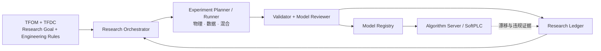

# ThermoForge

> **Autonomous Physics–Data Hybrid Modeling Research System**
> 面向数据中心 HVAC 的自主物理—数据混合建模研究系统

ThermoForge 接收物模型、历史数据和研究目标，持续提出假设、执行实验、积累证据，并产出可验证、可部署的模型包。

ThermoForge takes an object model, historical data, and a research goal, then continuously forms hypotheses, runs experiments, accumulates evidence, and delivers verifiable, deployable model packages.

---

## 是什么 / 不是什么

| ThermoForge 是 | ThermoForge 不是 |
|---|---|
| 可长期运行的自动建模研究平台 | 一个「让 LLM 写 Python 脚本」的工具 |
| 以契约驱动的可复现实验系统 | 一次性的调参或 AutoML 服务 |
| 物理模型与数据模型的混合建模框架 | 纯黑箱机器学习管线 |
| 交付带谱系、约束和指标的 Model Package | 交付孤立的 `model.pkl` |

## 核心原则

1. **Agent 只做研究推理与编排**，大规模科学计算交给确定性的 Python 计算层。
2. **一套变量语义贯穿全链路**：物模型、Excel、实验、模型签名、API、现场绑定使用同一 `variable_id`。
3. **Excel 是交换入口，不是数据库**，导入后转为可追溯、可复用的数据资产。
4. **研究过程必须持久化**，目标、假设、证据、结论和失败原因不能只存在于 LLM 上下文中。
5. **模型评价是多维的**，精度之外还包括泛化、物理一致性、稳定性、复杂度和运行成本。
6. **原始数据与已完成实验不可原地覆盖**，内容变化一律产生新版本。

完整原则见 [docs/README.md](docs/README.md)。

## 架构速览



研究闭环：`目标 → 假设 → 实验 → 证据 → 结论 → 知识 → 新假设`

详见 [系统总体设计](docs/architecture.md)。

## 关键契约

| 契约 | 职责 | 定义位置 |
|---|---|---|
| **TFOM** | 对象、属性、单位、角色、派生关系和物理约束 | [data-contract.md §3](docs/data-contract.md) |
| **TFDC** | 历史与实时数据如何表达和交换 | [data-contract.md](docs/data-contract.md) |
| **Dataset View** | 可复用、可哈希的数据选择与预处理 | [data-contract.md §7](docs/data-contract.md) |
| **Research Goal** | 研究对象、目标变量、候选输入和验收标准 | [research-loop.md §1](docs/research-loop.md) |
| **Experiment** | 一次可复现的模型实验 | [research-loop.md §5](docs/research-loop.md) |
| **Model Package** | 可验证、可部署的模型交付物 | [model-package.md](docs/model-package.md) |

术语速查见 [术语表](docs/glossary.md)；命名、单位、时间和哈希的规范性细节见 [工程约定](docs/conventions.md)。

## 文档

**新手从 [入门教程](docs/getting-started.md) 开始**：环境准备、五分钟跑通示例、命令行速查、常见任务流程。

设计文档从 [文档总览](docs/README.md) 进入。文档分三层：

**方案层**（当前工作面）

| 文档 | 内容 |
|---|---|
| [范围、非目标与前提](docs/scope.md) | 一期做什么、明确不做什么、方案成立的前提假设、什么算成功 |
| [设计决策记录](docs/design-decisions.md) | 17 条关键决策的备选、理由、代价与复审触发条件 |
| [可行性风险](docs/risks.md) | 12 项风险及其早期验证方式，含 2026-08-08 的核实结果 |
| [数据探查报告](docs/data-survey.md) | 对 `data/` 工作簿的结构与数值探查，及其对方案的影响 |
| [开放议题](docs/open-questions.md) | 尚未**决定**的方案级与契约级问题 |
| [缺口分析](docs/gap-analysis.md) | 尚未被任何文档**覆盖**的空白，按价值链盘点 |
| [待办问题清单](docs/issues.md) | 跨上述文档的统一问题索引，已定级排序，可直接对应 Issue |

**设计层**

| # | 文档 | 内容 |
|---:|---|---|
| 1 | [系统总体设计](docs/architecture.md) | 系统边界、组件、Agent 职责与技术分层 |
| 2 | [TFDC 数据契约](docs/data-contract.md) | 变量体系、Excel 规范、Data Vault、数据版本 |
| 3 | [自主研究闭环](docs/research-loop.md) | 研究状态机、实验协议、验证矩阵与模型评分 |
| 4 | [模型包与部署契约](docs/model-package.md) | 模型签名、制品结构、注册与线上接入 |
| 5 | [实施路线图](docs/roadmap.md) | 阶段划分、验收标准与首个垂直切片 |

**实现层**

| 文档 | 内容 |
|---|---|
| [工程约定](docs/conventions.md) | 命名正则、单位表、时区处理、哈希规范化、完整错误码表 |
| [实现细则与已知陷阱](docs/implementation-notes.md) | 库行为差异、边界情况、泄漏路径与测试基线 |
| [术语表](docs/glossary.md) | 缩写、ID 前缀、枚举值速查 |

## 仓库结构

当前仓库只包含文档与示例数据；代码目录按 [architecture.md §7](docs/architecture.md) 规划。

```text
ThermoForge/
├── docs/              # 现有 · 设计文档与契约说明
├── data/              # 现有 · 示例与研究数据
├── contracts/         # 规划 · TFOM / TFDC / Research Goal / Experiment / Model Package Schema
├── src/               # 规划 · thermoforge_core | _data | _research | _models | _runtime
├── pi/                # 规划 · Agent extensions / skills / prompts
├── tests/             # 规划
├── examples/          # 规划 · 冷水机端到端示例
├── research/          # 运行产物 · Research Ledger（默认不入库）
└── vault/             # 运行产物 · Data Vault（默认不入库）
```

契约、示例、代码和小型固定测试数据应提交到 Git；`vault/` 与运行期 `research/` 制品不提交。

## 项目状态

**Phase 0–4 的 MVP 已实现并通过端到端示例验证**（见 [新手教程](docs/getting-started.md)），方案文档仍在持续演进。关键取舍见 [设计决策记录](docs/design-decisions.md)，未决问题见 [开放议题](docs/open-questions.md)。

| 阶段 | 内容 | 状态 |
|---|---|---|
| — | 方案论证：范围、决策、风险、开放议题 | 进行中 |
| Phase 0 | 契约定稿：TFOM / TFDC / Research Goal / Experiment / Model Package Schema | ✅ 完成（`contracts/` + `thermoforge_core`） |
| Phase 1 | 数据底座：导入器、指纹、Parquet、Dataset View | ✅ 完成（`thermoforge_data`） |
| Phase 2 | 确定性研究内核：Ledger、Runner、验证套件 | ✅ 完成（`thermoforge_research` / `thermoforge_models`） |
| Phase 3 | Pi/Agent 编排：工具接口、预算与停止条件 | ✅ 完成（22 个工具 + CLI + 编排器） |
| Phase 4 | 模型注册与部署：Model Package、发布门禁、绑定 | ✅ 完成（`thermoforge_runtime`） |
| Phase 5 | 系统化扩展：容器、队列、多站点、多 Agent | 未开始 |

各阶段验收标准见 [实施路线图](docs/roadmap.md)。

首个目标垂直切片为**冷水机输入功率模型**。数据探查后已修订输入定义与验证方式（见 [DD-12](docs/design-decisions.md)）：原候选输入中的制冷量实为电流百分比的重标定，用它建模构成循环论证。

**下一步**：确认 `data/` 中的工作簿是仿真生成还是现场采集（[Q10](docs/open-questions.md)），并解决实测 COP 中位数 9.99~11.31 超出物理范围的量纲问题。两者都会影响后续所有精度结论。

## 参与贡献

项目处于方案论证阶段，当前最有价值的贡献是**挑战方案本身**，而不是补充实现细节：

- [设计决策记录](docs/design-decisions.md) 中的取舍是否成立，尤其是标注为「建议复审」的 DD-03（自研 Ledger vs 复用 MLflow）和 DD-08（物理模型选型）。
- [可行性风险](docs/risks.md) 是否有遗漏，特别是 R2/R3——若流量不可信或制冷量由功率反算，整个建模目标需要重选。
- [前提假设](docs/scope.md) 在你的场景中是否成立。
- [开放议题](docs/open-questions.md) 的判据是否合理。
- TFOM / TFDC 是否覆盖你所在场景的设备与数据源；Excel 硬性规则在真实 BMS 导出数据上是否可行。
- [工程约定](docs/conventions.md) 与 [实现细则](docs/implementation-notes.md) 中标注 **[草案]** 的取值。

欢迎通过 Issue 提出问题，或在 PR 中直接修订文档。

## 许可证

基于 [MIT License](LICENSE) 发布。
