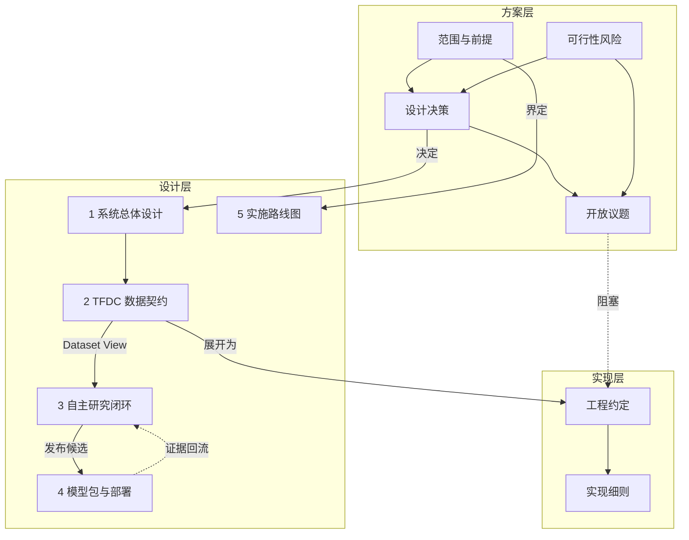

# ThermoForge 文档

ThermoForge 是一个面向数据中心 HVAC 的自主物理—数据混合建模研究系统。

> 给 ThermoForge 物模型、历史数据和研究目标，让它持续提出假设、执行实验、积累证据并产出可部署模型。

英文定位：**Autonomous Physics-Data Hybrid Modeling Research System**。

## 核心原则

1. Harness/Agent 负责研究推理、流程编排和工具调用，不直接承担大规模科学计算。
2. Python 计算运行时负责数据处理、参数辨识、训练、仿真、优化和验证。
3. Excel 是数据交换入口，不是系统内部数据库；导入后转换为可复用、可追溯的数据资产。
4. 物模型、Excel、实验、模型签名、API 和现场绑定使用同一套变量语义。
5. 研究过程必须持久化。目标、假设、实验、证据、结论和失败原因不能只存在于 LLM 上下文中。
6. 模型评价不仅关注拟合精度，还必须覆盖泛化能力、物理一致性、稳定性、复杂度和运行成本。
7. 原始数据、数据版本和已完成实验不可被原地覆盖，确保结果可复现。

## 文档导航

> 第一次使用本项目？先读 [新手教程](./getting-started.md)（环境准备、跑通示例、命令行速查）。

V2 六 Codex 后台研究从 [V2 使用指南](./v2-getting-started.md) 开始；
实际验证、版本兼容和研究效果边界见 [V2 实现与验证](./v2-validation.md)。

项目已完成 Phase 0–4 的 MVP 实现（见 [新手教程](./getting-started.md) 跑通示例），方案文档仍在持续演进。文档分三层：方案层记录取舍与未决问题，设计层描述系统与契约，实现层给出落地细节。

### 方案层 — 讨论中

先读这一层。它记录了边界、取舍依据和尚未回答的问题，是当前阶段的主要工作面。

| 文档 | 内容 |
|---|---|
| [范围、非目标与前提](./scope.md) | 一期做什么、明确不做什么、方案成立所依赖的假设、什么算成功 |
| [设计决策记录](./design-decisions.md) | 17 条关键决策的备选方案、理由、代价与复审触发条件 |
| [可行性风险](./risks.md) | 12 项风险及其早期验证方式，含 2026-08-08 的核实结果 |
| [数据探查报告](./data-survey.md) | 对 `data/` 工作簿的结构与数值探查，回答上述风险中可提前验证的七项 |
| [开放议题](./open-questions.md) | 尚未**决定**的方案级与契约级问题，含判据和建议时点 |
| [缺口分析](./gap-analysis.md) | 尚未被任何文档**覆盖**的空白，按价值链盘点，含补齐顺序 |
| [待办问题清单](./issues.md) | 跨上述文档的统一问题索引，已定级和排序，可直接对应 Issue |

### 设计层 — 已成文

| # | 文档 | 内容 | 主要读者 |
|---:|---|---|---|
| 1 | [系统总体设计](./architecture.md) | 系统边界、组件、Agent 职责和技术分层 | 全体 |
| 2 | [TFDC 数据契约](./data-contract.md) | 统一变量体系、Excel 规范、Data Vault 和数据版本 | 数据接入、导入器实现 |
| 3 | [自主研究闭环](./research-loop.md) | 研究状态机、实验协议、验证与模型评分 | 建模、研究编排 |
| 4 | [模型包与部署契约](./model-package.md) | 模型签名、制品结构、注册和线上接入 | 部署、算法服务 |
| 5 | [实施路线图](./roadmap.md) | MVP 范围、阶段划分、验收标准与后续演进 | 规划、评审 |

### 实现层 — 待落地时使用

| 文档 | 内容 |
|---|---|
| [工程约定](./conventions.md) | 命名正则、单位表、时区处理、哈希规范化、完整错误码表 |
| [数据处理手册](./data-processing-handbook.md) | 从原始工作簿到可训练样本的每一步处理与**全部假设登记**（含工况辨识、冷量拆分口径） |
| [实现细则与已知陷阱](./implementation-notes.md) | 库行为差异、边界情况、泄漏路径、测试基线 |
| [术语表](./glossary.md) | 缩写、ID 前缀、枚举值速查 |

## 文档之间的关系



数据流向是 **TFOM/TFDC → Dataset View → Experiment → Model Package**，同一套 `variable_id` 语义贯穿始终；线上监控产生的证据回流研究闭环，但不得自动覆盖生产模型。

## 当前阶段的下一步

数据探查已于 2026-08-08 完成（[报告](./data-survey.md)）。结论是**原定的冷水机功率模型切片不能按原样推进**：制冷量列实为电流百分比的重标定，用它建模构成循环论证且会通过原验收条件；单机温度是总管公式的副本，四台机组完全相同，留一设备验证不成立。切片已据此修订（[DD-12](./design-decisions.md)）。

当前优先级最高的两件事：

1. **确认数据是仿真还是现场采集**（[Q10](./open-questions.md)）——多项证据指向仿真生成，若属实则本次测出的精度基线不代表真实可达水平。
2. **解决 COP 量纲问题**——实测系统 COP 中位数 9.99~11.31，超出物理范围，在此之前不应开展物理建模。

## 关键契约

| 契约 | 职责 | 定义位置 |
|---|---|---|
| TFOM | 定义对象、属性、单位、角色、派生关系和物理约束 | [data-contract.md §3](./data-contract.md) |
| TFDC | 定义历史与实时数据如何表达和交换 | [data-contract.md §4](./data-contract.md) |
| Dataset View | 定义可复用、可哈希的数据选择与预处理结果 | [data-contract.md §7](./data-contract.md) |
| Research Goal | 定义研究对象、目标变量、候选输入和验收标准 | [research-loop.md §1](./research-loop.md) |
| Experiment | 定义一次可复现的模型实验 | [research-loop.md §5](./research-loop.md) |
| Model Package | 定义可验证、可部署的模型交付物 | [model-package.md §2](./model-package.md) |

## 一期建议

第一阶段不要从 UI 或复杂多 Agent 系统开始。优先打通以下最小闭环：

```text
TFOM + TFDC-XLSX
        ↓
导入、校验、版本化、数据画像
        ↓
Research Goal
        ↓
基线模型 + 一个物理模型 + 一个混合模型
        ↓
时序验证 + 物理约束验证
        ↓
Research Ledger + Model Package
```

对应的阶段划分和验收标准见 [实施路线图](./roadmap.md)，推荐的首个垂直切片是冷水机输入功率模型。

## 文档约定

- 契约字段和枚举值以本目录文档为唯一来源，[术语表](./glossary.md) 只做索引和摘要。
- 示例中的 ID、数据集名和数值均为示意，不代表真实站点。
- 标注为「建议」的内容可在实现阶段调整；标注为「必须/不得」的内容属于契约硬性要求，变更需要同步提升契约版本。
- 标注为 **[草案]** 的具体取值（阈值、格式选择、新增字段）尚未经真实数据验证，实现前需评审确认；各文档末尾的「待决策」清单汇总了这些开放议题。
