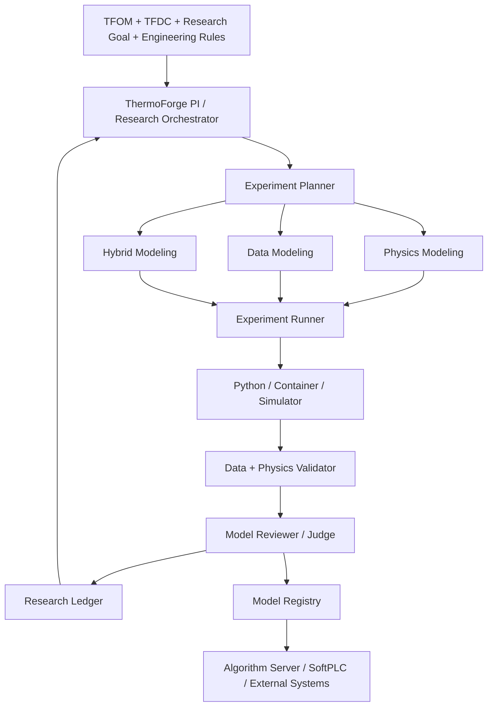

# 系统总体设计

## 1. 项目定位

ThermoForge 不是一个“让 LLM 写 Python 脚本”的工具，而是一个可长期运行的自动建模研究平台。系统接收四类输入：

- TFOM 物模型：设备是什么，包含哪些变量、参数、关系和约束。
- TFDC 数据：历史数据或实时数据及其完整语义。
- Research Goal：要研究的目标、候选输入、模型类型和验收条件。
- Engineering Rules：精度、物理一致性、时延、可解释性和部署限制。

系统持续执行：

```text
目标 → 假设 → 实验 → 证据 → 结论 → 知识 → 新假设
```

最终交付的不是单独的 `model.pkl`，而是包含签名、约束、指标、数据谱系和研究谱系的 Model Package。

## 2. 总体架构



## 3. 职责边界

### Agent 层负责

- 理解研究目标和当前证据。
- 发现和选择数据集，但不直接读取海量原始记录。
- 生成可审计的研究假设和实验计划。
- 选择物理、数据或混合建模路径。
- 调用确定性工具执行实验。
- 分析结果、解释失败并决定下一轮研究方向。
- 在满足验收条件后请求发布模型。

### 计算层负责

- Excel/Parquet 数据处理和质量分析。
- 参数辨识、统计回归和机器学习训练。
- ODE、非线性优化、灵敏度分析和 Monte Carlo。
- 历史回放、工况仿真、极端条件和约束测试。
- 生成结构化指标、图表、日志和模型制品。

### 契约与存储层负责

- TFOM、TFDC 和其他契约的版本管理。
- 数据导入、指纹、不可变版本和谱系。
- Dataset View 的定义、物化、哈希和复用。
- 研究账本、模型注册表和审计记录。

## 4. 建议组件

| 组件 | 主要职责 | 一期建议 |
|---|---|---|
| Pi Harness | 研究编排、工具调用、会话入口 | 保持轻量，只做控制面 |
| TFOM Registry | 管理对象模型与物理约束 | YAML + JSON Schema |
| TFDC Importer | 导入和校验 Excel | Python |
| Data Vault | 原始数据、Parquet、元数据、谱系 | 文件系统 + DuckDB + Parquet |
| Dataset Engine | 查询、画像、采样、Dataset View | DuckDB/Polars/Pandas |
| Experiment Runner | 隔离执行建模实验 | Python 子进程，后续容器化 |
| Validator | 数据、泛化、物理和运行时验证 | 结构化测试套件 |
| Research Ledger | 目标、假设、实验、发现和决策 | 文件制品 + DuckDB 索引 |
| Model Registry | 模型包版本和发布状态 | 文件系统，后续对象存储 |

## 5. Agent 角色

一期可以由一个主 Agent 顺序执行所有角色，不必立即实现并发多 Agent。逻辑角色包括：

| 角色 | 职责 |
|---|---|
| ThermoForge PI | 管理研究目标、预算、证据和下一步决策 |
| Data Scientist | 数据发现、质量分析、Dataset View 设计 |
| Physics Scientist | 建立物理方程、参数范围和守恒约束 |
| ML Scientist | 建立数据模型和可靠的基线 |
| Hybrid Scientist | 设计残差、参数或物理约束混合模型 |
| Experiment Engineer | 生成并执行可复现实验 |
| Model Reviewer | 独立检查指标、约束、泛化和发布条件 |

## 6. 推荐工具接口

Agent 只获取结构化摘要和有限样本，不把整份历史数据加载到上下文。

```text
tf_dataset_import
tf_dataset_list
tf_dataset_get
tf_dataset_schema
tf_dataset_profile
tf_dataset_query
tf_dataset_sample
tf_dataset_materialize
tf_dataset_compare

tf_goal_create
tf_research_status
tf_hypothesis_create
tf_experiment_plan
tf_experiment_run
tf_experiment_get
tf_model_compare
tf_model_publish
```

每个有副作用的工具必须返回稳定 ID、输入版本、状态和制品位置。Agent 不应通过自由文本猜测一次实验是否成功。

## 7. 建议仓库结构

```text
ThermoForge/
├── docs/
├── contracts/
│   ├── tfom/
│   ├── tfdc/
│   ├── research-goal/
│   ├── experiment/
│   └── model-package/
├── src/
│   ├── thermoforge_core/
│   ├── thermoforge_data/
│   ├── thermoforge_research/
│   ├── thermoforge_models/
│   └── thermoforge_runtime/
├── pi/
│   ├── extensions/
│   ├── skills/
│   └── prompts/
├── tests/
├── examples/
├── research/
└── vault/
```

`vault/` 和运行产生的 `research/` 制品默认不提交到 Git；契约、示例、代码和必要的小型固定测试数据应提交。

## 8. 设计决策

- Pi 是可替换的控制面，研究事实保存在契约和账本中。
- 原始数据只读，所有清洗和聚合都通过 Dataset View 表达。
- 所有科学计算通过确定性工具执行，并记录环境和随机种子。
- 发布决策必须由可机器检查的验收条件驱动。
- 先实现单机、可复现闭环，再演进到队列、容器和分布式 Worker。

