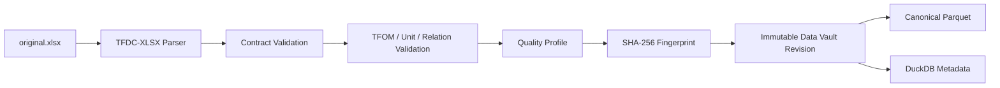

# TFDC 数据契约

## 1. 目标

TFDC（ThermoForge Data Contract）用于统一 Excel、数据库、API、MQTT、BACnet、OPC UA 和其他来源的数据语义。

Excel 只是 TFDC 的一种传输载体：

```text
TFDC
├── TFDC-XLSX
├── TFDC-JSON
├── TFDC-Parquet
├── TFDC-API
└── TFDC-MQTT
```

建模逻辑只依赖 TFDC，不依赖数据最初来自哪个系统。

## 2. 统一变量体系

### `property_code`

`property_code` 表示跨设备稳定的物模型属性，使用 `lower_snake_case`：

```text
evap_chw_supply_temp
evap_chw_return_temp
evap_chw_flow
cooling_capacity
input_power
supply_return_temp_diff
```

### `variable_id`

`variable_id` 表示具体对象实例上的属性：

```text
variable_id = object_id.property_code
```

示例：

```text
CH-01.evap_chw_supply_temp
CH-01.input_power
SYS-CHW.header_supply_temp
SYS-CHW.supply_return_temp_diff
```

`variable_id` 在 Excel、历史库、Dataset View、实验、模型签名、API、SoftPLC 和实时绑定中必须完全一致。算法内部可以使用矩阵列，但模型元数据必须保留每列到 `property_code` 或 `variable_id` 的映射。

## 3. TFOM 与 TFDC 的关系

- TFOM 回答“对象和属性是什么意思”。
- TFDC 回答“这些对象和属性的数据如何表达与交换”。

TFOM 应定义属性的名称、单位、类型、角色、合法范围、派生表达式和物理约束。例如：

```yaml
model_id: chilled_water_header
version: "1.0"
properties:
  header_supply_temp:
    name_zh: 冷冻水供水温度
    unit: Cel
    dtype: float
    role: state
  header_return_temp:
    name_zh: 冷冻水回水温度
    unit: Cel
    dtype: float
    role: state
  supply_return_temp_diff:
    name_zh: 供回水温差
    unit: Cel
    dtype: float
    role: derived
    expression: header_return_temp - header_supply_temp
```

如果数据同时提供供水温度、回水温度和温差，导入器应检查派生值一致性；超出容差时报告 `DATA_CONSISTENCY_ERROR`。

## 4. TFDC-XLSX v1.0

### 工作表

| Sheet | 必需 | 用途 |
|---|---:|---|
| `manifest` | 是 | 数据集身份、版本、时区和来源 |
| `objects` | 是 | 对象实例及其物模型 |
| `variables` | 是 | 变量语义、单位、角色和质量规则 |
| `data` | 是 | 带时区的历史时序数据 |
| `parameters` | 否 | 设备额定参数和固定参数 |
| `relations` | 否 | 对象之间的系统拓扑关系 |
| `bindings` | 否 | 现场点位、协议地址和外部字段绑定 |
| `events` | 否 | 启停、报警、维护和控制策略事件 |
| `quality` | 否 | 来源系统已有的质量标记 |

### `manifest`

采用 `key`、`value` 两列：

| key | value |
|---|---|
| contract | TFDC |
| contract_version | 1.0 |
| dataset_id | DC01_2026_CHILLER |
| dataset_version | 1 |
| site_id | DC01 |
| timezone | Asia/Shanghai |
| time_resolution | 60s |
| object_model_version | DC-HVAC-1.0 |
| source_system | BMS |
| created_at | 2026-08-08T12:00:00+08:00 |
| description | DC01 chiller historical data |

### `objects`

| object_id | object_model_id | object_name | parent_id | system_id |
|---|---|---|---|---|
| CH-01 | chiller.v1 | 冷水机1 | SYS-CHILLER | CHW |
| CH-02 | chiller.v1 | 冷水机2 | SYS-CHILLER | CHW |
| SYS-CHW | chilled_header.v1 | 冷冻水总管 | DC01 | CHW |

### `variables`

建议字段：

| 字段 | 说明 |
|---|---|
| `variable_id` | `object_id.property_code` |
| `object_id` | 必须存在于 `objects` |
| `property_code` | 必须存在于对应 TFOM |
| `name_zh` / `name_en` | 展示名称 |
| `unit` | 必须与 TFOM 兼容 |
| `dtype` | `float`、`integer`、`boolean`、`string` 等 |
| `role` | `state`、`control`、`disturbance`、`target`、`context`、`derived` |
| `source_kind` | `measured`、`derived`、`estimated`、`manual` |
| `nullable` | 是否允许缺失 |
| `min_value` / `max_value` | 工程合法范围 |
| `sample_period` | 期望采样周期 |
| `aggregation` | 重采样时的默认聚合方式 |
| `description` | 补充说明 |

示例：

| variable_id | object_id | property_code | unit | dtype | role | source_kind |
|---|---|---|---|---|---|---|
| CH-01.evap_chw_supply_temp | CH-01 | evap_chw_supply_temp | Cel | float | state | measured |
| CH-01.evap_chw_flow | CH-01 | evap_chw_flow | m3/h | float | state | measured |
| CH-01.input_power | CH-01 | input_power | kW | float | target | measured |

### `data`

第一列固定为 `timestamp`，其余列名必须精确匹配 `variables.variable_id`：

| timestamp | CH-01.evap_chw_supply_temp | CH-01.evap_chw_flow | CH-01.input_power |
|---|---:|---:|---:|
| 2026-01-01T00:00:00+08:00 | 6.8 | 521.2 | 412.5 |
| 2026-01-01T00:01:00+08:00 | 6.8 | 522.1 | 411.7 |

导入器不得根据“冷机功率”“power1”或“P”等近似名称进行猜测性映射。

### `parameters`

| object_id | parameter_code | value | unit |
|---|---|---:|---|
| CH-01 | rated_capacity | 3500 | kW |
| CH-01 | rated_power | 620 | kW |
| CH-01 | rated_chw_flow | 600 | m3/h |

### `relations`

| from_object | relation | to_object | port_from | port_to | medium | direction |
|---|---|---|---|---|---|---|
| CH-01 | chilled_water_to | SYS-CHW | evap_out | supply_in | water | forward |

### `bindings`

| variable_id | adapter | source_ref |
|---|---|---|
| CH-01.evap_chw_supply_temp | BACnet | device=3101,AI=7 |
| CH-01.input_power | OPCUA | ns=2;s=CH01.Power |
| SYS-CHW.header_supply_temp | MQTT | dc01/chw/supply_temp |

绑定信息只存在于 Adapter 边界；模型本身不得依赖现场地址。

## 5. Excel 硬性规则

- 只接受 `.xlsx`，拒绝 `.xlsm` 和宏。
- 禁止合并单元格。
- 第一行为表头，表头不得重复或为空。
- `data` 中只允许静态值，禁止公式和外部工作簿引用。
- `property_code` 使用 `lower_snake_case`。
- `variable_id` 大小写敏感。
- `timestamp` 使用带时区的 ISO 8601 格式。
- 缺失值使用空单元格，不使用 `NULL`、`N/A`、`--`、`9999` 等哨兵值。
- 单位必须与 TFOM 一致或可通过已登记的确定性规则转换。
- 未声明的数据列、多余变量、非法对象引用和重复时间戳必须显式报告。

## 6. 导入和 Data Vault



建议目录：

```text
vault/datasets/DC01_2026_CHILLER/rev_0001/
├── source/original.xlsx
├── canonical/
│   ├── data.parquet
│   ├── variables.parquet
│   ├── objects.parquet
│   └── parameters.parquet
├── manifest.json
├── quality.json
├── profile.json
├── lineage.json
└── fingerprint.json
```

原始 Excel 永久只读。相同内容可按指纹去重；内容变化必须创建新 revision，不能覆盖旧版本。实验必须引用完整版本，例如：

```text
DC01_2026_CHILLER@rev_0001
```

## 7. Dataset View

数据筛选、清洗、聚合和特征选择通过可版本化的 Dataset View 表达，禁止修改原始数据：

```yaml
view_id: VIEW-0021
dataset: DC01_2026_CHILLER@rev_0001
scope:
  object_model: chiller.v1
objects: [CH-01, CH-02, CH-03]
resolution: 5min
features:
  - evap_chw_supply_temp
  - evap_chw_return_temp
  - evap_chw_flow
  - cw_supply_temp
  - cooling_capacity
target: input_power
filter:
  operating_state: running
```

规范化后对 View 定义计算哈希。相同数据版本和相同 View 定义应复用同一份物化 Parquet。

构建通用设备模型时，由 Dataset Engine 将多个实例的 `variable_id` 转换为长表形式：

| object_id | timestamp | evap_chw_supply_temp | evap_chw_flow | input_power |
|---|---|---:|---:|---:|
| CH-01 | ... | 6.7 | 521.4 | 412.0 |
| CH-02 | ... | 6.8 | 519.2 | 405.0 |

该映射由契约引擎生成，不允许 Agent 自行重命名字段。

## 8. 数据质量报告

导入后至少输出：

- 时间范围、记录数、采样间隔及间隔漂移。
- 缺失率、重复时间戳、乱序和时间空洞。
- 每个变量的最小值、最大值、分位数和异常值数量。
- TFOM 范围违规、单位问题和派生量一致性问题。
- 设备、变量和工况覆盖情况。
- 原始文件指纹、契约版本和导入器版本。

