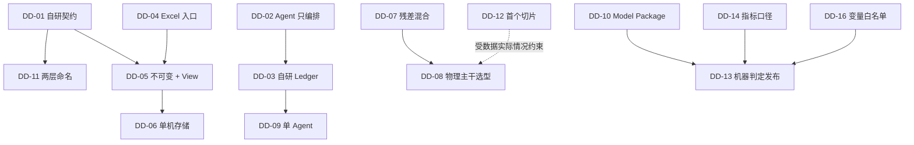

# 设计决策记录

现有设计文档陈述的是结论（「使用 DuckDB」「优先残差混合」「自研 TFOM」），但没有记录**为什么不选另一条路**。方案讨论阶段，备选与代价比结论本身更重要——结论可以推翻，判断依据不能丢失。

本文按决策记录（ADR）格式整理已隐含在文档中的关键取舍。每条包含问题、备选、理由、代价和复审触发条件。**代价一栏必须诚实**：没有代价的决策通常意味着分析不充分。

状态说明：**已采纳** = 已写入设计文档；**建议** = 本文首次提出，待确认；**待定** = 见 [开放议题](./open-questions.md)。

---

## DD-01 自研 TFOM / TFDC 契约

**状态**：已采纳（[data-contract.md](./data-contract.md)）

**问题**：建模需要统一的设备与数据语义。是自研，还是复用既有建筑语义标准？

**备选**

- **A. 自研 TFOM + TFDC**（当前选择）
- **B. 复用 Brick Schema**：开源的建筑元数据本体（RDF/OWL），描述设备、点位、拓扑关系
- **C. 复用 Project Haystack**：基于标签的点位命名与分类约定，工业界采用面广
- **D. 复用 ASHRAE 223P**：较新的建筑语义数据模型标准（成熟度与工具生态需自行评估）
- **E. 不做语义层**，每个项目现场对齐字段

**选择与理由**：现有标准的重心是**拓扑与分类**（这是什么设备、连接到哪里、点位属于哪一类），而建模需要的是**属性的物理语义**：单位、合法范围、派生表达式、守恒约束、角色（state/control/target）。Brick 和 Haystack 都不承载「`supply_return_temp_diff = return - supply`，容差 0.1 K」这类信息，而这正是导入校验和物理约束检查的依据。方案 E 则与「可复现、可跨项目复用」的核心目标直接冲突。

**代价**

- 自研标准需长期维护，且与生态隔离——无法直接消费已有 Brick 模型的站点数据。
- 增加落地摩擦：现场必须先做一次语义映射才能导入（见 [风险 R9](./risks.md)）。
- 存在重复造轮子的风险，尤其在 `relations`（拓扑）部分——这恰恰是 Brick 做得最好的地方。

**建议的折中**：TFOM 只承载**建模必需的物理语义**，`objects` / `relations` 的拓扑部分保留与 Brick 的映射能力，不自行发明设备分类体系。

**复审触发**：ASHRAE 223P 生态成熟并覆盖物理约束语义；或需要对接已有 Brick/Haystack 模型的站点。

---

## DD-02 Agent 只做编排，不做科学计算

**状态**：已采纳（[architecture.md §3](./architecture.md)）

**问题**：Agent 是调用预置工具，还是直接生成并执行分析代码？

**备选**

- **A. 预置确定性工具，Agent 只调用**（当前选择）
- **B. Code Interpreter 模式**：Agent 自由编写并执行 Python
- **C. 混合**：受限沙箱内允许生成代码，通过验证后固化为工具

**选择与理由**：可复现性是本方案的核心主张。生成式代码每次运行都可能不同，实验无法比较，也无法在几个月后重现。此外 Agent 直接处理数据会把大量原始记录带入上下文，成本高且不可靠。

**代价**

- **灵活性显著下降**。任何工具未覆盖的分析方法都需要先改代码再研究，研究节奏受工程节奏限制。
- 工具集设计不足会成为主要瓶颈——这是本决策最现实的失败模式。
- 「自主研究」的自主性被工具边界限定，实际更接近「在预定动作空间内的自动搜索」。

**复审触发**：工具覆盖不足被证实为闭环停滞的主因。届时转向方案 C：沙箱内生成代码，经验证后**固化为新工具**再纳入正式实验，而非直接采信一次性脚本的结果。

---

## DD-03 自研 Research Ledger，不直接采用现成 MLOps 平台

**状态**：已采纳（[research-loop.md §8](./research-loop.md)），但**建议复审**

**问题**：实验跟踪、制品存储、数据版本管理是否需要自己实现？

**备选**

- **A. 全自研**（当前选择：文件制品 + DuckDB 索引）
- **B. MLflow**：成熟的 run / 参数 / 指标 / 制品跟踪与模型注册
- **C. DVC**：数据与流水线版本管理，Git 原生
- **D. Kedro / Metaflow**：流水线编排框架
- **E. 在 B/C 之上叠加 Ledger 语义层**

**选择与理由**：现有工具记录的是「一次运行的参数和指标」，缺少本方案真正需要的语义——**假设、证据、发现、决策，以及它们之间的引用关系**。「哪些实验支持这个结论」「这个假设是否已被证伪」无法用 MLflow 的数据模型表达。

**代价**

- 重新实现了实验跟踪、制品存储、模型注册这些**已被充分解决**的问题，且质量大概率不如成熟工具。
- 失去现成的 UI、对比视图与生态集成。

**建议**：这是本文中最应被挑战的决策。合理路径是**方案 E**——研究语义层（Goal / Hypothesis / Finding / Decision）自研，因为它确实没有现成方案；而 run 跟踪与制品存储抽象为可替换后端，一期用文件 + DuckDB 实现（零依赖、便于起步），保留后续切换到 MLflow 的可能。**关键是现在就把接口分开**，而不是等到迁移时再重构。

**复审触发**：Phase 2 结束时评估自研跟踪层的实际维护成本。

---

## DD-04 Excel 作为一期数据入口

**状态**：已采纳（[data-contract.md §4](./data-contract.md)）

**问题**：一期从哪种数据载体接入？

**备选**：Excel（当前）／CSV／直连时序库或历史库／API 拉取

**选择与理由**：现场能实际拿到的、无需打通网络与权限的交付物，绝大多数情况就是 Excel 导出。选它是为了让方案在真实约束下可启动，而不是因为它技术上更优。

**代价**

- 规模上限硬性：单表 1,048,576 行 × 16,384 列，60s 分辨率约 2 年。
- **不存储时区**，导致契约必须引入「timestamp 必须是文本单元格」这类反直觉规则（见 [conventions §3.1](./conventions.md)）。
- 解析慢，百万行需分钟级。
- 现场导出的 Excel 通常包含合并单元格、多级表头、单位写在标题里——契约的硬性规则会导致大量文件一次导不进去（[风险 R9](./risks.md)）。

**缓解**：TFDC 从一开始就定义为多载体契约，Excel 只是其中之一。规模或增量更新成为问题时切换到 TFDC-Parquet，建模逻辑不变。这一设计是本决策代价可控的前提。

**复审触发**：单文件超过阈值，或需要增量/实时接入。

---

## DD-05 原始数据不可变 + Dataset View

**状态**：已采纳（[data-contract.md §6–7](./data-contract.md)）

**问题**：数据清洗结果存在哪里？

**备选**：原地清洗覆盖／每个实验各自预处理／不可变原始数据 + 可版本化 View（当前）

**选择与理由**：原地清洗使「用了哪版数据」永久不可考；各实验自行预处理则使实验之间不可比——两个模型的差异可能来自模型，也可能来自某人多加了一行 `dropna()`。View 把预处理提升为一等公民，可哈希、可复用、可比较。

**代价**

- 存储放大：原始 + 规范化 + 各 View 物化结果。
- View 定义语言需要设计并长期维护；表达能力不足时会诱使人绕过它。
- 增加一层概念，上手成本变高。

**复审触发**：View 表达能力被证实不足以覆盖常见预处理需求。

---

## DD-06 一期单机：文件系统 + DuckDB

**状态**：已采纳（[architecture.md §4](./architecture.md)）

**问题**：元数据与制品的存储后端？

**备选**：文件 + DuckDB（当前）／PostgreSQL + MinIO + 队列／云托管服务

**选择与理由**：一期唯一的使用者是研究闭环本身，并发度为 1。此时分布式基础设施的运维成本远超收益，且会让「跑起来」的门槛从分钟级变成天级。

**代价**

- **DuckDB 不支持多进程并发写**，并行实验需要额外设计（见 [implementation-notes §10.2](./implementation-notes.md)）。
- 单机容量与算力上限。
- 迁移到 Phase 5 架构时需要一次真实的数据迁移。

**复审触发**：出现并行实验需求、数据超单机容量、或引入多站点。

---

## DD-07 混合建模优先残差式

**状态**：已采纳（[research-loop.md §4](./research-loop.md)）

**问题**：三种混合方式（残差 / 参数 / 物理约束）先做哪个？

**选择与理由**：残差式 `Y = Y_physics + ML(X)` 实现最简单，且增益可直接量化——把 ML 项关掉就是物理基线。参数混合需要处理参数的可辨识性，物理约束模型需要在训练中引入约束求解，两者工程量都更大。

**代价与风险**

- **残差模型会吸收物理模型的系统性错误**。若物理主干缺少某个关键机理，ML 残差项会把它学走，指标很好但物理部分实际是错的——一旦工况超出训练范围，两部分同时失效。
- 残差项通常不满足物理约束（如单调性），混合后的整体行为可能违反物理直觉。

**强制配套要求**：任何残差混合实验**必须同时报告物理主干单独的指标**，以及残差项的量级占比。若残差项贡献了大部分预测能力，说明物理模型选择有问题，应回到建模而非继续调残差。这一点应写入实验模板。

**复审触发**：残差项占比持续过高；或需要模型在训练域外保持物理合理性。

---

## DD-08 物理模型：轻量参数化 + 现成物性库

**状态**：建议（当前文档只给了 `Q = m·Cp·ΔT` / `P = Q/COP` 的起点）

**问题**：物理主干从零推导，还是复用行业已有模型？

**备选**

- **A. 从第一性原理自行推导**（文档现状的默认读法）
- **B. 复用 EnergyPlus 的 `Chiller:Electric:EIR` 曲线模型**：以额定工况为基准，用三条曲线描述性能——容量随蒸发/冷凝温度变化（CAPFT）、能效比随温度变化（EIRFT）、能效比随部分负荷率变化（EIRFPLR）
- **C. 引入 Modelica Buildings Library 等完整机理库**
- **D. 用 CoolProp 等物性库提供水与制冷剂的密度、比热**

**建议**：**B + D**。`Chiller:Electric:EIR` 是行业验证多年的半经验模型，参数量适中、可辨识、可解释，天然覆盖温度与部分负荷两个主要影响维度，作为物理基线远优于从 `Q = m·Cp·ΔT` 现推——后者只是能量平衡，本身不构成功率模型。物性用 CoolProp 可避免自行处理密度/比热的温度依赖（见 [implementation-notes §6.1](./implementation-notes.md)）。

方案 C 引入的依赖重量级，与一期「单机可复现闭环」的定位不符。

**代价**

- 曲线模型的形式（通常为双二次多项式）本身是经验拟合，外推能力有限。
- 引入外部库需纳入 `environment.lock`，并确认许可证与部署环境的兼容性。

**复审触发**：曲线模型在实测数据上系统性失配，需要更强机理。

---

## DD-09 一期单 Agent 顺序扮演多角色

**状态**：已采纳（[architecture.md §5](./architecture.md)）

**理由**：并发多 Agent 会引入协调、冲突和不确定性，而一期需要先证明**闭环本身有效**。角色在逻辑上分离、在执行上串行，可以先验证职责划分是否合理，再决定是否物理拆分。

**代价**：串行导致研究吞吐低；单一上下文中扮演多角色时，「独立评审」的独立性存疑——Model Reviewer 与产出模型的是同一个上下文，容易自我确认。

**缓解建议**：Model Reviewer 的输入应**仅限结构化指标与验证报告**，不包含建模过程的推理轨迹，以降低确认偏误。这是一期就应遵守的约束，而非等到多 Agent 时再解决。

---

## DD-10 交付 Model Package 而非序列化权重

**状态**：已采纳（[model-package.md](./model-package.md)）

**理由**：模型上线后要回答「用了哪版数据」「通过了哪些验证」「怎么回滚」，单个权重文件无法承载这些信息。

**代价**：打包与校验流程增加发布摩擦；模型包结构一旦发布，其自身也成为需要版本管理的契约。

---

## DD-11 两层变量命名（`property_code` / `variable_id`）

**状态**：已采纳（[data-contract.md §2](./data-contract.md)）

**问题**：模型签名用通用属性名还是具体实例名？

**理由**：通用设备模型必须能部署到任意同类设备，签名若绑定 `CH-01` 则不可复用；但数据和实时绑定必须能定位到具体实例。两层命名同时满足二者，且转换规则是纯机械的。

**代价**：增加一层间接，实现中需要处理拼接与切分的边界情况（见 [conventions §1.1](./conventions.md)）；跨对象的系统级模型（如涉及多台设备的联合模型）在这套命名下表达笨拙，需要额外设计。

---

## DD-12 首个垂直切片：冷水机输入功率

**状态**：已采纳（[roadmap.md §8](./roadmap.md)），**2026-08-08 依据数据探查修订**

**理由**：冷水机功率模型同时涉及物理关系、多变量、跨设备泛化和部署签名，覆盖面广，是验证全链路的合适载体。

**探查后的修订（[data-survey §5](./data-survey.md)）**：对象保留，但**输入定义和验证方式必须改**。

原定候选输入中的 `cooling_capacity` 在实际数据中是 `电流百分比 × 96.72`，与目标功率同源——用它建模构成循环论证，且会以 MAPE 4.35% 通过原验收条件。单机温度则是冷冻水/冷却水总管公式的副本，四台机组数值完全相同。

修订后：

```text
目标：运行冷机总功率
输入：冷冻水总管 f / t_supply / t_return，冷却水总管 t_supply / t_return，室外温湿度，运行台数
禁用：chiller.load、chiller.电流百分比、chiller 的两个温度属性
验证：时间外推 + 负荷区间；不做留一设备验证（数据不支持）
```

表冷器方案已被排除——其流量与温度同样是总管公式的副本。

**连带影响**：DD-08 的物理模型选型需推迟——实测系统 COP 中位数 9.99~11.31，超出水冷离心机组的物理范围，须先解决量纲/标定问题（[data-survey §F6](./data-survey.md)）。

---

## DD-13 发布由机器可判定的验收条件驱动

**状态**：已采纳（[research-loop.md §7](./research-loop.md)）

**理由**：若发布依赖人工主观判断，则「自主研究」无法收敛，且容易在看到结果后调整标准（事后合理化）。

**代价**：硬阈值在初期必然定得不合理——定高了永远发布不了，定低了发布垃圾模型。且阈值本身需要版本管理，修改阈值必须留痕并说明理由，否则规则形同虚设。

**配套要求**：权重与阈值属于 Research Goal，Agent 在看到结果后不得修改（文档已有此规定）。补充建议：阈值的每次修订都应作为一条 Decision 记入账本。

---

## DD-14 指标以 CVRMSE 为主口径，并纳入偏差指标

**状态**：建议（当前文档指标集为 RMSE / MAE / MAPE / CVRMSE）

**理由**：MAPE 在低负荷区因分母趋零而不稳定，不适合作为主口径。更重要的是，现有指标**全部是绝对误差类，无法暴露系统性偏差**——一个恒定高估 3% 的模型可能 RMSE 良好，但用于能效优化会持续把工况推向错误方向。

**建议**：CVRMSE 作为主精度指标，**NMBE 作为必报的偏差指标**并单独设阈值，MAPE 保留为参考。详见 [implementation-notes §5](./implementation-notes.md)。

**实测支持（[data-survey §F4](./data-survey.md)）**：基线实验中多个模型的 NMBE 达到 −0.15 ~ −0.75，而同一模型的 MAPE 看起来并不异常。仅报绝对误差类指标确实会漏掉这一量级的系统性偏差，本建议已被数据证实必要。

**待确认**：这会改动 Research Goal 的 `acceptance` 结构，属 [开放议题](./open-questions.md)。

---

## DD-15 单位采用 UCUM

**状态**：建议（文档已使用 `Cel` / `m3/h` / `kW`，符合 UCUM 但未明示）

**理由**：需要一个大小写敏感、机器可解析、有量纲运算语义的单位体系。现有示例已事实上采用 UCUM 写法，明确声明可避免实现时各写各的。

**代价**：UCUM 写法对人不友好（`kW.h`、`m3/h`），需要维护别名表处理现场常见写法。详见 [conventions §2](./conventions.md)。

---

## DD-16 建模变量采用白名单制，允许跨设备取用

**状态**：已采纳（2026-08-08 与需求方确认；[research-loop.md §1](./research-loop.md)）

**问题**：Agent 设计实验时，能否从物模型的全量变量中自由选择输入特征？

**备选**

- **A. 白名单制**：只允许使用 Research Goal `candidate_inputs` 中列出的变量计算 `target`（当前选择）
- **B. 开放式特征选择**：Agent 自动从物模型全部变量中筛选，以统计相关性为准

**选择与理由**：选 A。需求方明确要求「只能使用指定的变量建模计算得到指定的变量」。此外，数据探查已给出开放式选择的反例——`冷水主机.load` 是电流百分比的重标定（[data-survey §F1](./data-survey.md)），若放任自动特征选择，这类泄漏/循环变量会以最高的统计相关性被优先选中，且能通过精度验收（见 DD-12 的循环论证分析）。白名单同时与 DD-02（有限动作空间）和 DD-13（机器可判定）一致：变量集合成为可在实验执行前机器校验的硬约束。

**代价**

- 发现白名单之外的有效变量需要先修订 Research Goal（留痕）再实验，研究自动化程度受限。
- 白名单质量直接决定研究上限——选错变量集合，闭环只会高效地产出无效模型。

**跨设备规则**：白名单条目**允许来自不同设备对象**（如用冷却塔的出水温度预测冷水机功率），以两层命名 `object.variable` 引用；跨设备不改变封闭性——未列入白名单的变量一律不可用。

**复审触发**：白名单维护被证实为研究停滞主因，或反复出现「真实有效变量不在名单内」的情况。届时可按 DD-02 方案 C 的思路，允许 Agent 提出变量增补**建议**（附证据），经确认后纳入白名单，而非直接放行。

---

## 决策依赖关系



推翻 DD-01 或 DD-02 会连带影响大部分下游决策；DD-04、DD-06、DD-08 相对独立，替换成本较低。

## 相关文档

- [范围、非目标与前提](./scope.md) — 这些决策所处的边界
- [可行性风险](./risks.md) — 决策失效时的表现与应对
- [开放议题](./open-questions.md) — 尚未做出的决策
- [文档总览](./README.md)
