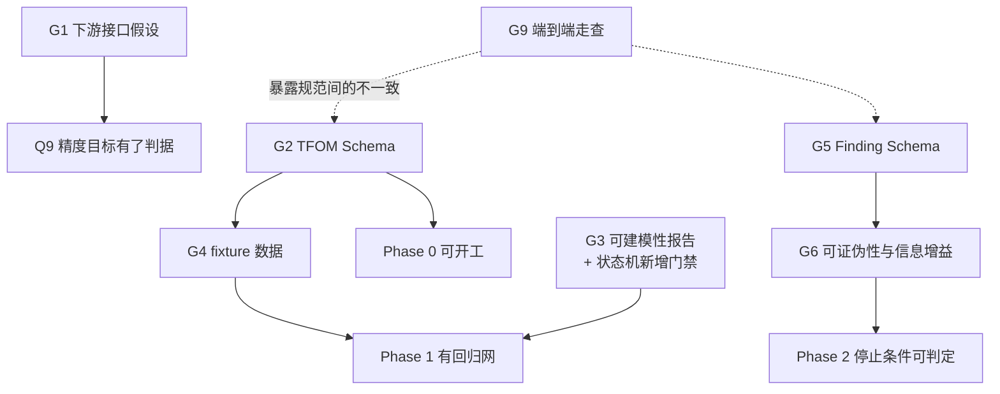

# 缺口分析

对方案做一次整体盘点：沿价值链逐环节检查覆盖度，找出**尚未设计**的部分。

与 [开放议题](./open-questions.md) 的区别：那里记录的是「已识别但未决定」的问题，本文记录的是「尚未被任何文档覆盖」的空白。两者的处理方式不同——前者需要决策，后者需要设计。

---

## 1. 价值链覆盖度

```text
数据源 → 接入 → 版本化 → 画像 → [可建模性判定] → 研究目标 → 假设 → 实验
      → 验证 → 评分 → 模型包 → 发布 → 部署 → [优化器] → [收益验证] → 证据回流
```

| 环节 | 覆盖文档 | 深度 | 评价 |
|---|---|---|---|
| 数据源与接入 | data-contract §4–5 | ●●●● | 充分，但**只有 XLSX 载体展开**，其余四种只有名字 |
| 版本化与谱系 | data-contract §6 | ●●●● | 充分 |
| 数据画像 | data-contract §8 | ●●○○ | 只有统计层，**缺语义层**（见 G3） |
| **可建模性判定** | — | ○○○○ | **完全空白**（见 G3） |
| 研究目标 | research-loop §1 | ●●○○ | 有示例无 Schema；权重与阈值来源未定 |
| 假设 | research-loop §3 | ●○○○ | **无 Schema、无可证伪性要求**（见 G6） |
| 实验 | research-loop §5 | ●●●● | 充分 |
| 验证 | research-loop §6 + implementation-notes §4 | ●●●● | 充分 |
| 评分 | research-loop §7 | ●●○○ | 维度齐全，权重机制未定 |
| 模型包 | model-package §1–5 | ●●●● | 充分 |
| 发布门禁 | model-package §8 | ●●●● | 充分 |
| 部署 | model-package §7 | ●○○○ | 只有一张链路图 |
| **优化器接口** | — | ○○○○ | **完全空白**（见 G1） |
| **收益验证** | risks R10 | ●○○○ | 只提了风险，无方法 |
| 证据回流 | model-package §7 | ●○○○ | 有方向，无机制 |
| **TFOM 契约** | data-contract §3 | ●○○○ | **贯穿全链路却只有一段示例**（见 G2） |

覆盖不均衡的规律很清楚：**中段（实验、验证、模型包）设计充分，两端（数据的语义质量、模型的下游价值）几乎空白**。这是从「怎么建模」出发写文档的自然结果，但两端恰恰是决定方案成败的地方——[数据探查](./data-survey.md)已经在数据端印证了这一点。

---

## 2. 第一梯队：阻断性缺口

### G1 下游价值链完全空白

**现状**：[scope.md §2](./scope.md) 把闭环控制执行和能效优化平台排除在范围外，[model-package.md §7](./model-package.md) 画了一张到 SoftPLC 的链路图，[roadmap.md](./roadmap.md) Phase 4 交付「算法服务器/SoftPLC 接口适配」——但**接口本身从未定义**，下游是否存在也从未确认。

**为什么是阻断级**：一个精确的冷机功率模型本身不产生任何价值，价值只在被优化器消费后才实现。而方案对优化器的了解为零：

- 它存在吗？是既有系统、待建系统，还是假设？
- 它需要什么形式的模型——单点预测、批量、可微、带梯度、还是带约束描述？
- 它的调用频率、延迟预算、失效降级策略是什么？
- 它能接受什么精度？（这是 [Q9](./open-questions.md) 真正的判据，目前无法回答）

排除某物的**实现**是合理的范围管理；连**接口**一起排除，等于把交付物扔进真空。

**需要补**：一份下游接口假设文档，即使暂时只能写成「假设优化器具备以下特征」，也比空白强。这同时会给 [Q4](./open-questions.md)（是否进入闭环控制）提供判据。

> **已回答（2026-08-09）**：下游消费者确认为两类——仿真（秒级动态模型，不要求可微）与算法寻优（静态模型，必须可微连续）。已固化为 [DD-17](./design-decisions.md)，含模型选型约束（树模型不得作为寻优模型）。寻优器的具体接口（调用频率、批量、降级策略）仍待确认。

### G2 TFOM 契约实际未定义

**现状**：TFOM 被 6 份文档引用——architecture 的组件表、data-contract 的校验、research-loop 的 `object_model`、model-package 的签名与兼容性、conventions 的 `quantity_kind` 建议、glossary。但它的规范只有 [data-contract §3](./data-contract.md) 里约 20 行的一个 YAML 示例，而 TFDC-XLSX 有 5 个小节。

**具体缺什么**：

| 缺口 | 影响 |
|---|---|
| 属性字段全集与必填性 | 无法写 Schema，Phase 0 无法交付 |
| `expression` 用什么语言、谁求值、如何防注入 | 派生量一致性检查（`TFDC-604`）无法实现 |
| 物理约束的表达语法 | 「COP < Carnot」这类约束写不出来，[research-loop §7](./research-loop.md) 的 Physics 评分维度落不了地 |
| 约束求值发生在哪一层 | 导入器？Validator？模型运行时？三者都需要，但共用什么实现？ |
| `parameters`（额定值）与 `properties`（时序属性）的关系 | 归一化特征（PLR）依赖此，[风险 R5](./risks.md) 的缓解措施依赖此 |
| 对象模型的继承或组合 | `chiller.v1` 与 `centrifugal_chiller.v1` 是什么关系？多站点复用时必然遇到 |
| 版本迁移 | `chiller.v1 → v2` 时已有数据集和模型包怎么办 |

**为什么是阻断级**：TFOM 是 Phase 0 的头号交付物，也是 [DD-01](./design-decisions.md) 的核心主张（「现有标准不承载物理语义，所以自研」）。主张成立与否，取决于自研的那部分究竟长什么样——而它现在还不存在。

### G3 语义层数据校验缺失，且状态机里没有位置

**现状**：[data-contract §8](./data-contract.md) 的质量报告有 6 类检查，全部是统计层的：时间范围、缺失率、分位数与异常值、范围违规、覆盖情况、指纹。

**问题**：[数据探查](./data-survey.md)发现的三个阻断级问题，**没有一个能被这 6 类检查发现**：

| 发现 | 性质 | §8 能否发现 |
|---|---|---|
| `load = 电流百分比 × 96.72` | 目标与输入同源 | ❌ 两列统计特征都正常 |
| 4 台冷机温度完全相同 | 设备间无区分度 | ❌ 每列单独看都合法 |
| 系统 COP 中位数 9.99 | 量纲/标定不自洽 | ❌ 需要跨变量的物理知识 |

这类检查属于**语义层**：它们关心变量之间的关系，而非单变量的分布。

**同时，研究状态机里没有对应的状态**。当前流程是 `DATA_PROFILING → BASELINE_MODELING`，缺一个判定「这份数据能否支撑这个研究目标」的门禁。若存在该门禁，本次探查发现的循环论证会在建模之前被拦下，而不是产出一个 MAPE 4.35%、通过验收、物理内容为零的模型。

**需要补**：

1. **可建模性报告**（Modelability Report），作为画像的语义层补充，至少包含：
   - 派生链分析：目标的上游依赖是否出现在候选输入中
   - 同源检测：候选输入与目标的相关性是否高到不合理（本例 R² = 0.966 且指标完全相同）
   - 设备区分度：同类实例之间输入是否有实质差异
   - 物理自洽：由数据算出的关键无量纲量（COP、效率、PLR）是否落在物理可能范围
   - 有效工况覆盖：目标可用样本占比、时间与负荷分布
2. **状态机新增状态** `MODELABILITY_ASSESSMENT`，位于 `DATA_PROFILING` 与 `BASELINE_MODELING` 之间，未通过则不允许进入建模。

这是本次探查带来的最直接的方案改进，也是最容易被证明有价值的一条。

### G4 Phase 0 的固定测试数据不存在

**现状**：[roadmap.md](./roadmap.md) Phase 0 要求交付「一份冷水机示例物模型和一份小型 Excel 固定测试数据」。

**问题**：现有 `data/` 中的工作簿不能充当这个角色——43.8 MB（不是「小型」）、违反 6 条硬性规则、合规状态未确认、且疑似仿真生成（[Q10](./open-questions.md)）。

**依赖链**：构造合规的 TFDC-XLSX fixture 需要先有 TFOM Schema（G2）→ 而 [implementation-notes §13](./implementation-notes.md) 要求「每个错误码一个 fixture」，共约 50 份 → 这些 fixture 是导入器唯一可靠的回归网。

**结论**：G2 不解决，Phase 0 与 Phase 1 都无法真正开工。这是当前的关键路径。

---

## 3. 第二梯队：方案完整性缺口

### G5 「证据」没有结构，可机器验证的引用无法成立

方案的核心主张之一是「假设必须引用已有证据，禁止无理由随机尝试模型」（[research-loop §3](./research-loop.md)）。但 Ledger 中 Finding 的形式是 `findings/F-0017.md`——**自由文本 markdown**。

自由文本的 Finding 意味着「引用证据」只能是 LLM 自述，无法机器校验。闭环因此退化为：Agent 说它引用了证据，系统相信它。这与「研究事实不存在于 LLM 上下文中」的设计原则冲突。

**需要补**：Finding 的结构化 Schema，至少包含断言、支持它的实验 ID 列表、适用工况域、置信度、**证伪条件**、状态（active / superseded / refuted）。有了适用域，才能判断一条旧发现是否适用于新工况；有了证伪条件，才能在后续实验中自动检验它。

### G6 假设的可证伪性与「信息增益」未定义

[research-loop §9](./research-loop.md) 的停止条件之一是「连续若干轮没有产生显著信息增益」，但**信息增益从未定义**。候选定义至少有四种，彼此不等价：指标改善幅度、被排除的假设数量、预测不确定性的缩小、新覆盖的工况域。不定义就无法作为停止条件，闭环可能空转直到预算耗尽。

同样，方案要求假设引用证据，但没要求假设**可证伪**——即「什么样的实验结果会推翻它」。不可证伪的假设（如「模型在复杂工况下表现不佳」）无法驱动实验设计。一个自称研究系统的方案，缺了科学方法论里最基本的这一条。

### G7 动态与时序建模在契约中没有位置

全部文档中，动态建模只出现一次：[research-loop §4](./research-loop.md) 提到「时序模型」作为候选之一。但相关的契约、验证方式和部署形态都不存在：

- Experiment Contract 无法表达状态空间模型、时滞或初始状态。
- 评分表有 Stability 维度（「长时间仿真是否漂移或发散」），但没有对应的验证方法。
- 有状态推理的部署形态只在 [implementation-notes §9.1](./implementation-notes.md) 被打了个补丁（`history_required`），那是接口层的权宜之计，不是建模方法论。

**这不是理论顾虑**：[数据探查 F5](./data-survey.md) 显示冷冻水温差全年只在 4.57–5.05 K 变动，说明系统处于强反馈控制之下。这类系统的输入输出关系被控制回路耦合，稳态映射 `Y = f(X)` 是否足够，需要方案明确表态。

### G8 系统级与跨对象建模的表达缺口

[DD-11](./design-decisions.md) 已承认「跨对象的系统级模型在两层命名下表达笨拙」，[Q3](./open-questions.md) 也把单设备与系统级列为未决。但 `relations` 契约只有一行示例，而系统级建模（多台设备联合、拓扑约束、能量在设备间的传递）需要的表达能力远不止于此。

若下游优化的对象是冷站整体（这是最可能的情形），系统级建模就不是可选项。缺口需要在 Q3 决策前先摸清楚。

### G9 没有一份端到端的走查示例

所有文档都是**规范性**的：定义字段、约束、状态、规则。没有一份是**叙事性**的——完整展示一次研究从目标到模型包的实际过程：Agent 看到什么、调用了哪些工具、返回了什么、如何据此提出下一个假设、人在哪里介入、最终产物长什么样。

这对方案评审是实质障碍：评审者无法从规范推想出系统实际如何运转，也就无法判断设计是否合理。补一份走查文档的成本很低，价值很高——它往往会暴露规范之间的不一致。

---

## 4. 第三梯队：工程与运行缺口

| # | 缺口 | 现状 | 影响 |
|---|---|---|---|
| G10 | **人工审批的交互形式** | research-loop 与 roadmap 都提到「人工审批点」，但没有形式 | 人要看到什么信息才能决定批不批？审批成本直接决定 [Q2](./open-questions.md) 自主程度的可行性 |
| G11 | **安全与权限边界** | 完全没有 | Agent 可写文件、可发布模型。谁能触发发布？若走开源（[Q1](./open-questions.md) B），他人运行时的沙箱边界是什么？ |
| G12 | **成本量级估算** | [风险 R9](./risks.md) 只提了「不可控」 | 一轮研究大约多少 token、多少机时、多少钱？方案阶段缺数量级估算就无法判断可行性 |
| G13 | **契约演进的迁移机制** | [conventions §6](./conventions.md) 定义了版本规则，但没有迁移路径 | TFDC 1.0 → 2.0 时，已有的数据集 revision、实验记录、模型包如何处理 |
| G14 | **可观测性与研究过程调试** | implementation-notes 提了结构化日志 | 闭环产出坏结论时，如何定位是数据、工具还是推理的问题？如何回放一次研究？ |
| G15 | **实时数据路径** | TFDC 定义了 5 种载体，只展开了 XLSX | 而 [model-package §6](./model-package.md) 已假设实时 API 存在，两者之间有断层 |
| G16 | **文档语言策略** | README 中英混排，docs 全中文 | 若 [Q1](./open-questions.md) 选「开源框架」，需要英文文档。该决定悬置，语言策略也悬置 |

---

## 5. 明确不算缺口

以下内容确实没有，但属于**已被正确推迟**，不应计入缺口：

- UI、多租户、权限体系、分布式基础设施 —— [scope.md §2](./scope.md) 已明示排除，[roadmap.md](./roadmap.md) Phase 5 已规划。
- 故障诊断（FDD）—— 已明示为独立方向。
- 全楼动态仿真 —— 已明示归属专业仿真工具。
- 并发多 Agent —— [DD-09](./design-decisions.md) 已给出推迟理由与复审触发条件。

区别在于：这些有明确的排除理由和复审条件，而第一、二梯队的缺口是**没有被想到**或**被默认为已解决**。

---

## 6. 建议补齐顺序

依赖关系决定顺序，而非重要性：



**建议的前三件事**：

1. **G9 端到端走查** —— 成本最低、见效最快。写一遍完整流程会同时暴露 G2、G5、G10 的具体缺口，让后续设计有的放矢。
2. **G2 TFOM Schema** —— 关键路径。它一天不定，Phase 0 和 Phase 1 就一天开不了工。
3. **G3 可建模性判定** —— 本次数据探查已经证明了它的价值：它能拦下一个会「通过验收」的错误模型。把探查中做的检查固化成组件和状态机门禁，是把一次性发现变成系统能力的唯一方式。

G1 需要外部信息（下游是否存在、需要什么），应尽早发起询问，但不阻塞上述三项。

## 相关文档

- [开放议题](./open-questions.md) —— 已识别但未决定的问题（本文记录的是未被覆盖的空白）
- [范围、非目标与前提](./scope.md) · [设计决策记录](./design-decisions.md) · [可行性风险](./risks.md)
- [数据探查报告](./data-survey.md) —— G3 的直接依据
- [文档总览](./README.md)
