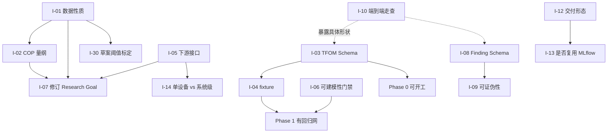

# 待办问题清单

跨文档的统一问题索引。[开放议题](./open-questions.md)、[缺口分析](./gap-analysis.md)、[可行性风险](./risks.md) 和 [数据探查报告](./data-survey.md) 各自记录了一部分问题，本文把它们汇成一份可跟踪、可分配的扁平清单。

**每条问题的详细背景在各自的源文档中，本文只做索引、定级和依赖关系。** 条目编号 `I-NN` 可直接对应 Issue 编号。

状态说明：`待确认` 需外部信息 · `待决策` 需项目方拍板 · `待设计` 可内部完成 · `待修复` 已定位待动手

---

## 优先级总表

| ID | 问题 | 类型 | 需要谁 | 状态 | 源 |
|---|---|---|---|---|---|
| **P0 — 阻断，不解决无法开工** ||||||
| I-01 | 确认 `data/` 工作簿是仿真生成还是现场采集 | 数据 | 数据提供方 | 待确认 | [Q10](./open-questions.md) [F9](./data-survey.md) |
| I-02 | 系统 COP 中位数 9.99–11.31，超出物理范围 | 数据 | 领域专家 | 待确认 | [F6](./data-survey.md) |
| I-03 | TFOM 契约实际未定义 | 缺口 | 设计 | 待设计 | [G2](./gap-analysis.md) |
| I-04 | Phase 0 的固定测试数据不存在 | 缺口 | 设计 | 待设计 | [G4](./gap-analysis.md) |
| **P1 — 高，影响方案成立性** ||||||
| I-05 | 下游优化器接口完全空白 | 缺口 | 项目方 + 设计 | 待确认 | [G1](./gap-analysis.md) |
| I-06 | 语义层数据校验缺失，状态机缺门禁 | 缺口 | 设计 | 待设计 | [G3](./gap-analysis.md) |
| I-07 | Research Goal 需修订：剔除循环输入、重设验收条件 | 契约 | 设计 | 待设计 | [F1](./data-survey.md) [DD-12](./design-decisions.md) |
| I-08 | Finding 缺结构化 Schema，证据引用无法机器验证 | 缺口 | 设计 | 待设计 | [G5](./gap-analysis.md) |
| I-09 | 假设的可证伪性与「信息增益」未定义 | 缺口 | 设计 | 待设计 | [G6](./gap-analysis.md) |
| I-10 | 缺一份端到端走查示例 | 缺口 | 设计 | 待设计 | [G9](./gap-analysis.md) |
| I-11 | 需要独立的规范化预处理工具 | 缺口 | 设计 | 待设计 | [R8](./risks.md) |
| I-12 | 交付形态：内部工具 / 开源框架 / 产品化平台 | 决策 | 项目方 | 待决策 | [Q1](./open-questions.md) |
| I-13 | 跟踪层是否复用 MLflow，接口现在就要分离 | 决策 | 项目方 + 设计 | 待决策 | [Q7](./open-questions.md) [DD-03](./design-decisions.md) |
| I-14 | 建模对象是单设备还是系统级 | 决策 | 项目方 | 待决策 | [Q3](./open-questions.md) |
| I-15 | `data/` 工作簿的多处完整性缺陷 | 数据 | 数据提供方 | 待修复 | [F7](./data-survey.md) |
| **P2 — 中，不阻塞当前阶段** ||||||
| I-16 | 动态与时序建模在契约中没有位置 | 缺口 | 设计 | 待设计 | [G7](./gap-analysis.md) |
| I-17 | 系统级建模的表达能力与 `relations` 契约 | 缺口 | 设计 | 待设计 | [G8](./gap-analysis.md) |
| I-18 | 契约级议题 C1–C9（打包处理） | 契约 | 设计 | 待决策 | [C1–C9](./open-questions.md) |
| I-19 | 人工审批的交互形式 | 缺口 | 设计 | 待设计 | [G10](./gap-analysis.md) |
| I-20 | 安全与权限边界 | 缺口 | 设计 | 待设计 | [G11](./gap-analysis.md) |
| I-21 | 成本量级估算 | 缺口 | 设计 | 待设计 | [G12](./gap-analysis.md) |
| I-22 | 契约演进的迁移机制 | 缺口 | 设计 | 待设计 | [G13](./gap-analysis.md) |
| I-23 | 可观测性与研究过程调试 | 缺口 | 设计 | 待设计 | [G14](./gap-analysis.md) |
| I-24 | 实时数据路径（TFDC-API / MQTT） | 缺口 | 设计 | 待设计 | [G15](./gap-analysis.md) |
| I-25 | 文档语言策略 | 缺口 | 项目方 | 待决策 | [G16](./gap-analysis.md) |
| I-26 | 「自主」到什么程度算成功 | 决策 | 项目方 | 待决策 | [Q2](./open-questions.md) |
| I-27 | 是否最终进入闭环控制 | 决策 | 项目方 | 待决策 | [Q4](./open-questions.md) |
| I-28 | 与既有 BMS / 能效平台的关系 | 决策 | 项目方 | 待决策 | [Q5](./open-questions.md) |
| I-29 | 是否复用 Brick / Haystack / 223P | 决策 | 项目方 + 设计 | 待决策 | [Q6](./open-questions.md) |
| I-30 | 各文档中 **[草案]** 阈值的标定 | 实现 | 设计 | 待确认 | [conventions §8](./conventions.md) [implementation-notes §14](./implementation-notes.md) |

---

## P0 详情

### I-01 确认数据性质：仿真还是现场采集

**背景**：多项证据指向 `data/` 工作簿是由少量驱动序列 + Excel 公式生成——2,955,883 个公式单元格；两条物理独立的总管有逐点相同的温度序列；`air_inlet_temp` 中位数恰为 24.000，湿度恰好卡在 44.000–66.000；「测量」字段带 10 位以上小数。

**为什么是 P0**：若确为仿真，数据中的「物理关系」就是生成它的公式，模型学到的只是这些公式。本次测出的 8.9% 精度基线不代表真实数据的可达水平，[I-07](#i-07-research-goal-需修订) 的验收条件也就没有依据。

**同时需要确认**：该文件已随公开仓库发布，其授权范围与是否需要脱敏。

**需要谁**：数据提供方。**阻塞**：I-02、I-07、I-30。

### I-02 系统 COP 超出物理范围

**背景**：实测 `sum(load)/sum(power)` 的 p05–p95 为 8.95–10.80，`Q_表头/sum(power)` 为 8.21–27.39。水冷离心机组的实际 COP 通常在 5–7。同时两种制冷量口径相差 p50 +10.4%、p95 +62%，彼此不自洽。

根源疑似 `load = 电流百分比 × 9672/100` 中的 `9672` 常数——它与冷机功率量级（最大 917–1099 kW）组合出的名义 COP ≈ 9.67。

**需要确认**：`9672` 的含义与单位；`电流百分比 = 100%` 对应什么工况；`power` 的单位与计量口径。

**为什么是 P0**：在此之前不应开展任何物理建模——物理主干若建立在错误的标定上，后续所有实验都是无效的。

**需要谁**：领域专家 / 数据提供方。

### I-03 TFOM 契约实际未定义

**背景**：TFOM 被 6 份文档引用、贯穿全链路，但规范只有 [data-contract §3](./data-contract.md) 里约 20 行的 YAML 示例，而 TFDC-XLSX 有 5 个小节。

**需要交付**：

- 属性字段全集与必填性
- `expression` 的语言、求值方（含注入防护）
- 物理约束的表达语法（如何写「COP < Carnot」）与求值层次
- `parameters`（额定值）与 `properties`（时序属性）的关系
- 对象模型的继承或组合规则
- 版本迁移规则

**为什么是 P0**：它是 Phase 0 的头号交付物，也是 [DD-01](./design-decisions.md)「自研契约」主张成立与否的依据。**它一天不定，Phase 0 和 Phase 1 就一天开不了工。**

**需要谁**：设计（可内部完成）。**阻塞**：I-04，以及整个 Phase 0/1。

### I-04 Phase 0 的固定测试数据不存在

**背景**：[roadmap](./roadmap.md) Phase 0 要求「一份冷水机示例物模型和一份小型 Excel 固定测试数据」。现有工作簿不能充当——43.8 MB、违反 6 条硬性规则、合规状态未确认、疑似仿真。

**需要交付**：一份合规、小型、可公开的合成 TFDC-XLSX；以及 [implementation-notes §13](./implementation-notes.md) 要求的「每个错误码一个 fixture」（约 50 份）。后者是导入器唯一可靠的回归网。

**依赖**：I-03。

---

## P1 详情（摘要）

| ID | 要点 |
|---|---|
| **I-05** | scope 排除优化器的**实现**是合理的范围管理，但连**接口**一起排除等于把交付物扔进真空。需要确认：优化器是否存在？需要什么形式的模型（单点/批量/可微/带约束）？调用频率与延迟预算？能接受什么精度？最后一项是 [Q9](./open-questions.md) 真正的判据。 |
| **I-06** | 本次发现的三个阻断问题，现有质量报告的 6 类统计检查**一个都发现不了**。需新增「可建模性报告」（派生链分析、目标同源检测、设备区分度、物理自洽、有效工况覆盖），并在状态机中新增 `MODELABILITY_ASSESSMENT` 门禁，位于 `DATA_PROFILING` 与 `BASELINE_MODELING` 之间。 |
| **I-07** | 目标保留为冷机总功率，但必须禁用 `chiller.load`、`chiller.电流百分比`（与目标同源）、`chiller.condenser_return_t` / `evaporator_supply_t`（表头公式副本，无设备区分度）；取消留一设备验证；`mape_max: 0.05` 改为基于实测基线的 CVRMSE ≤ 0.10、NMBE ±0.02，并把 NMBE 纳入必报。 |
| **I-08** | Ledger 中 Finding 是自由文本 markdown，导致「假设必须引用证据」只能是 LLM 自述。需要 Schema：断言、支持实验 ID 列表、适用工况域、置信度、**证伪条件**、状态（active/superseded/refuted）。 |
| **I-09** | 停止条件依赖的「显著信息增益」从未定义，候选定义至少四种且互不等价。同时应要求假设声明证伪条件——不可证伪的假设无法驱动实验设计。 |
| **I-10** | 所有文档都是规范性的，没有一份叙事性地展示一次研究实际怎么跑。**成本最低、见效最快**，写一遍会同时暴露 I-03、I-08、I-19 的具体形状。 |
| **I-11** | 现有工作簿违反 6 条硬性规则，导入器第一步就会中止。结论不是放松校验，而是提供独立的规范化预处理工具，把「修数据」与「校验数据」分成两个阶段；并让导入失败时输出可操作的修复清单而非仅错误码。 |
| **I-12** | 决定后续所有抽象层级。仓库当前 MIT 开源，形式上指向「可复用框架」，需确认是否为实质目标。 |
| **I-13** | 研究语义层（Goal/Hypothesis/Finding/Decision）确实无现成方案，但 run 跟踪与制品存储是已被充分解决的问题。建议跟踪层抽象为可替换后端——**这个抽象现在就要做**，否则后续迁移等于重写。 |
| **I-14** | 若下游优化对象是冷站整体（最可能的情形），系统级建模就不是可选项，`relations` 契约现在就不能敷衍。依赖 I-05 的答复。 |

### I-15 数据文件的完整性缺陷

需数据提供方核实并修复：

| 缺陷 | 详情 | 错误码 |
|---|---|---|
| 冷却塔表全空 | 20 列 × 35,040 行无任何数据 | `TFDC-306` |
| 集总负载 6/7 属性为空 | 仅 `load` 有值 | `TFDC-306` |
| 冷冻水泵时间轴损坏 | 36,608 行（其余表 35,040）；2,049 行重复时间戳；76 次时间倒流；序列止于 12-26 而非 12-31 | `TFDC-503/504` |
| 布尔字段出现 19 | `chwp_02.fault_alarm` 与 `maintenance_status` | `TFDC-404` |
| 负流量 | `冷却水总管.f` 最小 −1837.83 m³/h | `TFDC-602` |
| 负制冷量 | `集总负载.load` 最小 −29,247.9 | `TFDC-601` |
| 功率与电流零值不一致 | `chiller_01.power` 9,594 个零值 vs `电流百分比` 21,630 个零值 | `TFDC-604` |
| 表头行标签互换 | 冷冻水泵表「物模型」行装的是实例名 `chwp_01` | — |

---

## 依赖关系与建议顺序

**建议的动作顺序**

1. **立即发起询问**：I-01、I-02、I-05、I-15 —— 都需要外部信息，回复周期不可控，应最早发出。
2. **并行开展设计**：I-10（成本最低，先做）→ I-03（关键路径）→ I-06、I-08。
3. **待项目方拍板**：I-12、I-14、I-26 ~ I-29。
4. **收到数据方答复后**：I-07、I-30。

## 相关文档

- [开放议题](./open-questions.md) —— 待决策问题的完整判据
- [缺口分析](./gap-analysis.md) —— 设计空白的完整论证
- [可行性风险](./risks.md) · [数据探查报告](./data-survey.md)
- [文档总览](./README.md)
