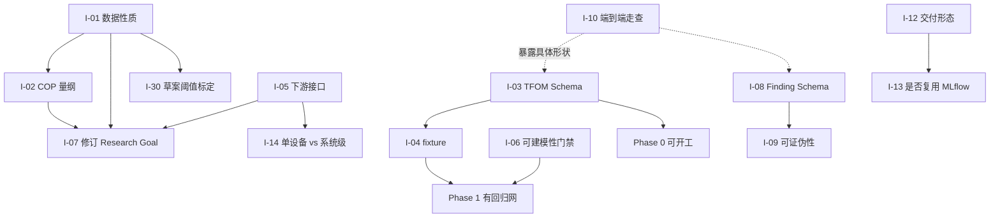

# 待办问题清单

跨文档的统一问题索引。[开放议题](./open-questions.md)、[缺口分析](./gap-analysis.md)、[可行性风险](./risks.md) 和 [数据探查报告](./data-survey.md) 各自记录了一部分问题，本文把它们汇成一份可跟踪、可分配的扁平清单。

**每条问题的详细背景在各自的源文档中，本文只做索引、定级和依赖关系。** 条目编号 `I-NN` 可直接对应 Issue 编号。

状态说明：`待确认` 需外部信息 · `待决策` 需项目方拍板 · `待设计` 可内部完成 · `待修复` 已定位待动手

---

## 优先级总表

| ID | 问题 | 类型 | 需要谁 | 状态 | 源 |
|---|---|---|---|---|---|
| **P0 — 阻断，不解决无法开工** ||||||
| I-01 | 确认 `data/` 工作簿是仿真生成还是现场采集 | 数据 | 数据提供方 | 待确认 | [Q10](./open-questions.md) [F9](./data-survey.md) |
| I-02 | 系统 COP 中位数 9.99–11.31，超出物理范围 | 数据 | 领域专家 | 待确认 | [F6](./data-survey.md) |
| I-03 | TFOM 契约实际未定义 | 缺口 | 设计 | 待设计 | [G2](./gap-analysis.md) |
| I-04 | Phase 0 的固定测试数据不存在 | 缺口 | 设计 | 待设计 | [G4](./gap-analysis.md) |
| **P1 — 高，影响方案成立性** ||||||
| I-05 | 下游优化器接口完全空白 | 缺口 | 项目方 + 设计 | 待确认 | [G1](./gap-analysis.md) |
| I-06 | 语义层数据校验缺失，状态机缺门禁 | 缺口 | 设计 | 待设计 | [G3](./gap-analysis.md) |
| I-07 | Research Goal 需修订：剔除循环输入、重设验收条件 | 契约 | 设计 | 待设计 | [F1](./data-survey.md) [DD-12](./design-decisions.md) |
| I-08 | Finding 缺结构化 Schema，证据引用无法机器验证 | 缺口 | 设计 | 待设计 | [G5](./gap-analysis.md) |
| I-09 | 假设的可证伪性与「信息增益」未定义 | 缺口 | 设计 | 待设计 | [G6](./gap-analysis.md) |
| I-10 | 缺一份端到端走查示例 | 缺口 | 设计 | 待设计 | [G9](./gap-analysis.md) |
| I-11 | 需要独立的规范化预处理工具 | 缺口 | 设计 | 待设计 | [R8](./risks.md) |
| I-12 | 交付形态：内部工具 / 开源框架 / 产品化平台 | 决策 | 项目方 | 待决策 | [Q1](./open-questions.md) |
| I-13 | 跟踪层是否复用 MLflow，接口现在就要分离 | 决策 | 项目方 + 设计 | 待决策 | [Q7](./open-questions.md) [DD-03](./design-decisions.md) |
| I-14 | 建模对象是单设备还是系统级 | 决策 | 项目方 | 待决策 | [Q3](./open-questions.md) |
| I-15 | `data/` 工作簿的多处完整性缺陷 | 数据 | 数据提供方 | 待修复 | [F7](./data-survey.md) |
| **P2 — 中，不阻塞当前阶段** ||||||
| I-16 | 动态与时序建模在契约中没有位置 | 缺口 | 设计 | 待设计 | [G7](./gap-analysis.md) |
| I-17 | 系统级建模的表达能力与 `relations` 契约 | 缺口 | 设计 | 待设计 | [G8](./gap-analysis.md) |
| I-18 | 契约级议题 C1–C9（打包处理） | 契约 | 设计 | 待决策 | [C1–C9](./open-questions.md) |
| I-19 | 人工审批的交互形式 | 缺口 | 设计 | 待设计 | [G10](./gap-analysis.md) |
| I-20 | 安全与权限边界 | 缺口 | 设计 | 待设计 | [G11](./gap-analysis.md) |
| I-21 | 成本量级估算 | 缺口 | 设计 | 待设计 | [G12](./gap-analysis.md) |
| I-22 | 契约演进的迁移机制 | 缺口 | 设计 | 待设计 | [G13](./gap-analysis.md) |
| I-23 | 可观测性与研究过程调试 | 缺口 | 设计 | 待设计 | [G14](./gap-analysis.md) |
| I-24 | 实时数据路径（TFDC-API / MQTT） | 缺口 | 设计 | 待设计 | [G15](./gap-analysis.md) |
| I-25 | 文档语言策略 | 缺口 | 项目方 | 待决策 | [G16](./gap-analysis.md) |
| I-26 | 「自主」到什么程度算成功 | 决策 | 项目方 | 待决策 | [Q2](./open-questions.md) |
| I-27 | 是否最终进入闭环控制 | 决策 | 项目方 | 待决策 | [Q4](./open-questions.md) |
| I-28 | 与既有 BMS / 能效平台的关系 | 决策 | 项目方 | 待决策 | [Q5](./open-questions.md) |
| I-29 | 是否复用 Brick / Haystack / 223P | 决策 | 项目方 + 设计 | 待决策 | [Q6](./open-questions.md) |
| I-30 | 各文档中 **[草案]** 阈值的标定 | 实现 | 设计 | 待确认 | [conventions §8](./conventions.md) [implementation-notes §14](./implementation-notes.md) |
| I-31 | `objects.parent_id` 示例引用未登记对象，成员资格无法强制 | 契约 | 设计 | 待决策 | [data-contract §4](./data-contract.md)（Phase 0 实现发现） |
| I-32 | `content_sha256` 未明示 `timestamp` 列是否参与指纹 | 契约 | 设计 | 待决策 | [conventions §5.2](./conventions.md)（Phase 0 实现发现） |
| I-33 | 温差别名 `Cel` 与温度规范单位同名，单位消歧依赖 `quantity_kind` 贯穿全链路 | 契约 | 设计 | 待确认 | [conventions §2.1–2.2](./conventions.md)（Phase 0 实现发现） |
| I-34 | 契约缺少通用「记录值非法」错误码，部分校验失败暂归入近义码 | 契约 | 设计 | 待决策 | Phase 1 实现发现 |
| I-35 | TFDC-502 授权降级后按 WARN 呈现，注册表主级别为 ERROR | 契约 | 设计 | 待决策 | Phase 1 实现发现 |
| I-36 | 旧格式工作簿 `runtime_accum` 原始单位未确认，暂按 `s` 登记 | 数据 | 数据提供方 | 待确认 | Phase 1 实现发现 |
| I-37 | 旧格式适配器的 0/1→布尔转换属适配层登记规则，需数据提供方确认语义 | 数据 | 数据提供方 | 待确认 | Phase 1 实现发现 |
| I-38 | Experiment 契约 `hyperparameters` 只支持标量，physics 输入映射与单调性约束暂以字符串编码 | 契约 | 设计 | 待决策 | Phase 2 实现发现 |
| I-39 | `environment_lock` 包条目 sha256 的取值口径未定义，实现取 `name==version` 摘要 | 契约 | 设计 | 待决策 | [conventions §5.3](./conventions.md)（Phase 2 实现发现） |
| I-40 | `cop_below_carnot` 检查中冷凝温度以冷却水供水温度近似，端口约定需明确 | 实现 | 设计 | 待确认 | Phase 2 实现发现 |
| I-41 | §6.2 的 `COP > 0` 与「制冷量为正时 input_power > 0」实现上是同一判定，重复计数 | 契约 | 设计 | 待决策 | [implementation-notes §6.2](./implementation-notes.md)（Phase 2 实现发现） |
| I-47 | Experiment 契约新增 `rolling_cv` 块属 MINOR 契约演进，research-loop §5 示例未含该字段 | 契约 | 设计 | 待决策 | Phase 2 增补（滚动原点 CV） |
| I-42 | 模型状态机 `can_transition` 允许沿链跳级，发布留痕可被绕过 | 契约 | 设计 | 待决策 | [model-package §5](./model-package.md)（Phase 4 实现发现） |
| I-43 | 冷加载冒烟未按 environment.lock 重建依赖，与 §8.3 有差距 | 实现 | 设计 | 待设计 | [implementation-notes §8.3](./implementation-notes.md)（Phase 4 实现发现） |
| I-44 | 编排器「planner 无可行假设」与「连续无信息增益」共用停止码；发布工具默认超范围策略待确认 | 实现 | 设计 | 待确认 | [research-loop §9](./research-loop.md)（Phase 3 实现发现） |
| I-45 | Q9 初始验收 CVRMSE ≤ 0.10 实测无诚实模型可达，切片已修订为 0.13 并留痕 | 阈值 | 设计 | 待确认 | [data-survey §Q9](./data-survey.md)（垂直切片实测） |
| I-46 | 残差混合的 monotone_constraints 只约束残差项，组合模型单调性不传递 | 实现 | 设计 | 待决策 | [implementation-notes §6.3](./implementation-notes.md)（垂直切片实测） |

---

## P0 详情

### I-01 确认数据性质：仿真还是现场采集

**背景**：多项证据指向 `data/` 工作簿是由少量驱动序列 + Excel 公式生成——2,955,883 个公式单元格；两条物理独立的总管有逐点相同的温度序列；`air_inlet_temp` 中位数恰为 24.000，湿度恰好卡在 44.000–66.000；「测量」字段带 10 位以上小数。

**为什么是 P0**：若确为仿真，数据中的「物理关系」就是生成它的公式，模型学到的只是这些公式。本次测出的 8.9% 精度基线不代表真实数据的可达水平，[I-07](#i-07-research-goal-需修订) 的验收条件也就没有依据。

**同时需要确认**：该文件已随公开仓库发布，其授权范围与是否需要脱敏。

**需要谁**：数据提供方。**阻塞**：I-02、I-07、I-30。

### I-02 系统 COP 超出物理范围

**背景**：实测 `sum(load)/sum(power)` 的 p05–p95 为 8.95–10.80，`Q_表头/sum(power)` 为 8.21–27.39。水冷离心机组的实际 COP 通常在 5–7。同时两种制冷量口径相差 p50 +10.4%、p95 +62%，彼此不自洽。

根源疑似 `load = 电流百分比 × 9672/100` 中的 `9672` 常数——它与冷机功率量级（最大 917–1099 kW）组合出的名义 COP ≈ 9.67。

**需要确认**：`9672` 的含义与单位；`电流百分比 = 100%` 对应什么工况；`power` 的单位与计量口径。

**为什么是 P0**：在此之前不应开展任何物理建模——物理主干若建立在错误的标定上，后续所有实验都是无效的。

**需要谁**：领域专家 / 数据提供方。

### I-03 TFOM 契约实际未定义

**背景**：TFOM 被 6 份文档引用、贯穿全链路，但规范只有 [data-contract §3](./data-contract.md) 里约 20 行的 YAML 示例，而 TFDC-XLSX 有 5 个小节。

**需要交付**：

- 属性字段全集与必填性
- `expression` 的语言、求值方（含注入防护）
- 物理约束的表达语法（如何写「COP < Carnot」）与求值层次
- `parameters`（额定值）与 `properties`（时序属性）的关系
- 对象模型的继承或组合规则
- 版本迁移规则

**为什么是 P0**：它是 Phase 0 的头号交付物，也是 [DD-01](./design-decisions.md)「自研契约」主张成立与否的依据。**它一天不定，Phase 0 和 Phase 1 就一天开不了工。**

**需要谁**：设计（可内部完成）。**阻塞**：I-04，以及整个 Phase 0/1。

### I-04 Phase 0 的固定测试数据不存在

**背景**：[roadmap](./roadmap.md) Phase 0 要求「一份冷水机示例物模型和一份小型 Excel 固定测试数据」。现有工作簿不能充当——43.8 MB、违反 6 条硬性规则、合规状态未确认、疑似仿真。

**需要交付**：一份合规、小型、可公开的合成 TFDC-XLSX；以及 [implementation-notes §13](./implementation-notes.md) 要求的「每个错误码一个 fixture」（约 50 份）。后者是导入器唯一可靠的回归网。

**依赖**：I-03。

---

## P1 详情（摘要）

| ID | 要点 |
|---|---|
| **I-05** | scope 排除优化器的**实现**是合理的范围管理，但连**接口**一起排除等于把交付物扔进真空。需要确认：优化器是否存在？需要什么形式的模型（单点/批量/可微/带约束）？调用频率与延迟预算？能接受什么精度？最后一项是 [Q9](./open-questions.md) 真正的判据。 |
| **I-06** | 本次发现的三个阻断问题，现有质量报告的 6 类统计检查**一个都发现不了**。需新增「可建模性报告」（派生链分析、目标同源检测、设备区分度、物理自洽、有效工况覆盖），并在状态机中新增 `MODELABILITY_ASSESSMENT` 门禁，位于 `DATA_PROFILING` 与 `BASELINE_MODELING` 之间。 |
| **I-07** | 目标保留为冷机总功率，但必须禁用 `chiller.load`、`chiller.电流百分比`（与目标同源）、`chiller.condenser_return_t` / `evaporator_supply_t`（表头公式副本，无设备区分度）；取消留一设备验证；`mape_max: 0.05` 改为基于实测基线的 CVRMSE ≤ 0.10、NMBE ±0.02，并把 NMBE 纳入必报。 |
| **I-08** | Ledger 中 Finding 是自由文本 markdown，导致「假设必须引用证据」只能是 LLM 自述。需要 Schema：断言、支持实验 ID 列表、适用工况域、置信度、**证伪条件**、状态（active/superseded/refuted）。 |
| **I-09** | 停止条件依赖的「显著信息增益」从未定义，候选定义至少四种且互不等价。同时应要求假设声明证伪条件——不可证伪的假设无法驱动实验设计。 |
| **I-10** | 所有文档都是规范性的，没有一份叙事性地展示一次研究实际怎么跑。**成本最低、见效最快**，写一遍会同时暴露 I-03、I-08、I-19 的具体形状。 |
| **I-11** | 现有工作簿违反 6 条硬性规则，导入器第一步就会中止。结论不是放松校验，而是提供独立的规范化预处理工具，把「修数据」与「校验数据」分成两个阶段；并让导入失败时输出可操作的修复清单而非仅错误码。 |
| **I-12** | 决定后续所有抽象层级。仓库当前 MIT 开源，形式上指向「可复用框架」，需确认是否为实质目标。 |
| **I-13** | 研究语义层（Goal/Hypothesis/Finding/Decision）确实无现成方案，但 run 跟踪与制品存储是已被充分解决的问题。建议跟踪层抽象为可替换后端——**这个抽象现在就要做**，否则后续迁移等于重写。 |
| **I-14** | 若下游优化对象是冷站整体（最可能的情形），系统级建模就不是可选项，`relations` 契约现在就不能敷衍。依赖 I-05 的答复。 |

### I-15 数据文件的完整性缺陷

需数据提供方核实并修复：

| 缺陷 | 详情 | 错误码 |
|---|---|---|
| 冷却塔表全空 | 20 列 × 35,040 行无任何数据 | `TFDC-306` |
| 集总负载 6/7 属性为空 | 仅 `load` 有值 | `TFDC-306` |
| 冷冻水泵时间轴损坏 | 36,608 行（其余表 35,040）；2,049 行重复时间戳；76 次时间倒流；序列止于 12-26 而非 12-31 | `TFDC-503/504` |
| 布尔字段出现 19 | `chwp_02.fault_alarm` 与 `maintenance_status` | `TFDC-404` |
| 负流量 | `冷却水总管.f` 最小 −1837.83 m³/h | `TFDC-602` |
| 负制冷量 | `集总负载.load` 最小 −29,247.9 | `TFDC-601` |
| 功率与电流零值不一致 | `chiller_01.power` 9,594 个零值 vs `电流百分比` 21,630 个零值 | `TFDC-604` |
| 表头行标签互换 | 冷冻水泵表「物模型」行装的是实例名 `chwp_01` | — |

---

## Phase 0 实现中发现的契约问题

### I-31 `objects.parent_id` 示例引用未登记对象

**背景**：Phase 0 在 `TfdcDataset` 做跨表引用校验时发现，[data-contract §4](./data-contract.md) 的示例中 `CH-01.parent_id = SYS-CHILLER`、`SYS-CHW.parent_id = DC01`，而 `SYS-CHILLER` 与 `DC01` 均未出现在 `objects` 表中。若按 TFDC-301 的口径强制 `parent_id ∈ objects`，文档自己的示例就无法通过校验。

**Phase 0 的处理**：record 结构层不强制 parent_id 成员资格（仅校验格式），成环检测（TFDC-309）与成员资格留给 Phase 1 导入器的语义校验。

**需要决策**：parent_id 允许引用站点 / 未登记的上层系统（则 TFDC-301 的适用范围需写明例外），还是要求所有祖先都必须登记为对象。

### I-32 `content_sha256` 未明示 `timestamp` 列是否参与指纹

**背景**：[conventions §5.2](./conventions.md) 规定「列按 variable_id 字典序排序、行按 timestamp 升序排序」，列摘要只提到 `variable_id` 列，未说明时间轴本身是否参与哈希。若不参与，「同一组值配到不同时间轴」会得到相同 `content_sha256`，revision 去重会把两条不同时间轴的数据误判为同一内容。

**Phase 0 的处理**（`thermoforge_core.fingerprint.content_sha256`）：将 `timestamp` 作为第一列参与列摘要，dtype 记为 `timestamp`，值按 UTC 微秒 int64 小端编码。若契约另有约定，需同步修订实现与指纹回归测试。

### I-33 温差别名 `Cel` 与温度规范单位同名

**背景**：[conventions §2.1](./conventions.md) 中 `Cel` 既是温度的规范单位，又是温差（规范单位 `K`）的允许别名。仅凭单位字符串无法确定 `Cel` 该走仿射（+273.15）还是线性（恒等）换算，必须依赖 `quantity_kind` 消歧。

**Phase 0 的处理**：`normalize_unit(unit, quantity_kind)` 接受可选的 quantity_kind；`convert_value` 在未声明 quantity_kind 时拒绝 `Cel ↔ K` 换算（报 TFDC-402），防止 273.15 偏移被静默引入。这意味着 **quantity_kind 事实上成为必填语义**，与 [conventions §8 待决策 #1](./conventions.md) 相关，建议尽快拍板为必填。

---

## Phase 1 实现中发现的契约问题

### I-34 缺少通用「记录值非法」错误码

**背景**：conventions §7 的错误码对单元格级问题覆盖良好，但以下情形没有精确归属：objects/parameters 等表的行校验失败（非引用、非命名问题）、data 表首列不是 `timestamp`、manifest 可选字段格式错误。Phase 1 导入器暂将它们归入 `TFDC-202`（MANIFEST_VALUE_INVALID）或 `TFDC-304`（标识符格式），语义上是近义借用。

**建议**：新增通用码（如 `TFDC-206 RECORD_VALUE_INVALID`），或为每张表的字段级校验逐个分配码。

### I-35 TFDC-502 授权降级后的级别

**背景**：[conventions §3.1](./conventions.md) 允许「manifest.timezone 已声明且用户显式允许」时按该时区解释 naive 时间戳，并要求记录降级行为。注册表中 TFDC-502 主级别为 ERROR，未说明授权降级后的级别。Phase 1 的处理：授权后以 **WARN** 呈现（计数 + `degradations` 记录），未授权仍为 ERROR——与 TFDC-503 的「WARN / ERROR」双级别写法不一致，建议契约明确。

### I-36 旧格式工作簿 `runtime_accum` 单位未确认

**背景**：旧格式工作簿各设备的 `runtime_accum` 数值量级与 `s`/`h` 均不能互相排除。Phase 1 在 TFOM（chiller.v2 等）中暂按 `s` 登记。若实际为小时，涉及单位换算与模型输入口径，需数据提供方确认后修订物模型版本。

### I-37 适配层 0/1→布尔转换需确认

**背景**：旧格式工作簿的 `status_run`/`fault_alarm` 等布尔语义字段以 0/1 存储，而 TFDC `boolean` 只接受 TRUE/FALSE（conventions §4.1）。适配层（`thermoforge_data.legacy`）将 0/1 显式转为 False/True，其他取值（如 19）原样进入管线以 TFDC-404 REJECT 呈现。该转换规则已写入 lineage（`property_name_mapping` / 适配器说明），但 0/1 的语义（是否 1=运行）需数据提供方确认。

**Phase 1 顺带说明**：[I-11](#p1-详情摘要) 的规范化预处理工具已落地为 `thermoforge_data.legacy`（转换 + 标准管线校验两段式）；I-15 的各项缺陷在真实工作簿导入中均以对应诊断呈现（负流量/负制冷量为 TFDC-601 REJECT，布尔 19 为 TFDC-404 REJECT，全空列为 TFDC-607 WARN），导入可完成。

---

## Phase 2 实现中发现的契约问题

### I-38 `hyperparameters` 只支持标量，结构化超参被迫字符串编码

**背景**：Experiment 契约（contracts/experiment）中 `hyperparameters` 的值类型为 `float | int | str | bool`。Phase 2 的 physics 模型需要「逻辑输入 → 数据列名」映射（`chw_flow=evap_chw_flow` 等）、hybrid 模型需要逐特征的 `monotone_constraints`，两者都是字典结构，当前只能在 `thermoforge_research._child` 中以 `"k=v;…"` / `"feat:1;…"` 字符串编码，牺牲了机器可校验性。

**建议**：契约扩展为允许一层嵌套 mapping，或为 physics/hybrid 路线增加显式字段（`input_mapping`、`monotone_constraints`）。

### I-39 `environment_lock` 包条目 sha256 的取值口径未定义

**背景**：[conventions §5.3](./conventions.md) 规定 packages 为 `[{name, version, sha256}, ...]`，但未定义 sha256 的计算对象（wheel 文件？安装目录？）。Phase 2（`thermoforge_research.runner.current_environment_lock`）取 `sha256("name==version")` 作为锁内身份——它保证同环境同指纹、跨环境不同指纹，但**不能**发现「同版本号内容被替换」的情形；该保证实际由 uv.lock 承担。若契约意图是内容级校验，需定义口径并修订实现。

### I-40 Carnot 检查的冷凝温度端口约定

**背景**：`physics_checks.check_hard_constraints` 的 `cop_below_carnot` 需要蒸发/冷凝两侧温度。Experiment Runner 在视图中只有冷却水**供水**温度时以其近似冷凝温度（偏高估 Carnot 上限会放松约束还是收紧取决于端口选择），近似口径写入 `physics_report.json` 的 `note` 字段。需要契约层明确应使用哪个端口（冷凝器回水/冷却水回水），以及在端口缺失时该约束应跳过还是降级。

### I-41 `COP > 0` 与「制冷量为正时 input_power > 0」重复计数

**背景**：[implementation-notes §6.2](./implementation-notes.md) 把 `COP > 0` 和「制冷量为正时 `input_power > 0`」列为两条独立硬约束，但在 `Q > 0` 的适用条件下二者是同一判定（COP = Q/P）。Phase 2 实现保留两条以便与文档对照，代价是同一违规样本被两条约束同时计入（总体口径不受影响，每条单独口径虚高）。建议契约合并为一条，或为二者定义不同的适用条件。

### I-47 `validation.rolling_cv` 属契约 MINOR 演进，示例文档未同步

**背景**：滚动原点 CV 作为增强验证方式加入 Experiment 契约（`validation.rolling_cv`，全部字段带默认值、不配则不启用，向后兼容）。按 [conventions §6](./conventions.md)「新增可选字段升 MINOR」的规则，这构成一次契约演进，但 [research-loop §5](./research-loop.md) 的实验定义示例不含该字段，`horizon_seconds` 默认值 86400 为本实现新引入的 **[草案]** 取值。需要设计方确认：契约版本号是否递增、文档示例是否补充、`horizon`/`step`/`embargo` 的默认值如何用真实数据标定。

---

## Phase 3/4 实现中发现的契约问题

### I-42 模型状态机允许沿链跳级

**背景**：`thermoforge_core.contracts.model_package.can_transition` 只判定「沿链前进」（目标序号 > 当前序号），因此 `candidate → approved` 这类跳级转换在契约层是合法的。`ModelRegistry.publish` 自身逐步走 `candidate → validated → approved → production` 并留痕，但任何直接调用 `transition()` 的写入方都可以跳过中间状态，validated/approved 的审计语义被架空。

**需要决策**：状态机是否要求逐级前进（`j == i + 1`），还是保留跳级能力并把 `publish()` 定为唯一允许的多级路径。

### I-43 冷加载冒烟未按 environment.lock 重建依赖

**背景**：[implementation-notes §8.3](./implementation-notes.md) 要求冒烟测试在「新解释器进程、按 `environment.lock` 重建的依赖、仅挂载模型包目录」中执行。Phase 4 的 `_gate_smoke` 做到了新解释器（`python -I` 隔离模式、空临时 cwd、仅传模型包路径），但依赖仍是当前 venv 的 site-packages——没有按 `environment.lock` 重建环境（重建需要 uv 解析与安装，单机门禁内代价过高）。后果是「模型包缺失依赖声明」一类问题无法被冒烟发现，只能发现加载/行为差异。

**需要设计**：是否在发布门禁之外增加可选的「完整冷环境验证」（按 lock 重建 venv 的离线流程），或在 §8.3 明确单机门禁的降级口径。

### I-44 编排器停止码与发布工具的两个默认口径

**背景**：Phase 3 实现中发现两处需要拍板的口径：

1. research-loop §2 的「MODEL_REVIEW → STOPPED: no useful hypothesis」与 §9 的「连续若干轮无显著信息增益」在 `ResearchOrchestrator` 中共用停止码 `no_information_gain`（`detail` 字段区分成因：planner 耗尽 vs 增益停滞）。若下游要分别统计，需要独立停止码。
2. `tf_model_publish` 自动从数据版本生成签名与约束：单位/范围取自数据变量声明，未声明范围的输入默认 `out_of_range=reject`（可通过参数覆盖）。「无工程范围的输入越界时该如何处置」属于部署策略，需领域确认。

### I-45 Q9 初始验收阈值实测不可达

**背景**：[data-survey §Q9](./data-survey.md) 建议初始验收 `CVRMSE ≤ 0.10、NMBE ±0.02`，依据是探查期 OLS 估计（CVRMSE≈0.12）。垂直切片（`examples/chiller_power`）完整管线实测：线性基线面 A CVRMSE=0.1216（最优诚实模型）、残差混合 0.1655、物理路线 1.1765（F6 未决，仅作参照）。**无诚实模型达到 0.10**——0.10 隐含假设了非线性模型能显著超过线性，实测不成立（树模型在时间外推面上外推能力弱）。

**切片的处理**：阈值修订为 CVRMSE ≤ 0.13（最优诚实模型 + 合理余量），修订理由与三次实验 ID 在 Ledger 决策记录中留痕，依据写入 `examples/chiller_power/report.md`。待 F6 的 COP 量纲问题解决后应重新标定并收紧。

### I-46 残差混合的单调性约束不传递到组合模型

**背景**：`ResidualHybrid` 的 `monotone_constraints` 由 XGBoost 在**残差项**上强制，但组合输出 `Y = Y_physics + ML(X)` 的单调性还取决于物理主干：P = Q/COP 中 COP 随 PLR（即流量）变化，主干对流量不必单调。切片实测 hybrid 模型 `monotonic:chw_flow:+` 违规 17/20，尽管残差项声明了 `chw_flow:1`。

**需要决策**：单调性约束的语义是「残差项单调」还是「组合输出单调」？若是后者，实现上需要对物理主干做单调性参数限制（如约束 c3 符号），或在契约中明确单调性检查的对象口径。

---

## 依赖关系与建议顺序

**建议的动作顺序**

1. **立即发起询问**：I-01、I-02、I-05、I-15 —— 都需要外部信息，回复周期不可控，应最早发出。
2. **并行开展设计**：I-10（成本最低，先做）→ I-03（关键路径）→ I-06、I-08。
3. **待项目方拍板**：I-12、I-14、I-26 ~ I-29。
4. **收到数据方答复后**：I-07、I-30。

## 相关文档

- [开放议题](./open-questions.md) —— 待决策问题的完整判据
- [缺口分析](./gap-analysis.md) —— 设计空白的完整论证
- [可行性风险](./risks.md) · [数据探查报告](./data-survey.md)
- [文档总览](./README.md)
