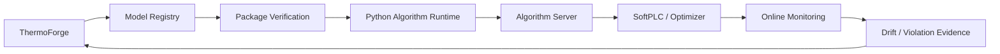

# 模型包与部署契约

## 1. 交付目标

模型交付物必须能够回答以下问题：

- 模型预测什么，输入输出的工程语义和单位是什么？
- 使用了哪个数据版本和哪套预处理？
- 通过了哪些数据、物理、泛化和性能测试？
- 如何加载、运行、监控和回滚？
- 由哪些研究目标、假设和实验产生？

因此不能只发布一个序列化权重文件。

## 2. 建议结构

```text
models/chiller-power/1.7.0/
├── model.yaml
├── signature.yaml
├── artifact/
├── preprocessing.yaml
├── constraints.yaml
├── metrics.json
├── validation.json
├── dataset-lineage.json
├── research-lineage.json
├── environment.lock
├── checksums.json
└── README.md
```

## 3. 模型签名

通用设备模型使用 `property_code` 表达输入输出，在部署绑定到具体对象时解析为 `variable_id`：

```yaml
model_id: chiller-power
version: 1.7.0
object_model: chiller.v1
inputs:
  - property_code: evap_chw_supply_temp
    unit: Cel
    dtype: float
    required: true
  - property_code: evap_chw_return_temp
    unit: Cel
    dtype: float
    required: true
  - property_code: evap_chw_flow
    unit: m3/h
    dtype: float
    required: true
  - property_code: cw_supply_temp
    unit: Cel
    dtype: float
    required: true
outputs:
  - property_code: input_power
    unit: kW
    dtype: float
```

部署到 `CH-01` 后，对应变量为 `CH-01.evap_chw_supply_temp` 等。模型内部不得依赖 BACnet、OPC UA 或 MQTT 地址。

## 4. 约束

`constraints.yaml` 至少描述：

- 输入工程范围和超范围策略。
- 输出合法范围。
- 质量标记和缺失值处理策略。
- 守恒、单调性和设备额定值约束。
- 适用对象模型版本。
- 已验证工况域和禁止外推域。

对于优化控制场景，建议额外声明模型是否连续、是否可微、最大安全调用频率以及批量推理能力。

## 5. 版本和状态

模型使用语义化版本，并维护发布状态：

```text
candidate → validated → approved → production → deprecated → retired
```

- 模型签名或行为不兼容时提升主版本。
- 可兼容能力变化时提升次版本。
- 不改变模型语义的修复提升补丁版本。
- 相同版本的任何文件不得被原地替换；内容变化必须生成新版本。

## 6. 线上数据契约

实时 API 延续 TFDC 的 `variable_id`：

```json
{
  "contract": "TFDC",
  "version": "1.0",
  "timestamp": "2026-08-08T12:00:00+08:00",
  "values": {
    "CH-01.evap_chw_supply_temp": 6.7,
    "CH-01.evap_chw_return_temp": 11.9,
    "CH-01.evap_chw_flow": 521.4,
    "CH-01.cw_supply_temp": 29.7
  }
}
```

Excel、API 和现场运行不更换变量名。Adapter 根据 `bindings` 把现场点位转换为 `variable_id`。

## 7. 建议部署链路



线上漂移、约束违规和预测误差应作为新证据回流 Research Ledger，但不得自动覆盖生产模型。新模型仍需经过完整验证和发布门禁。

## 8. 发布门禁

发布前至少检查：

- 文件齐全且校验和一致。
- 模型签名与 TFOM 兼容。
- Dataset View、代码和环境可定位。
- 所有硬性验收条件通过。
- 推理延迟和资源占用达标。
- 未见设备/时间/工况验证结果可接受。
- 超范围输入行为明确且安全。
- 模型加载和最小推理冒烟测试通过。
- 回滚版本和兼容策略已记录。

