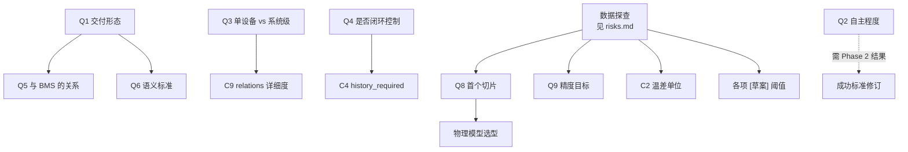

# 开放议题

本文汇总尚未做出的决策，是方案讨论阶段的**议程**。已做出的决策见 [设计决策记录](./design-decisions.md)；尚未被任何文档覆盖的设计空白见 [缺口分析](./gap-analysis.md)——那些需要的是设计，不是决策。

议题按影响层级分为三类：

- **Q — 方案级**：影响「值得做吗、做什么」，决定后才谈得上设计。
- **C — 契约级**：影响 Schema 与接口形态，需在 Phase 0 冻结前定。
- **I — 实现级**：影响代码细节，可在实现中边做边定，此处只做索引。

每条给出备选、**判据**（依据什么来决定，而不是凭偏好）、以及建议的决策时点。

---

## 方案级议题

### Q1 交付形态是什么

**备选**

- A. 内部研究工具——只服务自己的项目
- B. 可复用的开源框架——他人可接入自己的数据与物模型
- C. 产品化平台——含 UI、多租户、服务化

**判据**：是否有第二个真实使用场景。没有第二个用户时，为通用性付出的抽象成本大概率是浪费；但若已知会有，早期的接口设计需要不同。

**影响**：契约的严格程度、文档语言、错误信息的友好度、是否需要现场适配工具（[风险 R8](./risks.md)）。仓库当前以 MIT 协议开源，形式上指向 B，但需确认是否为实质目标。

**建议时点**：立即。这条影响后续所有取舍。

---

### Q2 「自主」到什么程度算成功

**备选**

- A. 自动执行实验，人工主导假设
- B. 自动生成假设，人工审批后执行
- C. 自主完成多轮闭环，人工只做发布审批

**判据**：[风险 R7](./risks.md) 的对照评估结果——Agent 提出的假设是否具备与人工可比的信息增益。这是可以用小样本实验回答的经验问题，不应靠讨论定论。

**影响**：Agent 层的投入规模、[DD-02](./design-decisions.md) 工具集的覆盖广度、成功标准的表述。

**建议时点**：Phase 2 结束、有基线实验结果后。在此之前按 [scope.md §5](./scope.md) 的保守设定推进。

---

### Q3 建模对象是单设备还是系统级

**备选**

- A. 单设备模型（冷水机、表冷器、水泵各自建模）
- B. 系统级模型（整个冷站的能效）
- C. 单设备模型 + 拓扑组合出系统行为

**判据**：下游优化器实际需要什么粒度。若优化的是冷站整体运行策略（几台机组、出水温度设定值），则需要 C；若只是单机运行优化，A 足够。

**影响**：`relations` 拓扑契约的重要性、[DD-11](./design-decisions.md) 两层命名在跨对象模型下的表达能力、验证矩阵中「系统」维度的设计。

**建议时点**：一期按 A 推进（[scope.md](./scope.md) 已如此界定），但需在 Phase 0 确认 C 是否为既定方向——若是，`relations` 契约现在就不能敷衍。

---

### Q4 最终是否进入闭环控制

**备选**：只做离线分析与建议 ／ 开环建议由人执行 ／ 闭环自动执行

**判据**：安全责任的承担方式。一旦进入闭环，模型失效的后果从「建议不准」变为「设备运行异常」，对模型的可用性、降级策略、故障回退的要求是数量级的差异。

**影响**：[model-package.md §4](./model-package.md) 中「最大安全调用频率」「是否连续可微」等声明的必要性、在线推理的 `not_ready` 语义（[implementation-notes §9.1](./implementation-notes.md)）、延迟指标的严格程度。

**建议时点**：现在明确方向即可，不必立即实现。当前 [scope.md §2](./scope.md) 已排除闭环执行，但签名设计应为其预留空间。

---

### Q5 与既有 BMS / 能效平台的关系

**备选**：旁挂（读数据、出模型）／嵌入（作为平台的建模模块）／替代

**判据**：数据获取渠道与部署环境由谁掌握。这决定 Adapter 的实现方、模型的运行位置，以及 [scope.md §3](./scope.md) 边界是否成立。

**建议时点**：与 Q1 一并确定。

---

### Q6 是否复用既有建筑语义标准

**备选**：纯自研 TFOM ／ TFOM + Brick 映射 ／ 迁移到 ASHRAE 223P

**判据**：目标站点是否已有 Brick/Haystack 模型；223P 的工具生态成熟度；映射工作量与收益比。

**影响**：[DD-01](./design-decisions.md) 的复审。当前建议是 TFOM 只承载建模必需的物理语义，拓扑部分保留映射能力。

**建议时点**：Phase 0 冻结 TFOM Schema 前。至少要决定「是否为映射预留字段」，这比事后加要便宜得多。

---

### Q7 是否以现成 MLOps 工具为底座

**备选**：全自研 ／ 研究语义层自研 + 跟踪层用 MLflow ／ 全部依赖现成工具

**判据**：自研跟踪层的实际维护成本，以及是否需要现成的对比 UI 与生态集成。

**影响**：[DD-03](./design-decisions.md) 明确标注为「最应被挑战的决策」。当前建议是把跟踪层抽象为可替换后端——**这个抽象现在就要做**，否则后续迁移等于重写。

**建议时点**：Phase 2 设计 Research Ledger 时。

---

### Q8 首个垂直切片选什么对象

**备选**：冷水机输入功率（当前）／表冷器换热 ／ 依数据探查结果决定

**判据**：**实际数据支持哪一个**。

**已回答（2026-08-08，[data-survey §5](./data-survey.md)）**：**保留冷水机功率模型，但重新定义输入**。

表冷器路径已被排除——其 `flow`、`chw_supply_t`、`chw_return_t`、`heat_transfer` 全部是冷冻水总管的公式副本，作为建模对象同样退化；泵与风机的 `power ~ status_frequency` 虽非循环，但只是相似定律，信息量太低。「运行冷机总功率 ~ 表头工况」是本数据中唯一既非循环、又非平凡的关系。

修订要点：禁用 `chiller.load`、`chiller.电流百分比`（与目标同源）、`chiller.condenser_return_t` / `evaporator_supply_t`（表头公式副本，无设备区分度）；**不做留一设备验证**，本数据不支持。

**影响**：[DD-12](./design-decisions.md) 已据此更新；物理模型选型（[DD-08](./design-decisions.md)）需等 COP 量纲问题解决后再定。

---

### Q9 精度目标从何而来

**备选**：沿用 `mape_max: 0.05` ／ 由基线实验标定后设定 ／ 由下游优化收益反推

**判据**：第三种最有意义——优化器需要多高的模型精度才能带来净收益？若功率预测误差 5% 与 10% 对最终节能量影响相近，那么追求 5% 是浪费。

**部分回答（2026-08-08，[data-survey §F4](./data-survey.md)）**：`mape_max: 0.05` 在诚实输入下**不可达**。线性基线在时间切分测试集上 CVRMSE ≈ 0.12、MAPE ≈ 8.9%；而使用循环特征时 MAPE = 4.35%，恰好「达标」——原目标值很可能就是在循环特征下估出来的。

建议初始验收改为 **CVRMSE ≤ 0.10、NMBE 在 ±0.02 以内**，待非线性模型跑出后再收紧。仍需回答的是「优化器实际需要多高精度」，这要下游场景确定。

**影响**：验收条件、研究预算、[风险 R1](./risks.md)。修订须记为一条 Decision（[DD-13](./design-decisions.md)）。

---

### Q10 示例数据的开放范围

`data/` 中的工作簿已随仓库公开。需确认：它是真实站点数据还是仿真生成；若为真实数据，是否已获得授权公开；设备编号等是否需要脱敏。

**判据**：数据来源方的授权范围与合规要求。

**探查发现（2026-08-08，[data-survey §F9](./data-survey.md)）**：多项特征强烈提示该工作簿是由少量驱动序列 + Excel 公式生成的**仿真数据**——2,955,883 个公式单元格；两条物理独立的总管有逐点相同的温度序列；「测量」字段带 10 位以上小数；`air_inlet_temp` 中位数恰为 24.000。

这把 Q10 从单纯的合规问题变成了**方案有效性问题**：若确为仿真数据，其中的「物理关系」就是生成它的公式，模型学到的只是这些公式，本次测出的精度基线不能代表真实数据的可达水平。

**影响**：能否作为公开示例与固定测试数据；更重要的是，是否需要另行获取现场数据来标定精度目标和验证物理模型。

**建议时点**：立即，优先级已升至最高。

---

## 契约级议题

需在 Phase 0 冻结 Schema 前决定。

| # | 议题 | 备选 | 判据 |
|---|---|---|---|
| C1 | TFOM 是否引入 `quantity_kind` 字段 | 引入 ／ 仅靠单位字符串推断 | 温度与温差换算规则不同（[conventions §2.2](./conventions.md)），仅靠单位串无法安全区分 |
| C2 | 温差的规范单位改为 `K` | 是（需修订 data-contract 示例）／ 保持 `Cel` 并特殊处理 | 同上；影响现有示例的正确性 |
| C3 | `acceptance` 是否纳入 NMBE | 纳入并单独设阈 ／ 保持现状 | 现有指标全为绝对误差类，无法暴露系统性偏差（[DD-14](./design-decisions.md)） |
| C4 | 模型签名是否扩展 `history_required` | 扩展 ／ 由部署方自行约定 | 一旦使用滞后特征，不扩展则部署方无法知道需备多长历史（[implementation-notes §9.1](./implementation-notes.md)） |
| C5 | 模型是否声明 `object_model_compat` 版本范围 | 声明范围 ／ 绑定单一版本 | 物模型小版本升级时是否需要重新发布所有模型 |
| C6 | `time_resolution` 格式 | 简写 `60s` ／ ISO 8601 `PT60S` | 可读性与解析一致性，二者择一即可 |
| C7 | 超宽数据（变量数 > 16383）的表达 | 分片 `data_N` ／ 强制长表 ／ 改用 Parquet | 取决于实际变量规模 |
| C8 | 哈希中按集合语义排序的字段清单 | 需逐 Schema 明确 | 未明确则哈希不稳定，缓存复用失效（[conventions §5.1](./conventions.md)） |
| C9 | `relations` 契约的详细程度 | 最小可用 ／ 完整拓扑 | 取决于 Q3 是否走向系统级建模 |

---

## 实现级议题

不阻塞方案讨论，在实现中依据实测确定。完整清单见：

- [工程约定 §8](./conventions.md) — 存储后端、质量阈值默认值等
- [实现细则 §14](./implementation-notes.md) — 各项 **[草案]** 阈值、golden 集选取策略、单写者模型的适用边界

其中标注 **[草案]** 的阈值（`y_floor`、embargo 长度、守恒容差、响应体上限）**必须用真实数据标定**，不宜靠讨论确定。

---

## 议题依赖

**关键路径**：一次数据探查同时解锁 Q8、Q9 和大部分草案阈值，是当前性价比最高的一步；Q1 则决定了整体抽象层级，宜尽早明确。

## 相关文档

- [范围、非目标与前提](./scope.md) · [设计决策记录](./design-decisions.md) · [可行性风险](./risks.md)
- [工程约定](./conventions.md) · [实现细则与已知陷阱](./implementation-notes.md)
- [文档总览](./README.md)
