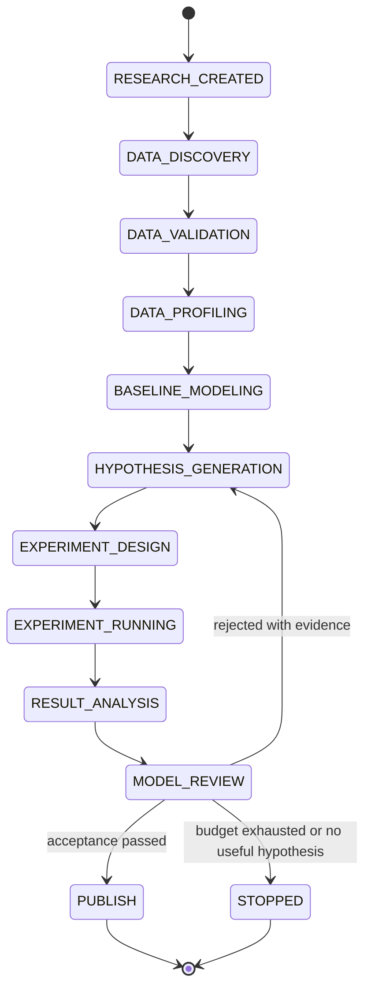

# 自主研究闭环

## 1. 研究对象

Research Goal 是一次持续研究的根对象。自然语言目标必须先规范化为结构化契约，再允许执行实验。

```yaml
goal_id: RG-0001
name: 冷水机输入功率模型
object_model: chiller.v1
purpose: optimization
target: input_power
candidate_inputs:
  - evap_chw_supply_temp
  - evap_chw_return_temp
  - evap_chw_flow
  - cw_supply_temp
  - cw_return_temp
  - cooling_capacity
  - outdoor_wet_bulb_temp
model_types:
  physics: true
  data: true
  hybrid: true
acceptance:
  mape_max: 0.05
  physics_violation_rate_max: 0.001
  inference_latency_ms_max: 5
  extrapolation_required: true
```

目标还应记录计算预算、最长研究时间、最大实验数和需要人工审批的动作。

## 2. 状态机



每次状态转换必须记录原因、输入制品、输出制品、执行者、时间和错误信息。

## 3. 研究策略

推荐复杂度递增顺序：

1. 可解释的朴素基线。
2. 领域物理模型和参数辨识。
3. 统计模型与树模型。
4. 混合模型。
5. 只有证据表明必要时才使用深度模型。

失败不是简单的“指标不达标”，而要生成结构化发现，例如：

- 低负荷区存在系统性偏差。
- 缺失室外湿球温度导致冷却侧变化无法解释。
- 模型在未见设备上过拟合。
- 物理模型主体正确，但残差随部分负荷率变化。
- 某个数据区间对应传感器漂移，不应直接用于训练。

下一轮假设必须引用已有证据，禁止无理由随机尝试模型。

## 4. 三类建模路线

### 物理模型

例如冷水机功率模型可以从以下关系出发：

```text
Q = m × Cp × ΔT
P = Q / COP
COP = f(T_chw, T_cw, PLR, ...)
```

通过历史数据辨识参数，同时保留参数范围、单位和方程版本。

### 数据模型

候选模型可包括线性/多项式回归、随机森林、梯度提升、神经网络和时序模型。选择必须考虑样本量、动态特征、可解释性和部署成本。

### 混合模型

ThermoForge 应优先支持三种混合方式：

1. **Residual Hybrid**：`Y = Y_physics + ML(X)`，机器学习拟合物理模型残差。
2. **Parameter Hybrid**：物理方程保持不变，模型根据工况预测动态参数。
3. **Physics-Constrained Model**：数据模型直接预测输出，但训练或验证中加入守恒、单调性和范围约束。

## 5. Experiment Contract

每次实验必须有独立、不可变的定义：

```yaml
experiment_id: EXP-0042
goal_id: RG-0001
hypothesis_id: H-0011
dataset_view: VIEW-0021
model:
  category: hybrid
  physics: cooling_balance_v2
  residual: xgboost
target: input_power
validation:
  temporal_split:
    train: 0.70
    validate: 0.15
    test: 0.15
  equipment_holdout:
    enabled: true
metrics: [RMSE, MAE, MAPE, CVRMSE]
physics_tests:
  enabled: true
runtime:
  environment_lock: env-sha256
  random_seed: 20260808
```

实验记录还必须包含：

- 数据集 revision 和 Dataset View 哈希。
- 代码版本、依赖锁、容器或运行环境指纹。
- 超参数、随机种子和资源限制。
- 标准输出、错误输出、退出状态和运行时长。
- 模型、指标、图表、预测结果和验证报告。
- 结论、失败原因和下一步问题。

## 6. HVAC 验证矩阵

不得仅使用随机 `train_test_split`。至少考虑：

| 维度 | 验证方式 |
|---|---|
| 时间 | 时间顺序切分、未来时间段外推 |
| 季节 | 夏季、过渡季、冬季 |
| 负荷 | 低负荷、中负荷、高负荷 |
| 环境 | 极端干球/湿球温度 |
| 状态 | 稳态、启停、故障和维护后 |
| 设备 | 留一设备验证，如 CH-01~03 训练、CH-04 测试 |
| 系统 | 不同设备组合和控制策略 |
| 外推 | 超出训练分布但仍处于工程合法范围的工况 |

## 7. 模型评分

模型不能只按最小 MAPE 排名。建议评分维度：

| 维度 | 典型指标 |
|---|---|
| Accuracy | RMSE、MAE、MAPE、CVRMSE |
| Generalization | 时间、设备、季节和工况留出表现 |
| Physics | 守恒误差、范围违规、单调性违规 |
| Stability | 长时间仿真是否漂移或发散 |
| Complexity | 参数量、特征数、维护成本 |
| Runtime | 推理延迟、内存、CPU 占用 |
| Interpretability | 参数和响应关系是否可解释 |
| Control Value | 是否连续、稳定、适合优化器调用 |

综合分数的权重必须属于 Research Goal 或项目策略，不能由 Agent 在看到结果后临时修改。硬性约束失败时，即使综合分数较高也不得发布。

## 8. Research Ledger

建议逻辑结构：

```text
research/
├── goals/RG-0001.yaml
├── hypotheses/H-0011.yaml
├── experiments/EXP-0042/
├── findings/F-0017.md
├── decisions/D-0009.yaml
└── models/M-0008.yaml
```

账本需要支持回答：

- 当前目标进展到哪里？
- 哪些模型已经失败，为什么失败？
- 哪些数据和实验支持某个结论？
- 哪些假设尚未验证？
- 下一项实验的预期信息增益是否值得计算成本？
- 已发布模型能否从数据、代码和环境完全复现？

## 9. 停止条件

持续研究不等于无限循环。满足任一条件时应停止并给出原因：

- 所有硬性验收条件均满足，发布候选模型。
- 达到实验数、计算量、费用或时间预算。
- 连续若干轮没有产生显著信息增益。
- 数据覆盖不足，无法验证关键工况。
- 必需变量或物理参数缺失。
- 结果需要领域专家确认或外部试验。

## 相关文档

- 方案背景：[设计决策记录](./design-decisions.md) — DD-07（残差混合的代价与强制配套要求）、DD-13（机器判定发布）、DD-14（指标口径建议）；[风险 R6、R7](./risks.md) — 混合建模增益与自主性价值的验证方式
- 上一篇：[TFDC 数据契约](./data-contract.md) — 本文实验引用的 Dataset View 与数据集 revision
- 下一篇：[模型包与部署契约](./model-package.md) — 通过验收后如何打包、注册与发布
- 实现参考：[实现细则与已知陷阱](./implementation-notes.md) §4–7 — 切分泄漏与 purge/embargo、指标公式与零分母、物理约束容差、可复现性
- 参考：[工程约定](./conventions.md)（实验与发布错误码）、[术语表](./glossary.md)（状态机、ID 前缀、混合建模方式）、[实施路线图](./roadmap.md)

