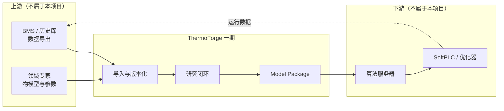

# 范围、非目标与前提

方案讨论阶段最容易失控的不是「要做什么」，而是「不做什么」没有写下来。本文明确一期边界、被排除的方向、方案成立所依赖的前提，以及什么算成功。

本文描述的是**一期（MVP）**范围。长期方向见 [实施路线图](./roadmap.md) Phase 5。

## 1. 一期范围

| 维度 | 一期范围 |
|---|---|
| 站点 | 单站点 |
| 对象 | 单一类别设备（首选冷水机，见 [DD-12](./design-decisions.md)） |
| 数据 | 离线历史数据，Excel 导入 |
| 建模 | 基线 + 物理 + 一种混合模型 |
| 验证 | 时间外推、设备留出、物理约束 |
| 交付 | 可复现实验 + Model Package + 冷加载验证 |
| 自主性 | 单 Agent 顺序扮演多角色，关键动作需人工审批 |
| 部署 | 产出模型包，交由外部运行时消费 |

## 2. 明确不做

以下方向不在一期范围内。列出它们不是否定其价值，而是避免方案在讨论中被无限扩张。

| 不做 | 理由 | 归属 |
|---|---|---|
| **闭环控制执行** | ThermoForge 产出模型，不直接下发控制指令。控制安全性、故障回退、联锁属于另一个工程领域 | SoftPLC / 优化器 |
| **数据采集与协议网关** | `bindings` 只描述点位映射关系，BACnet/OPC UA/MQTT 的实际采集由 Adapter 实现 | BMS / 边缘网关 |
| **通用 AutoML** | 目标是「用证据选出可解释、可部署的模型」，不是「在模型空间里搜最优」 | — |
| **全楼动态仿真** | EnergyPlus / Modelica 的领域。ThermoForge 做数据驱动的设备级建模，不做建筑热工仿真 | 专业仿真工具 |
| **故障诊断与报警（FDD）** | 与建模共享数据底座，但目标函数、评价方式和交付形态都不同 | 可作为后续独立方向 |
| **多租户 SaaS、权限体系、Web UI** | 一期唯一用户是研究闭环本身 | Phase 5 |
| **实时流处理基础设施** | 一期只做离线建模 | Phase 5 |
| **替代现有 BMS/BA 平台** | ThermoForge 旁挂在既有系统侧，消费其数据、向其交付模型 | — |

## 3. 系统边界

接口只有两处：**输入是带语义的数据**（TFDC），**输出是自描述的模型包**。两侧的实现都不由本项目负责。这一约束是方案能否保持可控规模的关键。

## 4. 前提假设

以下假设若不成立，方案需要实质调整而非局部修补。**建议在投入实现前先用真实数据逐条核实**——这些大多可以在不写代码的情况下确认。

| # | 假设 | 若不成立的后果 | 如何尽早核实 |
|---:|---|---|---|
| A1 | 历史数据可获取，时间跨度覆盖多个季节（≥1 年，至少含夏季与过渡季） | 无法做季节外推验证，模型适用范围大幅收窄 | 查看数据的时间范围 |
| A2 | 关键变量有**实测**：供回水温度、流量、输入功率 | 目标或输入不可信，建模失去基础 | 检查 `source_kind`，与现场确认表计配置 |
| A3 | 制冷量是独立测量或由可信测量导出，而非由功率反算 | 用其预测功率构成循环论证，指标虚高且无价值 | 核对 BMS 点位来源与计算逻辑 |
| A4 | 同类设备有多台，且型号/容量相近 | 留一设备验证不成立，通用设备模型退化为单机模型 | 查看设备台账与额定参数 |
| A5 | 设备额定参数（额定容量、功率、流量）可获得 | 无法做归一化，跨设备泛化困难 | 查铭牌或技术资料 |
| A6 | 有人能承担领域评审（判断物理关系与异常是否合理） | 自动化闭环缺少事实校验，容易在错误方向上迭代 | 组织确认 |
| A7 | 建模目标可用离线数据验证，无需现场试验 | 验证周期从天变为月，闭环速度失去意义 | 明确验收条件的可验证性 |
| A8 | 数据规模在单机可处理范围（千万行量级以内） | 一期技术选型（DuckDB + 单机）需要提前调整 | 估算变量数 × 时长 ÷ 采样周期 |

假设 A2、A3 在实际 HVAC 项目中失败率最高：冷冻水流量计不准或缺失是行业常态，而制冷量往往由 BMS 用 `Q = m·Cp·ΔT` 算出——一旦流量不可信，制冷量和 COP 全部不可信。详见 [风险 R2、R3](./risks.md)。

## 5. 什么算成功

方案讨论阶段应先约定成功标准，否则后期无法判断该继续还是该收敛。建议一期成功标准 **[草案]**：

**必须达成**

1. 能把一份**真实**现场 Excel 完整走通到 Model Package，全程无手工修补数据。
2. 实验可复现：固定数据、代码、环境与种子，指标一致（容差见 [implementation-notes §7.3](./implementation-notes.md)）。
3. 模型包能在干净环境冷加载并通过 golden 预测比对。
4. 在「未见设备 × 未来时间」测试面上给出指标，无论好坏都如实记录。

**期望达成**

5. 混合模型相对纯物理和纯数据基线有可量化的增益，且增益来源可解释。
6. 研究闭环产出至少 3 条由证据支持的结构化发现（而非仅指标数字）。
7. 至少一轮「假设 → 实验 → 证据 → 修订假设」由系统自主完成，人工只做审批。

**明确不作为一期成功标准**

- 达到某个具体精度数字。精度上限由数据质量决定，不由方案决定；先测出可达水平，再谈目标（见 [风险 R1](./risks.md)）。
- Agent 完全无人工介入。
- 支持多种设备类型。
- 性能与并发。

## 6. 与相邻方案的关系

| 相邻方案 | 关系 |
|---|---|
| 建筑能耗仿真（EnergyPlus / Modelica） | 互补。仿真提供机理与先验，ThermoForge 提供数据标定与在线可用的轻量模型 |
| 语义标准（Brick / Haystack / ASHRAE 223P） | 潜在互补。TFOM 侧重建模所需的属性与约束，语义标准侧重拓扑与设备分类，可建立映射（见 [DD-01](./design-decisions.md)） |
| MLOps 平台（MLflow / DVC / W&B） | 潜在底座。它们管 run / 制品 / 数据版本，不管「假设—证据—结论」的研究语义（见 [DD-03](./design-decisions.md)） |
| 能效优化平台 | 下游消费方。ThermoForge 提供其所需的设备模型 |
| FDD 故障诊断 | 共享数据底座，目标不同，一期不做 |

## 相关文档

- [设计决策记录](./design-decisions.md) — 本文范围划分背后的取舍
- [可行性风险](./risks.md) — 前提假设不成立时的应对
- [开放议题](./open-questions.md) — 范围本身仍待确认的部分
- [实施路线图](./roadmap.md) · [文档总览](./README.md)
