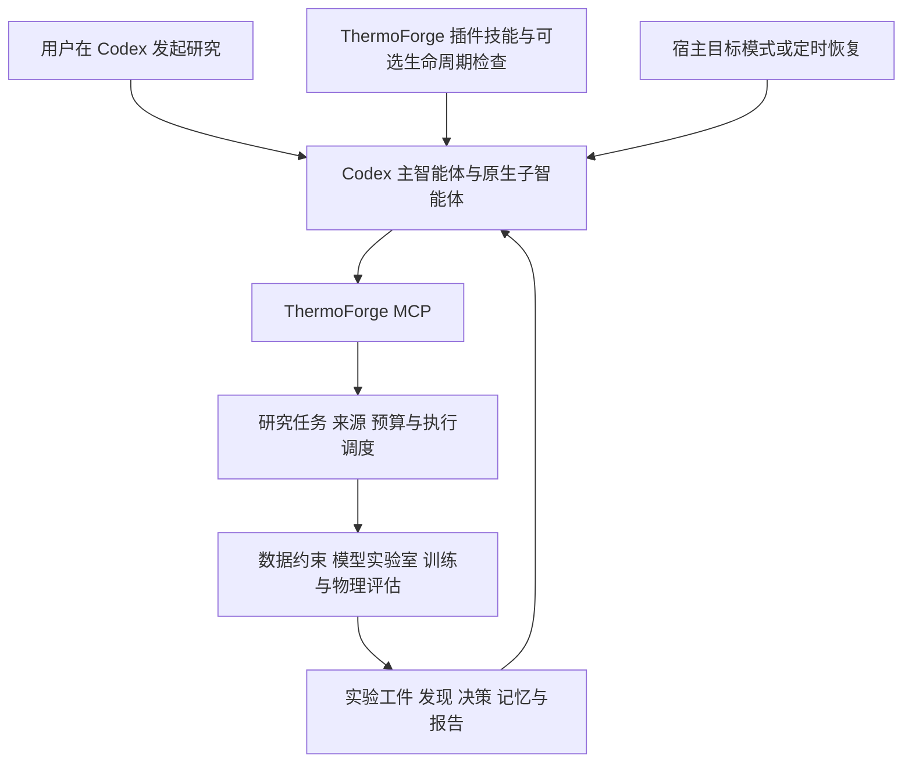

# V2 实施计划历史稿：插件优先方案（已被替代）

归档日期：2026-09-06。下面正文完整保留上一轮计划，供追溯；不得作为当前实施要求。

用户随后明确：ThermoForge 是独立软件，拥有自己的主智能体和多个完整候选智能体；Codex 是可选后端，插件是可选入口。下文“插件主入口”“使用 Codex 原生子智能体构成研究池”等表述来自助手对产品定位的误读，已撤回。当前要求以 [V2 实施计划](D:/ceshi_python/GitHub/ThermoForge/plan/v2-implementation-plan.md) 为准。

---

# ThermoForge V2 实施计划：Codex 插件与可追溯多智能体研究

更新日期：2026-09-06。状态：研究方案方向已获用户认可，新增 Codex 插件接入要求；本文件定义后续实施路线，尚未完成插件开发、安装或运行时切换。

原始 [V2 研究方案讨论稿](D:/ceshi_python/GitHub/ThermoForge/plan/v2-research-discussion.md) 原样留存，继续作为方案比较、论文来源和初始决策背景。本计划承接其来源契约、多候选探索、报告、记忆和进化要求，将 Codex 插件接入前移。代码基线仍为当前 `harness-schemes` 工作树，包含既有未提交工作；正式冻结 V1 时需记录最终代码、数据与环境版本。

本轮确定的方向是：让用户直接在 Codex 中使用 ThermoForge 插件，启动研究、查询状态、继续研究、拆分候选和查看报告。Codex 承担模型调用与智能体调度，ThermoForge 提供实验与证据后端。用户所说的“计算内核替换”，首先落实到智能体运行时；现有训练、数值计算、指标、物理检查与可复现模型包继续作为领域内核。

当前工具调用问题已从代码核实：

| 路径 | 现状 | 结论 |
|---|---|---|
| 内置会话 Agent | `HarnessAgent.ask` 传工具 schema，执行 tool_calls 并回填结果，循环直到回答或上限 | 已有 function calling，不是所有入口都不能调用工具。[代码](D:/ceshi_python/GitHub/ThermoForge/src/thermoforge_agent/agent.py:101) |
| OpenAI 兼容客户端 | 有 tools 时发送 `tools` 和 `tool_choice=auto` | 模型可选择调用，也可直接回答；兼容接口并非天然禁止工具。[代码](D:/ceshi_python/GitHub/ThermoForge/src/thermoforge_agent/client.py:70) |
| 自动研究 planner | `make_ask` 只传 system/user 文本消息，仅取 content；planner 要求返回计划 JSON | 该入口没有让模型自行检索或继续调用工具的通道。[调用处](D:/ceshi_python/GitHub/ThermoForge/src/thermoforge_webui/services/research.py:228)、[设计说明](D:/ceshi_python/GitHub/ThermoForge/src/thermoforge_webui/services/planner.py:1) |
| 无人值守脚本 | 复用 `make_planner(make_ask(config), context)` | 同样受上述入口限制，实验由编排器按 JSON 执行。[代码](D:/ceshi_python/GitHub/ThermoForge/scripts/autoresearch.py:208) |

因此，已证实的直接原因是当前运行流程的设计。不同服务商对流式用量、工具参数和推理字段的实现可能不同，但本轮没有对配置中的实际端点做请求测试，不能断言它的兼容性或模型主动性有缺陷。现有文本 ping 也不能验证工具调用能力。切换到 Responses API 等新端点本身，仍不能自动补出研究调度、恢复和证据系统。

推荐分层如下：



Codex 调用 ThermoForge MCP 后，后端直接执行领域工具，不再为了规划下一轮而二次调用内置 OpenAI 兼容客户端。一次研究只指定一个负责推进的运行时，避免 Codex 与旧 autoresearch 同时推动同一目标。内置运行路径保留为 V1 对照，V2 插件路径需能在未配置 ThermoForge 自身模型 API key 时完成研究。

插件是技能、MCP 与可选生命周期配置的交付包；推理、工具循环、子智能体生命周期由 Codex 宿主提供。现有 Python STDIO MCP 可继续使用，无需因插件化改为 HTTP。原 `.mcp.json` 只是连接配置，尚不是完整插件。[官方插件架构](https://developers.openai.com/plugins/concepts/plugins)、[打包规范](https://developers.openai.com/plugins/build/plugins)、[Codex MCP](https://learn.chatgpt.com/docs/extend/mcp)

建议的插件结构（尚未创建）为：

```text
thermoforge/
  .codex-plugin/plugin.json
  .mcp.json
  skills/
    thermoforge-research/SKILL.md
    thermoforge-report/SKILL.md
  scripts/
    launch_mcp.py
    research_stop_check.py
  references/
    research-workflow.md
    evidence-and-report-contract.md
  hooks/
    hooks.json                 # 可选；基础闭环验收后再接入
```

插件内携带研究工作流、工具启动配置与配套资源；数据仓、实验记录和模型包持久保存在用户选择的项目数据目录。Python 依赖和领域内核需有明确安装/版本检查方案，不把“插件已安装”等同于实验环境已经准备完毕。现有 harness 方法论应打包为可访问资源，避免安装后仍依赖源码树中的相对路径。

MCP 启动器应显式解析项目根目录、Python 环境和 `TF_VAULT_ROOT` / `TF_RESEARCH_ROOT` / `TF_MODELS_ROOT`。目前 server 默认根目录由模块安装位置推导，不能把插件缓存目录当作数据目录；状态页和报告读取也要统一使用同一上下文。验收需覆盖从另一个工作目录启动、多项目切换，以及插件更新后研究记录仍存在。开发阶段可用个人 marketplace，公共发布与团队分发另行安排。

Codex 的“自循环”拆成以下机制验收：

| 机制 | 用途 | 应由谁控制 |
|---|---|---|
| 研究技能与当前任务 | 读取任务状态，检索、提案、执行、分析并选择下一步 | Codex 根据工作流操作后端；每个关键产物落盘 |
| Goal 模式 | 持续追求明确目标，可暂停、恢复、调整约束 | 宿主能力；运行前明确研究目标与完成标准。[官方说明](https://learn.chatgpt.com/docs/long-running-work) |
| Stop hook | 任务准备结束时，根据研究状态检查是否还需继续 | 可选增强，读取持久状态后返回有界的下一步提示，不承担实验执行。[官方说明](https://learn.chatgpt.com/docs/hooks) |
| 定时恢复 | 在同一任务中稍后检查长实验或恢复未完成研究 | 宿主 Scheduled；本地任务要求机器和应用运行。[官方说明](https://learn.chatgpt.com/docs/automations?surface=app) |

当前官方 Stop hook 可以用 `decision: block` 与 reason 触发续行，但它不保证在宿主关闭、配额不足或用户中断时仍运行。实施时先验收本机版本和 hook 信任流程。兼容本机 plugin-creator 校验器与当前官方规范，可采用默认 `hooks/hooks.json`，省略 manifest 内的 hooks 字段。本轮不安装 hook、不创建定时任务，也不启动自动实验。

完成、预算耗尽、用户暂停/取消、缺必需输入、达到失败/无进展阈值，均应使研究停止或进入明确的可恢复状态。Stop hook 仅服务显式绑定的研究 run，不影响普通聊天；检查 `stop_hook_active`、续行次数和实际状态变化，避免重复催促。用户中断优先，不用 hook 重启已取消工作。定时恢复、Goal 与手动继续要共用 run 所有权/租约，避免同时提交下一轮。

多智能体使用 Codex 原生委派。研究技能定义角色或候选任务，插件不会自行创造不受宿主约束的智能体池。候选数量、活跃子智能体上限、实验 worker 数是三项独立配置。当前对话运行环境提供总计四个并发槽位（含主智能体），这是本会话事实，不是 Codex 通用固定上限；五份候选在此限制下需分批，不能称为五个同时运行。正式复现五路同时探索时，需核实目标宿主支持至少一个协调者加五个 worker。[官方子智能体配置](https://learn.chatgpt.com/docs/agent-configuration/subagents)

初始多候选基线仍遵循原讨论稿：同模型、相同任务提示、冻结证据快照、独立上下文，候选生成完成前不互相看答案。宿主继承上下文与工具配置需记录，不能仅凭五个 agent 名称断言输入完全一致。不同角色、不同提示词或不同模型属于后续实验变量。第一阶段子智能体负责检索/提案/只读分析，协调者经受控入口提交实验；开放并行实现后，再补模型命名、工作目录和提交隔离。

插件化前必须补齐研究后端的强制约束，不能只在技能里要求遵守：

| 工作项 | 设计与验收要求 |
|---|---|
| 研究 run | 在现有 goal 下保存一次运行身份、宿主任务ID、配置、阶段和停止原因；开始、查询、暂停、恢复、取消有稳定语义 |
| 资料与想法 | 登记实际读取的资料和范围；新候选缺来源类型或研究理由则拒绝进入实验；自主猜想合法无论文；旧记录来源缺失标 unknown |
| 统一预算 | 调度前原子预留实验额度，执行后结算实际资源；失败、重试和取消仍记账；所有执行路径共用相同检查 |
| 长实验 | 提交返回 job_id；查询结果、请求取消、恢复等待有明确行为；重复提交使用幂等标识，不重复训练 |
| 状态与结论 | 外部运行时能提交实验后的发现、支持/反驳/证据不足判断、选择和淘汰理由，而非仅留下聊天文本 |
| 报告 | 从 run/goal 生成实验短报、候选比较和结题报告；数字读取工件，来源可追溯，实际代码与原始假设分开 |
| 外部用量 | 记录可获得的 Codex 调用标识、模型和用量；无法获取的 token/费用标 unavailable，不写零，不用 V1 API 单价推算订阅费用 |

尤其需要修正现有预算边界：`ResearchOrchestrator._check_budget` 位于内置循环，外部 MCP 直接调用 `tf_experiment_run` 不经过它。预算与来源门禁要下沉到共同实验入口；旧工具在 V2 run 内也必须接受同一校验，不能通过旧路径绕过。现有 Ledger 跨进程锁继续复用，但它不等于整轮预算、作业幂等和模型版本分配已经具备并发保障。[当前预算检查](D:/ceshi_python/GitHub/ThermoForge/src/thermoforge_research/orchestrator.py:297)、[直接实验入口](D:/ceshi_python/GitHub/ThermoForge/src/thermoforge_research/tools.py:1210)

外部 Codex 的模型调用由宿主管理，插件后端不一定能逐次取得或阻止这些调用。因此实验计算预算可以在后端硬限制；LLM 预算应结合宿主可用的限额/用量接口实现，并在验收报告中说明哪些可硬限制、哪些仅能估算。任何拿不到的完整内部推理日志都不作为插件必备能力；研究理由与来源记录作为独立结构化输出，沿用原讨论稿要求。[现有 MCP 用量说明](D:/ceshi_python/GitHub/ThermoForge/harness/prompts/mcp.md:22)

文献可以由 Codex 原生检索能力或 ThermoForge 文献工具发现，再经资料登记接口保存稳定 URL/DOI、实际阅读范围、简短证据和时间。宿主临时搜索引用编号不能充当持久来源ID。论文和历史结果都应通过同一来源契约关联到想法；检索、训练与报告完成情况分别记录，避免“找到论文”被写成“已经读懂或复现”。

若以后仍希望从 ThermoForge WebUI 发起研究，可增加第二条适配路线：Python 通过官方 Codex SDK 调用本地 Codex 运行时，或通过 App Server 接入更完整的会话、鉴权和事件流。当前官方已有稳定 Python SDK `openai-codex`，不必先引入 Node 桥接。它属于宿主集成，不能简化为替换 `base_url`，也不应保留旧 `ask -> str` 协议来丢弃工具事件。[Codex SDK](https://learn.chatgpt.com/docs/codex-sdk)、[App Server](https://learn.chatgpt.com/docs/app-server)

两条路线方向不同：插件是 Codex 调用 ThermoForge；SDK 适配是 ThermoForge 调用 Codex。先交付用户要求的插件主入口，WebUI 保留数据与报告浏览，程序化发起研究在插件小闭环稳定后单独验收。不得在同一研究中形成 Codex→插件→再次启动 Codex 的递归运行链。

后续任务按依赖执行，以下均未完成：

| 阶段 | 工作 | 交付与验收 |
|---|---|---|
| V2.0-A 基线与契约 | 冻结 V1 对照；run、来源、预算和实验入口统一；明确最终留出评估 | 外部入口不能绕过来源与实验预算；历史账本可读；复现指标口径一致 |
| V2.0-B 插件最小闭环 | 制作可安装插件、启动器和研究技能；接通发现/决策/报告写入 | 在新的 Codex 任务中，从状态检查、文献与历史读取到提案、实验、反馈、报告完整跑通；不依赖内置 LLM key |
| V2.0-C 持续研究 | 长实验任务、断点、停止条件；验证 Goal；按需要接 Stop hook 与同任务定时恢复 | 至少连续推进多轮；中断和恢复不重复执行；预算耗尽能结束；未启用 hook 时核心约束仍有效 |
| V2.1 多候选 | N=1/3/5、独立证据快照、候选去重与中心提交 | 记录实际并发和模型设置；共享状态不串线；相同预算下与 N=1 对照 |
| V2.2 研究树与记忆 | Top-K 分支、父子谱系、消融/复现、想法与实验记忆 | 能解释路线演变及失败类别；结题报告包含负结果和适用范围 |
| V2.3 进化搜索 | 先预定义策略切换，再评估生成新策略 | 同预算相对固定搜索有可复核增益，策略版本可回退，评估协议不被进化 |
| 后续可选：WebUI 适配 | 官方 Python SDK / App Server | 页面能启动、观察、暂停和恢复 Codex 研究；与插件使用同一研究状态服务 |

选型验证要分开运行时与多智能体的收益：A 为冻结的 V1；B 为 Codex 插件单智能体，使用同一实验内核与评价协议；C 为同一 Codex 配置下多候选。B→C 用于判断多候选增量；若 A→B 同时更换模型，结果只能解释为整个系统变化，不能全归因于运行时。记录完整实验预算、可得模型用量、墙钟时间、失败/重复实验率与最终留出质量；不同模型的原始 token 数不能直接当作相同费用。

验收重点包括：插件清单与技能校验；MCP 启动及工具发现；从新工作目录读取正确项目；来源缺失/伪引用拦截；绕过旧实验入口测试；预算并发预留；作业重试幂等与取消；长任务恢复；实际同模型/上下文配置记录；由真实工件生成报告。原数据白名单、时间切分、环境锁、模型校验和人类预处理审批边界继续适用，来源和预算约束在 Python 内核校验，不能依赖模型自觉或 hook 覆盖所有调用。

待细化参数是每个研究目标的预算、目标宿主可用并发、第一批代表性研究目标，以及具体 EvoX 实现选择。它们影响实验配置和后期策略，但不阻碍先实现插件基础与来源契约。本轮文档更新没有启用插件、定时任务或自循环，也未修改运行代码。
