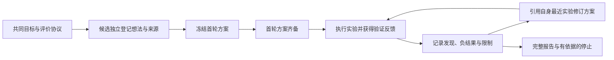

# V2 自主研究升级计划

讨论确认日期：2026-09-06。本文保存本次自主研究升级的范围与验收方式；原讨论稿 `v2-research-discussion.md` 保持原样。

## 目标与边界

继续使用独立运行的 ThermoForge 软件管理一个主 Codex 和五个候选 Codex。统一研究问题、允许数据、评价协议与总预算，让候选自行检索资料、提出假说、选择模型或实现模型，并根据真实实验反馈继续研究。候选是独立进程与会话，由软件传递消息。外部 MCP 副驾驶控制软件，无须用户逐轮操作 GUI。

此次升级不要求五个候选一定给出不同方案；相同方法可能是合理的独立选择。保留固定任务的功能验收模式，以便检验工具和调度。完整 EvoX 元进化、跨运行知识库，以及多智能体优于单智能体的结论，均不包含在本次已证实结果中。

## 三项功能交付

### 1. 自主方案与研究阶段

- 新建配置默认 `research_mode="autonomous"`，旧验收显式使用 `acceptance`；缺少模式字段的旧记录恢复为原验收行为。模式、策略和评价协议在运行中固定。
- 主智能体先确定共同问题与初始资料。首轮候选相互独立，主智能体也不提前阅读候选私有方案后再影响尚未提交者。
- 候选先登记想法，强制保存来源类别、选择理由、预测、反证条件。来源可为真实文献、历史实验或诚实标记的自主猜想，不要求虚构论文。
- `research_proposal_commit` 冻结模型规格、参数、源码哈希、评价协议与方案版本。首轮方案齐备后再开放实验。失败或停止候选的豁免由真实状态决定，并记录事件。

### 2. 反馈循环与重复实验识别

- 实验必须引用已提交的 `proposal_id`，模型和评价协议不得漂移。幂等重试不会重复训练。
- 后续提案必须引用自己的最近一次已结束实验，并存在对应发现与结果分析。新模型版本和参数是新方案，旧方案与结果保留。
- 用冻结协议、完整模型规格与模型实验室源码哈希识别相同请求。仅更换想法编号不能重复申报同一实验；有复现理由时显式声明 `purpose="replicate"`。
- 两次成功实验或一份阶段报告不再自动结束研究。候选须先保存覆盖全部已结束实验、想法及分析的报告，再用 `research_stop` 引用证据说明停止理由。
- 实验或执行回合额度将尽时转为报告收尾；token 限额或中断可能使收尾未完成，系统保留真实未完成状态，不自动补充预算。
- 真实验收暴露了报告预算不足：增加基于总预算比例与最近实际调用用量的提前收尾，持久保存收尾原因，阻止新增探索，保留在途归账与报告工具；其估算不能作为硬上限保证。

### 3. 受控分享与流程图追踪

- `independent` 全程独立研究，结题阶段主智能体统一比较；重复方案独立执行。
- `top_k`、`adaptive` 在首轮方案和实验反馈完成后，主智能体才通过软件分享明确引用的证据。暂时失败后恢复的候选仍须先完成自己的首轮。
- `reuse_experiments` 默认关闭，仅共享策略允许显式开启。复用前核对完整实验身份，标记来源作业及未重新训练；复用结果不计作独立复现。
- 页面显示研究阶段、方案版本与停止依据。流程图串联想法、方案、实验、反馈、修订、共享消息、停止决定和报告。只根据实际引用绘制关系。
- 验证反馈与最终外部留出评价分开，留出结果不返回候选用于搜索。

## 验收方法

1. 自动化检验提案屏障、模型与源码固定、反馈谱系、重复识别、研究停止、恢复隔离及旧验收兼容。
2. 页面检验自主启动配置、共享策略与复用控制、阶段/方案/停止显示及报告导出。界面验证不启动真实模型研究。
3. 开展一次有界的真实 Codex 自主运行，只给目标、数据与预算，不给预设模型序列。核对真实方案选择、实验、反馈修订、来源与 token 记录；是否检索论文按实际记录说明。
4. 研究质量另做对照：同数据、同评价协议、同总预算比较单 Codex 与五候选，包含主智能体开销，报告重复实验率与失败，并通过重复运行评价稳定性。最终留出用于完成后的外部评价。

## 既有证据的适用范围

旧六实例功能验收规定所有候选依次执行 linear 与 ridge(α=1)，使用相同合成数据、划分和种子。五个候选结果相同只能证明相同请求被正常执行，不能证明五份独立研究带来收益。候选 4 的示例中，验证 CVRMSE 改善约 3.68%，外部留出 CVRMSE 反而增加约 3.72%，也不能作为泛化改善的证据。

完成本计划的功能与真实流程验收，仍不等于已经证明研究质量优于单智能体；该结论须依赖第四步的等预算对照数据。
