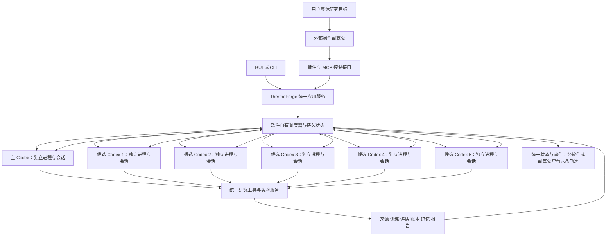

# ThermoForge V2 实施计划：独立软件管理六个 Codex 研究实例

更新日期：2026-09-06。状态：已按用户授权在 `codex/thermoforge-v2` 实施 V2，按功能提交。
独立 ThermoForge 服务在后台隐藏启动 1 个主 Codex 与 5 个候选 Codex，各自独立进程、会话和研究循环，通过软件通信，无需独立窗口。
真实六实例两轮动态工具并发与完整研究闭环验收已通过：五候选各完成两次实验并提交最终报告，主综合报告已生成；最终回归 829 项通过。证据统一记录于 [V2 验证说明](../docs/v2-validation.md)。

当前交付包括持久控制服务、来源与想法强制登记、验证反馈隔离、独立/Top-K/自适应预定义策略、研究谱系、三格式报告、GUI/CLI/MCP 和可分发插件。
完整 EvoX 元进化、其他模型后端及“六实例优于单实例”的科学效果结论仍是后续研究工作，不将架构验收当作质量增益证据。

ThermoForge 是独立软件，自己提供界面、研究调度、实例管理、实验反馈、记忆和报告。最新指定的首期运行配置为全部使用 Codex：主智能体与五个候选均是独立的完整 Codex 执行实例，拥有自己的上下文、工作区和持续工具循环。Codex 接入是首期核心交付，不再只是主智能体的可选扩展，也不能把五个候选降为普通模型请求或原生子智能体。

独立软件与采用 Codex 运行时可以同时成立：软件的任务、数据、通信和后台生命周期归 ThermoForge，外部聊天或插件不是持续运行条件；这套全 Codex 配置仍需要本地 Codex 运行时、有效认证及相应模型服务。此前可脱离 Codex 运行的要求保留为其他后端的后续兼容目标，不再要求先重建普通模型智能体内核才能交付首期六实例版本。安装和数据浏览可以独立，缺少 Codex 时不能声称全 Codex 研究可运行。

用户不希望日常操作依赖复杂页面，因此自然语言操作是正式产品要求：外部副驾驶通过插件/MCP 控制整套 ThermoForge 软件，完成准备、启动、查看、调整、暂停恢复与报告读取。GUI、CLI 与副驾驶是同一应用服务的不同入口，研究无需先由人在 GUI 点启动。插件对安装使用是可选的，但对话控制能力和插件交付已经列入实施范围，不再仅作为最后的分发附加项。

原始 [V2 研究方案讨论稿](D:/ceshi_python/GitHub/ThermoForge/plan/v2-research-discussion.md) 原样留存，作为文献、方案比较和决策背景。上一轮误将插件设为主入口的计划已保存为 [历史稿（已被替代）](D:/ceshi_python/GitHub/ThermoForge/plan/archive/v2-plugin-first-superseded.md)。当前实施以本文件为准：撤回“依赖 Codex 原生子智能体组成研究池”“候选只提交一次提案”“自循环依赖宿主 Goal/Stop hook”“先内置模型运行时、再可选接入 Codex”等前提。自然语言插件入口仍是正式易用性交付项，后台基础先完成。

V1 代码基线为 `1953326`，包含原有分布分析与模型报告；讨论稿保存提交为 `be16ff1`。这些已有修改已分功能提交并推送 `harness-schemes`，V2 从 `be16ff1` 建立独立分支。V1/V2 是产品演进称呼；单次运行另外冻结环境、数据与评价协议。

用户要求的基本结构是一个主 Codex 和 N 个候选 Codex，首期正式验收为 1＋5。每个候选具有完整研究能力和独立的连续研究轨迹，能够自行查文献、读历史、提出假设、编写模型、请求实验、分析结果、修复实现并继续研究，最终提交自己的方案和带来源的轨迹报告。主 Codex 具备相同的研究动作能力，另外承担目标组织、候选协调、资源建议、共享证据发布、路线比较与结题。候选数量不等于一次生成的想法数量。用户接受增加 token 消耗以换取这种完整运行方式；不能以节约 token 为由把六实例改成串行或一次性回答。

建议的职责划分如下：

| 层 | 负责什么 | 状态与决定归属 |
|---|---|---|
| 外部操作副驾驶 | 理解用户意图，经插件/MCP 操作软件、补齐必要输入、解释进度与报告 | 外部对话会话；不充当内部研究调度者 |
| 产品界面与 API/CLI/MCP | 建立研究、配置 Codex、查看六个后台实例的状态与轨迹、暂停恢复、查看报告 | 同一 ThermoForge 应用服务 |
| 软件调度器 | Codex 进程与会话生命周期、并发槽、消息路由、任务租约、预算预留、检查点和故障恢复 | 确定性程序；执行已校验的调度请求 |
| 主 Codex | 科研判断、组织候选、比较结果、选择下一步，也可开展自己的实验 | 独立 Codex 后台实例与主会话 |
| 候选 Codex × 5 | 在子预算内持续独立研究，提交各自方案、实验成果与报告 | 每个候选有独立 Codex 进程、会话、记忆与工作区 |
| Codex 适配器 | 经官方程序接口启动、驱动、观察与恢复单个完整 Codex 实例 | Codex 管理会话内推理和工具循环；ThermoForge 管理研究生命周期 |
| 领域服务 | 资料与想法登记、数据约束、实验排队、指标和物理检查、账本、模型包与报告 | ThermoForge 统一服务 |

主智能体与软件调度器是两个不同对象。主智能体提出科研和资源安排决定，调度器负责执行、校验与持久化，不再另跑一套 LLM planner 与主智能体争夺研究方向。主智能体和候选调用同一套研究工具；全局预算调整、其他轨迹管理等协调权限与普通研究能力分开授权。候选可以直接调用自己的研究工具并提交实验请求，不需要主智能体逐次转发。

外部操作副驾驶与内部主 Codex 分别存在。副驾驶把用户要求提交给软件；主 Codex 收到已登记的目标和约束后组织研究。副驾驶无需每轮发“继续”，也不替主 Codex 逐次决定实验。用户追加要求时，副驾驶提交带 run_id 的变更，由应用服务登记，再在明确检查点交给主 Codex 处理。外部副驾驶若也使用 Codex，是内部六个研究实例之外的另一个会话，身份和生命周期分开；它不计入 1＋5 候选池。

此前工具调用问题的代码证据保留。首期通过完整 Codex 工具循环接通研究服务；旧 API 路径继续维护兼容，不把重写它作为六实例版本的前置条件：

| 当前入口 | 事实与改造含义 |
|---|---|
| `HarnessAgent.ask` | 已实现工具 schema、工具执行、结果回填和多轮调用，可供后续普通模型运行时复用；不包裹首期 Codex 的内部循环。[代码](D:/ceshi_python/GitHub/ThermoForge/src/thermoforge_agent/agent.py:101) |
| OpenAI 兼容 `ChatClient` | 收到 tools 时发送工具与 `tool_choice=auto`；不能据此称协议天然不能调用工具。[代码](D:/ceshi_python/GitHub/ThermoForge/src/thermoforge_agent/client.py:70) |
| 自动研究 `make_ask` | 只发送 system/user 文本消息，取 content；这一条路径没有工具调用通道。[代码](D:/ceshi_python/GitHub/ThermoForge/src/thermoforge_webui/services/research.py:228) |
| 旧规划器与编排器 | 以单次 JSON 计划推进一轮实验；要拆出其中可复用的状态、约束和执行能力，升级为完整会话驱动。[规划器说明](D:/ceshi_python/GitHub/ThermoForge/src/thermoforge_webui/services/planner.py:1)、[编排器](D:/ceshi_python/GitHub/ThermoForge/src/thermoforge_research/orchestrator.py:117) |

上述旧接口结论来自代码分析，没有对原 OpenAI 兼容端点作工具能力测试，不能断言该服务商或模型主动性有缺陷。V2 的 Codex 动态工具已另做真实调用验证。更换 API 地址不会自动增加会话管理、研究调度或工具执行循环。

后端首期实现 Codex，保留普通模型扩展接口。上层统一为“启动实例、开始/恢复会话、发送任务、读取事件、暂停/取消、恢复”的语义。下列名称只是设计概念，具体 SDK 方法和事件字段在实施时按实际版本确定。

| 接入类型 | 模型/工具循环归谁 | ThermoForge 做什么 |
|---|---|---|
| 首期 Codex `AgentBackend` | 每个 Codex 实例管理自己的工具循环与上下文 | 后台隐藏启动六个独立实例，管理进程与会话，提供研究工具，发送任务、消费事件、跟踪轨迹 |
| 后续普通模型服务 `ModelProvider` | 模型返回文本和工具请求；内置 Agent Runtime 负责上下文、调用工具、回填和继续 | 保留不依赖 Codex 的兼容目标；不影响首期全 Codex 的实现顺序 |
| MCP / 插件外部入口 | 外部副驾驶管理与用户的操作对话 | 调用 ThermoForge 应用服务控制研究；内部智能体后端单独配置 |

不能用 `HarnessAgent` 再包住 Codex 的工具循环重复执行，也不能将 Codex 降成一个只返回字符串的 `base_url`。普通模型适配与完整智能体适配分开实现，避免为兼容而丢失工具事件、流式进度、取消和恢复能力。

首期正式 1＋5 交付中，主智能体和五个候选全部配置为 Codex，不能只接主智能体而候选暂不支持 Codex；前面的单实例原型和基线属于开发阶段。接口可分别保存主/候选配置，便于记录角色差异和后续扩展；同模型实验固定底层模型与推理配置。六个研究实例都必须是真实 Codex 运行时，不能仅把普通 API 请求命名为 Codex。

实施采用官方 App Server 的独立 stdio 进程和动态工具协议，验证基线为 `0.153.4`。本机旧全局 CLI `0.151.0` 能完成握手，但被当前默认模型拒绝；适配器现优先发现已安装且受支持的桌面运行时，也允许 `TF_CODEX_BIN` 显式指定。六个进程与会话分别核对，Windows 权限初始化顺序执行、研究回合实际并发。动态工具执行宿主保持开启，原生子智能体、shell 和继承的外部工具关闭。[App Server](https://learn.chatgpt.com/docs/app-server)

“独立进程”与“独立会话”分别验收：进程是由 ThermoForge 启停和监督的 Codex 后台执行实例；会话是该实例承担的一条研究轨迹。用户已明确可以没有独立窗口，直接在后台隐藏启动，因此不再要求终端或官方桌面窗口。目标仍为六个独立后台实例、六条独立研究会话，不能用一个后台进程内六条会话代替进程拆分。运行时自身可能另有辅助进程，验收统计研究实例的后台进程及映射，而不是要求系统总共只能出现六个进程。

接入通过软件管理的 App Server 后台进程与程序通信，不把终端连接或官方桌面窗口管理列为前置条件。Windows 启动器默认隐藏运行，持续收集协议事件和错误日志，避免研究依赖可见窗口或人工输入“继续”。缺少认证或必要用户输入时，将实际原因与等待状态传回软件和副驾驶，不让后台进程静默卡在不可见的交互界面。查看单个实例通过统一状态、事件和报告接口完成；将来需要调试窗口时另行提供，不影响首期验收。

ThermoForge 的候选池独立于 Codex 原生子智能体机制：run、主会话和每条候选轨迹都由软件创建、配置、记录与恢复。若 Codex 后端内部另有工具助手，它们属于该会话内部细节，不计入五条候选研究轨迹。基准模式应关闭可控制的嵌套委派；无法关闭时记录真实拓扑与额外用量，不能宣称它与纯 1＋5 完全等价。Codex 自身配置与能力仍需按版本验收。[原生子智能体说明](https://learn.chatgpt.com/docs/agent-configuration/subagents)

“同时运行”按软件层定义：六个独立 Codex 后台进程和会话可以持续存活，主智能体与五个候选有实际重叠的工作区间，候选的模型请求或研究动作可并发进行。记录实例/PID/会话映射、时间线、请求并发、排队和实验状态；不能把串行生成五份答案标成五路并行研究。模型服务连接/限流、软件活跃实例数与实验 worker 数分别配置。资源不足时可显式启用排队模式，但该次运行不能用作五路同时运行的验证。

每个候选都可持续完成多轮“资料 → 假设 → 实现 → 实验 → 分析 → 下一假设”。同时研究不要求六个训练作业始终同时占用计算设备；实验服务可按可用资源排队。候选等待实验时可继续允许的资料分析，避免在旧结果上误生成依赖尚未完成实验的结论。

同模型基线仍固定模型版本、请求参数、研究工具集合、起始任务和初始证据快照，并为候选建立独立上下文与采样。主智能体的协调职责提示与候选的共同研究提示分开记录。首轮候选独立探索，不看其他候选的回答；后续由主智能体在明确检查点发布带版本的共享发现。早期独立探索与后期共享进化是两种阶段，不把共享后的轨迹继续称为完全独立。

候选的状态至少关联 run_id、track_id、agent_id、instance_id、backend_process_id、backend_thread_id、backend_session_id、workspace、控制连接标识、阶段、父想法/实验、剩余额度、检查点和事件游标。重启时 PID 可以变化，仍需恢复同一研究轨迹并记录实例更替；不能只靠 PID 判断身份。后端不支持原会话恢复时，用已保存的研究材料建立新会话并显式记录会话更替，不承诺还原内部推理状态。

六个研究实例之间只通过 ThermoForge 传输任务、阶段反馈、发现和报告，不绕过程序直接共享可写会话文件。程序保存带 message_id、run_id、发送方、接收方、任务版本与工件引用的消息，跟踪投递/处理状态，重试去重。大报告与代码以不可变工件引用传递；来源与关键结论随摘要保留。候选可直接调用软件的实验和资料工具。主 Codex 通过软件分发任务、请求继续或修订，再经软件收到候选成果；软件只执行与记录通信和约束，不替主 Codex 生成科研判断。

同一 Codex 会话内一次工具循环由 Codex 执行；跨轮研究由 ThermoForge 在收到实际实验结果、新任务或阶段完成事件后继续驱动原会话。一次回复结束不等于研究完成，进程空闲也不等于失败。相同事件不得重复触发新轮次；空闲等实验时无需不断发送“继续”浪费 token。每个候选最终必须有独立方案、来源、实验记录、失败分析与结论报告；主 Codex 负责跨候选综合报告。

研究循环由 ThermoForge 的后台运行服务推进，并拥有六个隐藏 Codex 后台实例的生命周期。模型完成一次回复或达到单次工具轮数上限，只结束一个执行片段，软件根据阶段结果、待执行任务和预算决定是否继续；不能把“请用户再追问一次”作为默认自动研究恢复机制。WebUI/CLI 与外部副驾驶是控制或查看入口；关闭页面或外部对话不停止已授权的后台研究，暂停/取消通过明确控制命令执行并返回实际状态。后台实例退出则标记中断并恢复，不能继续显示正在研究；不依赖 ChatGPT Goal、Stop hook 或 Codex 定时任务来维持核心闭环。

MCP 连接和后台研究的生命周期要分离。当前 stdio MCP 服务通常随客户端连接创建进程；V2 中它应作为薄适配层连接独立 ThermoForge 服务，启动研究后返回 run_id，长期工作由后台 worker 执行。外部对话或 MCP 连接关闭，不能连带终止已启动的研究；重连可查询同一 run。连接器还需能发现服务状态，在已配置的本机环境中通过启动器启动服务，无需用户先打开网页；仍只保持一个拥有该 run 的调度实例。

完成、预算耗尽、用户取消、等待必需输入、连续失败或无有效进展均有明确停止/暂停状态。候选失败不直接终止其他候选；主智能体短暂不可用时，已授权轨迹可在剩余配额内继续，新的全局资源调整等待恢复。每次运行只有一个持有租约的软件调度者，旧 autoresearch 和其他客户端不能同时推进同一 run。

领域服务继续复用现有数据、模型与实验内核，补齐下列共同契约：

| 契约 | 要求 |
|---|---|
| 来源与想法 | 实验前保存来源类型、实际阅读范围、证据ID、启发说明、预测与反证条件；新候选缺来源类型或研究理由必须拒绝；自主猜想可合法无论文 |
| 共享评价 | 同一目标固定数据、切分、指标和物理约束；搜索只用训练/验证反馈，最终留出不反馈给任何研究会话 |
| 实验执行 | 统一提交、状态查询、取消与恢复；job_id 和幂等键防止重复训练；每条轨迹独立模型命名与工作目录 |
| 预算 | 全局与轨迹额度在执行前原子预留，完成或失败后结算；主智能体自己做实验也计入总预算 |
| 知识与记忆 | 每条轨迹有私有研究记忆，共享记忆带来源和发布版本；失败区分假说问题、实现错误、数据不足和预算不足 |
| 结论与报告 | 保存原始假设、实际实现、实验观察与研究解释；实验短报、轨迹报告、跨候选比较和目标结题报告共用事实层 |

目前预算检查在旧 `ResearchOrchestrator._check_budget`，直接工具入口不经过它，因此要下沉到共同实验服务。旧工具与外部 MCP 都必须经过相同的 run/来源/预算检查。Ledger 的文件锁可复用，但不能代替会话租约、原子额度预留和模型版本提交控制。[当前预算检查](D:/ceshi_python/GitHub/ThermoForge/src/thermoforge_research/orchestrator.py:297)、[直接执行入口](D:/ceshi_python/GitHub/ThermoForge/src/thermoforge_research/tools.py:1210)

主智能体与候选具有同级研究能力，不代表能任意修改统一评分器、其他候选工件或实际预算记录。所有正式实验由受控服务执行。完整 Agent 后端如具有额外 shell/文件访问能力，须验证其工作区与实际训练资源边界；仅有 MCP 校验不能证明所有计算都被限制。未具备可强制约束能力的后端要准确标示预算保证范围，不能把提示词要求当成资源隔离。

记录 Codex 可获得的模型标识、请求、工具事件和用量；不支持的能力明确标 unavailable。Codex 内部调用的精确额度控制取决于可用接口，不承诺仅凭一个 turn 开始前的检查就能实现硬 token 上限。六个研究实例分别记账，主智能体的协调与综合报告成本也计入研究总量；外部副驾驶的操作成本另列，能取得时计入整体使用成本。未来不同后端的 token、订阅用量和费用不混算；无法取得费用不能写零。正式来源与研究理由独立于可选内部推理日志，报告不要求取得完整思维链。

用户已接受六个完整 Codex 实例带来更多 token 消耗，产品以完整研究能力与效果为优先，并提供总量与实例用量展示。实际运行采用用户指定或已保存预算，不将这项偏好解释成无限预算；不能为维持旧单智能体费用而静默削减候选能力。六个进程也不意味着六份独立账号额度，认证、模型可用性及共享限流在接入原型中验证，不复制敏感凭据到研究报告或候选工作区。

文献工具沿用 CrossRef/arXiv/Semantic Scholar 检索，并增加资料内容读取与持久登记；宿主原生检索可作为可选渠道。每次检索和实际阅读范围单独记录，稳定 URL/DOI 与本地 source_id 关联，避免把临时引用编号作为永久来源。原论文与历史 EXP/F 都进入“资料 → 想法 → 实验 → 发现 → 决策 → 下一想法”的证据关系。

用户界面应提供研究目标及全局预算、主/候选 Codex 配置、候选数量/实际并发、六个后台实例的研究轨迹、当前实验队列、来源查看、暂停/取消/恢复、比较与结题报告。实例视图展示身份、当前会话、进程状态、最近事件、用量和错误，并区分执行中、等待实验、空闲、断连与失败；不能凭进程存活认定研究正在推进。这些状态同样可通过 MCP 供副驾驶读取，无需打开六个窗口。保留现有数据和模型页面，增加研究运行视图。其他后端选择随适配器实际交付开放，不预先显示虚假的可用能力。

日常控制应以少量任务级接口覆盖，而不要求副驾驶重演页面点击或手工串接所有实验工具。以下为待实现能力，最终工具名在接口设计时确定：

| 操作能力 | 行为 |
|---|---|
| 发现与准备 | 查询软件、数据集、目标、模型后端及已保存默认值；校验输入，返回确实缺少的信息 |
| 启动研究 | 根据目标、数据、预算和候选设置创建/启动 run，返回稳定 run_id 和实际状态 |
| 查询进度 | 获取主会话、各候选、实验队列、已用预算和新事件；只报告实际完成的内容 |
| 调整研究 | 更新已授权约束或预算，记录变更；清楚说明对当前与后续实验何时生效 |
| 暂停/恢复/取消 | 通过同一状态机控制 run；返回实际与待生效状态，明确运行中实验的处理规则 |
| 比较与报告 | 读取跨候选结果、结论依据及报告工件；按需打开对应图表，不强迫用户跳转页面 |

用户明确要求按指定目标和范围启动，且必要参数或已授权默认值齐备时，副驾驶可直接完成准备与启动，不额外插入一次通用确认。缺少关键输入则在对话中补齐；“看看结果”“解释原因”等查询不能被当作启动或修改命令。同一启动请求重复提交应幂等，GUI 和 MCP 并发操作也遵循同一 run 状态与版本检查。

既有需要真实人工决定的预处理操作仍保留相应边界；交互可设计成在副驾驶对话中展示具体变更，并通过可信的用户决定通道提交。模型自行生成的 actor=human 或“用户已同意”文本不能替代该决定。该设计用于避免把用户赶回复杂页面，不为普通研究实验新增审批。

现有网页副驾已能查数据、调用研究工具并导航页面，可复用其自然语言交互经验；但当前“执行单个实验/跳页”不等于持久研究 run 的完整控制。新的网页副驾和外部插件副驾都应使用任务级应用服务。[现有副驾](D:/ceshi_python/GitHub/ThermoForge/src/thermoforge_webui/services/copilot.py:1)

下表保留阶段验收设计。V2.0-P/A/B/U、V2.1 的工程交付及 V2.2 的谱系/报告已实现；实际验证范围见后附实现映射。V2.3 仅交付预定义策略切换，效果基准和任意新策略生成仍需后续研究。

| 阶段 | 工作 | 验收 |
|---|---|---|
| V2.0-P Codex 后台实例原型 | 固定 SDK/CLI 版本，验证隐藏启动独立 Codex 后台进程、会话及工具接入；核验认证、事件、暂停与恢复 | 全程不打开独立窗口，先验证一个实例再验证独立多进程并存；软件可读取状态与错误，重连不产生第二个研究执行者；列出实际接口限制 |
| V2.0-A 独立运行基础 | 拆分软件调度器、Codex AgentSession 和领域服务；持久消息、实例监督、来源、预算与实验统一入口 | 关闭外部聊天或插件后，ThermoForge 服务及其 Codex 研究实例可继续运行；重启恢复同一轨迹；软件不依赖外部对话每轮推进 |
| V2.0-B 完整单 Codex 基线 | 以一个完整 Codex 接通资料、假设、模型实现、实验、反馈与报告 | Codex 自主用工具、完成多轮实验反馈并产出有来源的方案和报告；固定 V1 对照与最终留出协议 |
| V2.0-U 自然语言控制入口 | 提供研究准备/启动/查询/调整/暂停恢复/报告接口，MCP 连接独立后台服务；制作操作副驾驶技能与插件 | 用户不打开 GUI 也能启动、控制和查看研究；客户端断开后后台继续；重连查看同一 run；GUI 状态一致 |
| V2.1 六个 Codex 独立实例 | 软件隐藏启动主 Codex＋五个候选 Codex 进程与会话；隔离上下文/工作区/额度，程序传递消息，中心实验服务，统一进度观察 | 六个后台实例身份可核对，主与五候选有实际重叠工作；每个候选至少完成两轮实验反馈与新假设、修复失败实现，独立提交方案及报告；单候选故障可恢复，其他候选继续 |
| V2.2 研究树、记忆与完整报告 | Top-K 路线、父子谱系、消融/复现、私有与共享记忆、跨候选比较 | 解释每条路线为何产生、如何演变、为什么保留/淘汰；包括负结果与适用条件 |
| V2.3 搜索策略进化 | 从预定义策略切换开始，再评估生成新策略；演化对象为研究路线/搜索策略 | 同预算相对固定搜索有可复核增益，策略可回退，评价与权限边界固定 |
| 副驾驶完整旅程验收 | 将自然语言入口与六个隐藏 Codex 实例、长期运行和报告串联；完善本地安装与连接体验 | 通过聊天指定目标，软件自动在后台启动主 Codex 与五个候选；断开重连、查询六条轨迹、暂停恢复、取得有来源的比较报告，全程无需独立窗口；卸载插件不影响后台软件使用 Codex 继续运行 |
| 后续其他后端兼容 | 实现 ModelProvider 与普通模型完整工具循环，复用同一研究服务与报告契约 | 在对应适配器验收后，才声明仅配置该模型服务且不安装 Codex 也能完成研究；不阻塞首期全 Codex 交付 |

实施顺序为 Codex 后台实例原型 → 独立服务与单 Codex 闭环 → 自然语言入口及六实例候选池 → 研究记忆与进化。自然语言控制接口与独立服务一起设计，插件入口可在单 Codex 闭环后先交付，再扩展到 1＋5；它是正式易用性验收项，公共分发另行安排。独立窗口不再是交付或验收要求；后台实例隔离、真实并发、完整研究循环和报告仍需验证。

对照实验分离“后端变化”“增加算力”和“多智能体机制”：A 为冻结 V1；B 为一个独立 Codex 研究智能体；C 为相同 Codex 版本、底层模型、配置及总预算下的主＋五候选；D 为用户接受增加总 token 预算的六实例配置；E 为在相应基线上加入共享记忆/分支。C 对 B 判断同预算机制收益；D 同时报告质量、时间和实际成本，属于产品效果评价。主智能体、全部候选、资料处理、协调、失败重试、报告与实验均入账。V1 到全 Codex 同时改变后端和能力，只能报告整体变化，不能全归因于多智能体。同预算评价是研究方法，不是限制用户正常运行预算的产品要求。

至少观测实际并发、同预算合格模型率、最终留出质量和波动、达到门槛的成本、重复/无效实验率、来源完整率与可复现率。五条轨迹即使都能持续研究，也不预先保证优于单条长轨迹；通过多个代表性设备目标和重复运行说明 1＋5 的适用条件与建议预算，不自动改变用户已确定的首期六实例目标。具体预算、并发资源及 EvoX 实现选择仍需细化，原讨论稿的论文依据继续有效。

实施记录（2026-09-06）：用户授权完成 V2、独立分支、按功能提交，并要求先推送已有修改。工程已按此推进，真实模型调用和隔离实验用于验收。原始讨论稿及已注明被替代的历史计划继续保留。

| 已交付能力 | 实现位置 | 验证方式 |
|---|---|---|
| Codex 独立进程、动态工具、恢复、用量 | `thermoforge_v2/codex.py` | 真实六进程两轮探针；协议故障与续接测试 |
| 持久运行、幂等、预算、恢复、暂停取消 | `store.py`、`engine.py`、`service.py`、`client.py` | SQLite 并发、独立服务进程、控制与恢复测试 |
| 文献读取、想法来源、实验与失败证据 | `research_tools.py` | 实际领域内核实验、lab 五连检、来源与可见性门禁 |
| 独立探索、路线排序、预定义自适应建议 | `strategy.py` 与主智能体协调工具 | 冻结口径、停滞、父路线去重与消息消费测试 |
| 谱系、来源、负结果、验证比较和最终留出 | `reports.py` 与服务报告入口 | JSON/Markdown/HTML、引用与留出隔离测试 |
| GUI、网页副驾、CLI、MCP、外部插件 | V2 页面、`tf v2`、`mcp.py`、`plugins/thermoforge` | 界面交互、真实浏览器、控制工具一致性、插件结构校验 |

当前中心训练 worker 固定为 1，六个 Codex 研究回合并行；这是不同的并发层。跨运行自动知识库检索、完整 EvoX 元进化与多设备重复效果基准尚未交付，运行内私有/显式共享证据和父子谱系已可使用。
