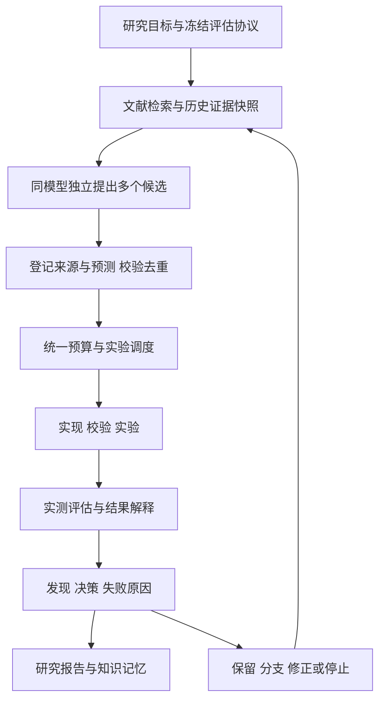

# ThermoForge V2 研究方案讨论稿

调研日期：2026-09-06。状态：供讨论，尚未确定 V2 实施范围；本轮只新增此文档。

本稿以当前 `harness-schemes` 工作树为基线。HEAD 为 `25f6f485079082a99111e378356dea89aa16953c`，查询时与 `origin` 远端同名分支一致；工作树另有尚未提交的分割画像、结果页与模型报告等修改，已纳入代码核查。这里的 V1/V2 是产品演进称呼，尚未创建版本标签、切换分支或改动包版本。正式冻结 V1 时，应记录最终提交以及数据、环境、模型和评估协议版本。

建议首先实施“可追溯的多候选研究”：保留 V1 实验内核，让同一模型独立提出多个候选，由中心调度器统一安排实验，以实测证据筛选；再引入研究分支、长期记忆，最后评估搜索策略进化。以下区分当前代码事实、外部研究结果和本项目建议；尚未运行任何 V2 性能实验。

当前实现提供了足够的基础：

| 能力 | 当前工作树核查 | V2 要补的部分 |
|---|---|---|
| 自动研究 | `ResearchOrchestrator` 每轮一个 planner 计划、一个实验；无人值守脚本对多个目标顺序轮转 | 候选批次、独立上下文、选择依据和研究分支 |
| 实验内核 | 数据与输入约束、时间切分、指标、物理检查、模型实验室校验、源码快照、研究账本 | 多候选共享预算、最终留出评估、候选间公平比较 |
| 文献 | 已有 `tf_literature_search`，连接 CrossRef、arXiv、Semantic Scholar；主要返回元数据和截断摘要 | 自动规划器的工具接入、资料持久化、阅读范围与证据定位 |
| 历史依据 | 后续假设强制 `basis` 引用已有 EXP/F；仅第一个假设允许空 | 文献及其他来源类型、实验前研究理由、冷启动候选批次语义 |
| 过程日志 | 端点返回时可保存 reasoning/cot，计划还可输出 reasoning | 来源与研究理由成为正式必填数据，不依赖可选日志 |
| 报告 | 已有实验比较、图表、模型结构、HTML/Markdown/PDF；本地有更详细模型报告脚本 | 从研究目标出发，串联资料、想法、实际实现、实验、失败与决策 |

代码证据：[单智能体编排](D:/ceshi_python/GitHub/ThermoForge/src/thermoforge_research/orchestrator.py:118)、[普通 chat 规划入口](D:/ceshi_python/GitHub/ThermoForge/src/thermoforge_webui/services/research.py:239)、[文献工具](D:/ceshi_python/GitHub/ThermoForge/src/thermoforge_research/tools.py:1927)、[摘要限制](D:/ceshi_python/GitHub/ThermoForge/src/thermoforge_research/litsearch.py:36)、[假设依据约束](D:/ceshi_python/GitHub/ThermoForge/src/thermoforge_research/ledger.py:239)、[现有报告入口](D:/ceshi_python/GitHub/ThermoForge/src/thermoforge_webui/services/reports.py:80)。

“能查文献”需要区分入口：会话 Agent/MCP 能使用检索工具，当前自动研究 planner 的 `make_ask` 没有传入 tools，不能在规划过程中自行调用它。V2 可在规划前增加受预算约束的检索阶段，也可提供有限轮次的只读资料工具循环。只改提示词无法接通这个能力。

用户记忆中的“五个同模型”有一个较吻合的候选：2025 年《Debate or Vote》主实验使用五个同构模型实例，将独立初始答案投票与后续辩论比较；在所测任务上，简单投票已贡献大部分收益。另一个相关来源是《More Agents Is All You Need》，重复输入同一问题后聚合。尚不能锁定用户原本看到哪篇；这些结果也没有证明五个是最佳数量，或五条自动科研循环优于等总预算的单循环。[Debate or Vote 论文](https://arxiv.org/html/2508.17536v2)、[Agent Forest 论文](https://arxiv.org/html/2402.05120v2)

需要区分四种机制：同模型独立采样扩大候选覆盖；多数投票聚合有可比较答案的输出；多智能体辩论额外引入互相阅读和修订；实验树让不同候选各自拥有实现、实验和后续分支。ThermoForge 更适合用真实实验评估候选。若五次请求使用相同模型、提示词、上下文并采用近乎确定性的生成，可能只得到重复方案；应保留独立采样并记录请求设置，实验执行自身仍保持原有可复现性。

EvoX 存在同名问题，当前先比较两条相关路线：

| 名称 | 原始方案 | 对本项目的含义 |
|---|---|---|
| Berkeley / SkyDiscover 的 EvoX | 联合进化候选方案，以及“选哪些历史候选、怎样生成变体”的搜索策略 | 适合已有可靠评估器和候选档案后的搜索层升级；并非固定五个角色。作者评估近 200 个优化任务，等迭代并不等于严格等费用，不能直接承诺 HVAC 收益。[论文](https://arxiv.org/abs/2602.23413)、[官方框架](https://github.com/skydiscover-ai/skydiscover) |
| EvoMap 的 EvoX 蜂群 | 官方文章包含独立上下文分题处理和伙伴选择实验 | 其约 26%→71% 来自 563 题的拆分与程序聚合，不能解释为同一题五票或完整科研蜂群的架构收益；文章也说明若干自组织机制尚未在同一闭环内验证。[官方实验说明](https://evomap.ai/research/self-organizing-ai-swarms) |

其他 auto-research 方案适合按能力组合，而非整套替换当前项目：

| 方案 | 如何工作 | 优先借鉴什么 |
|---|---|---|
| Karpathy autoresearch | 固定训练预算，改代码、训练、读验证指标、保留或回退，记录实验日志 | 评价入口固定、每次变更可追踪、失败记账。默认没有完整文献来源和论文生成流程。[官方仓库](https://github.com/karpathy/autoresearch) |
| Sakana AI Scientist / v2 | 构思与查新、实现、实验、分析、论文；v2 加入阶段化实验树 | 可行性验证、调参、研究议程、消融、重复实验以及从工件写报告。官方指出有强起始模板时 v2 未必优于 v1，领域模板仍值得保留。[v1 仓库](https://github.com/SakanaAI/AI-Scientist)、[v2 仓库](https://github.com/SakanaAI/AI-Scientist-v2)、[v2 论文](https://arxiv.org/abs/2504.08066) |
| Google Co-Scientist | 结合科学证据生成、评审、排名和进化假说，形成研究建议，部分生物医学方向有后续实验验证 | 假说质疑、相似性检查和元评审；内部排名只能辅助安排实验，不能替代真实指标。公开机制不等于完整系统可直接开源接入。[论文](https://arxiv.org/abs/2502.18864) |
| HKUDS AI-Researcher | 从论文与代码分析，经构思和实现，到实验与研究报告；论文包含先生成五个不同方向再收敛的步骤 | 资料概念与代码模块的对应关系、研究过程报告。这“五个方向”也不是同模型五副本性能结论。[论文](https://arxiv.org/abs/2505.18705)、[官方仓库](https://github.com/HKUDS/AI-Researcher) |
| EvoScientist | 论文中的研究员、工程师、进化管理者使用想法记忆与实验记忆 | 存储有效方向、失败条件和可复用实施经验，支持从历史结果产生新想法。论文三角色与当前产品仓库的子代理划分需分开理解。[论文](https://arxiv.org/abs/2603.08127)、[官方仓库](https://github.com/EvoScientist/EvoScientist) |
| AIDE / AlphaEvolve | 实验代码树或候选程序库，生成变体、执行评估、选择后续分支 | 候选档案、调试与改进分支、实测选择；不能自行补全文献依据和报告溯源。AIDE 有公开实现。[AIDE 论文](https://arxiv.org/abs/2502.13138)、[AIDE 仓库](https://github.com/WecoAI/aideml)、[AlphaEvolve 论文](https://arxiv.org/abs/2506.13131) |

这些工作支持尝试多候选、反馈与记忆，但原基准上的成绩不等于 ThermoForge 的收益。关于真实多步工具任务的研究也发现，多智能体效果依赖任务可分解性和顺序依赖，通信成本可能抵消收益。[Scaling Agent Systems 论文](https://arxiv.org/abs/2512.08296)

建议的 V2 工作流如下。并行提出想法与并行训练是两个独立设置；第一阶段可以并行提出五份计划，实验仍由现有执行器排队完成。

第一阶段的五个提案者使用相同模型和提示词、同一冻结证据快照、各自独立的上下文与客户端。第一批生成结束前不互相看答案，先校验并去重。中心调度器根据预算安排候选实验，评审可以指出问题、建议优先级；实测指标与物理/数据约束负责判断候选结果。

若预算只允许从五份提案中执行一两份，要把它标明为“多提案筛选”模式；这不能声称已验证“五条完整独立研究轨迹”的收益。以后可增加完整分支模式，每条路线在分配的子预算内继续研究，再做统一比较。角色分工或不同提示词可作为后续实验变量，不与第一轮同模型同提示基线混在一起。

当前不宜直接启动五个现有 orchestrator 共写同一目标。Ledger/ID 的锁只覆盖局部写操作，未统一锁住整轮目标状态与预算；模型实验室的版本分配、planner trace 和 `last_usage` 等可变对象也需要独立实例或集中提交。优先采用中心写账本、中心提交模型、独立提案 worker。后续真正并行执行时，再补隔离目录、预算预留、取消/重试幂等和故障恢复。[模型版本分配](D:/ceshi_python/GitHub/ThermoForge/src/thermoforge_research/model_lab.py:375)、[调用结果暂存](D:/ceshi_python/GitHub/ThermoForge/src/thermoforge_webui/services/research.py:244)

“为什么产生这个想法”应成为正式产物，并在实验前保存。现有端点 reasoning/cot 和计划解释可作为辅助日志，但不保证始终存在，也不等同于真实、完整、可验证的想法起源。应要求简短的研究依据说明，以及程序可验证的来源关系；不能从文字自述证明模型内部究竟受什么影响。

| 建议记录 | 必填含义 |
|---|---|
| 想法身份 | idea_id、goal/run/round/agent、创建时间、模型与提示配置、证据快照版本 |
| 来源类型 | 论文/官方资料、历史实验、用户输入、已有物理知识、组合推导、自主猜想；允许多选 |
| 来源关联 | source_id 或 EXP/F 等历史ID；原始依据与事后找到的支持材料分开记录 |
| 证据范围 | DOI/URL、资料版本、检索时间、实际读到的是元数据/摘要/全文/片段；章节、页码或片段定位 |
| 来源如何支持想法 | 摘要说明资料中的具体方法或观察、适用条件、迁入当前设备/数据时的假设 |
| 实验前预测 | 预期改善的指标或残差特征、可证伪条件、对照与消融、主要不确定性 |
| 实验后追加 | 实际实现、观察、解释、支持/反驳/证据不足、继续或淘汰的理由 |

强制的是“真实填写来源状态”，不是“每个想法必须有论文”。自主猜想可以没有文献ID，但必须标明没有外部依据；检索失败、只有摘要、全文不可得都照实保存，不能伪造引用。若说某论文启发了想法，该来源应在提交前已检索并提供给该候选；实验之后新找到的相关论文只作为追加支持。建议把来源关系建成 `资料 → 想法 → 实验 → 发现 → 决策 → 下一想法`，并允许一条想法关联多个来源。

文献阅读流程应为：查询并记录 → 去重和核验元数据 → 读取可访问内容并标明范围 → 提取方法、条件与局限 → 关联候选想法。工具返回标题摘要不等于读过全文；引用数也不能证明适用于当前设备。摘要足以提出初步猜想时可以继续，复现公式或声称方法一致时则需要足够的原文依据。资料内容只作为证据处理，不改变系统的研究与执行规则。

例如，以下仅是未来记录格式示意，不是当前项目的新发现：“历史残差诊断显示低负荷区域偏差较大；据此提出分段参数模型。尚无外部论文依据，标为基于历史结果的假设。预计低负荷 CVRMSE 改善且高负荷不恶化。以相同切分的原模型对照，并用单参数模型做消融；若多次运行无稳定改善，则当前证据不支持该方向。”实际记录需替换成真实实验ID、诊断工件和预先设定的阈值。

报告升级应与来源契约同步建设。建议统一研究事实数据，再复用现有导出器，提供三种阅读粒度：

| 产物 | 回答的问题 |
|---|---|
| 每次实验短报 | 为什么做、从哪里来、预期什么、实际运行了什么、结果怎样、是否支持假设 |
| 每轮候选比较 | 各候选的差别与来源，哪些重复/非法/未执行，成本，为什么继续或淘汰 |
| 研究目标结题报告 | 研究背景与资料、路线演变、关键对照/消融/复现、负结果、推荐模型、适用范围与下一步 |

每个数字从实验工件读取；事实性结论链接到 EXP/F 或来源证据；解释与猜想明确标注。报告保留“原始假设”和“实际实现”两个字段。当前模型报告脚本已记录一个实例：包描述沿用“Merkel/NTU 主干 + 偏差校正”，实际源码是 21 项二阶多项式岭回归。这说明报告要检查文字、公式和源码的一致性，不能只继承最早的想法说明。[当前导出脚本](D:/ceshi_python/GitHub/ThermoForge/scripts/export_model_report.py:290)

报告的比较范围也要固定。当前通用报告 `_best` 按可读到的 CVRMSE 取最小值；V2 应先按同目标、同数据版本、同切分、同评估面及可比约束分组，再给结论，避免跨设备/目标误排。没有进步也是有效结题：记录预算消耗、失败类型、剩余不确定性与后续需要的数据。指标表、引用存在性与关系完整性可自动校验；论文是否真正支持某句话仍需内容审查，不能仅凭URL有效就宣称已验证。

建议先安排以下对照，阶段性增加复杂度：

| 组别 | 配置 | 分离什么因素 |
|---|---|---|
| A | 当前 V1 单循环 | 现状基线 |
| B | 单循环 + 相同的检索、来源与报告基础 | 补充资料和流程的收益 |
| C | B + 同模型多提案、统一调度，先测 N=3/5 | 候选宽度的额外收益 |
| D（后续） | 相同总预算拆成五条独立短研究轨迹 | 多轨迹与一条长轨迹的差别 |
| E（后续） | 共享候选档案，保留 Top-K 并分支 | 历史共享与分支搜索的价值 |
| F（最后） | 相同基础上引入自适应搜索策略 | EvoX 式进化的增量价值 |

对照要求：固定起始代码、资料与历史快照、数据和评估协议；总 LLM 成本/用量与实验计算预算相当，检索总结、协调、评审、失败重试全部计入。等预算与等墙钟时间的结果分开报告；并行可能缩短等待，但不自动降低总费用。模型请求采样与训练随机种子分开管理，至少在多个代表性设备目标和重复运行上做小规模试验；样本量与胜出阈值在执行前确定。

搜索只使用训练/验证反馈。最终留出数据由评估器管理，研究代理不得反复用它改模型；算法和选型冻结后再做最终评估。历史上已经反复反馈给代理的“测试面”不能重新叫作未见过测试集，应另设新的时间段或设备留出。演化搜索策略本身也需要未用于调策略的目标评估，避免把某个站点的经验当作普遍规律。

主要观测：相同预算下的合格模型率、冻结协议下的质量与波动、达到门槛的成本、有效且不同的候选数量、重复/非法/失败实验率、物理约束通过率、来源记录完整率、可复现率。报告长度或 LLM 自评分不能充当研究效果的唯一指标。现有停止条件偏重 CVRMSE；V2 应按目标声明的多维改善和信息收益判断停止，避免漏掉偏差或物理一致性的改善。

建议的实施阶段和验收门槛如下；尚未承诺开发排期：

1. **V2.0：基线与研究证据。** 明确 V1 冻结快照和独立最终评估；新增资料/想法来源契约；接通自动研究的只读文献阶段；从同一事实层生成实验短报。验收：新候选缺少来源类型或研究理由，必须在实验前拦截；自主猜想可合法无论文；无法核验的引用不得作为已核验来源，结果数值无工件支持不得作为事实结论。文献不可得有正常记录流程，旧账本可读，缺失历史来源标为 unknown，不补造历史。
2. **V2.1：多候选探索。** N 可配置，独立客户端与上下文；校验、跨候选去重、预算预留、中心提交与执行、每轮比较报告。验收：N=1 可对照单循环；N=3/5 在冻结预算试验中记录实际增益或无增益；无共享状态串线、重复提交和总体超预算。五个冷启动想法的依据语义需在契约中明确，不能伪造前序实验来绕过现有首假设规则。
3. **V2.2：分支与研究记忆。** 增加 Top-K 候选档案、父子关系、对照/消融/复现，提炼想法记忆与实验记忆。失败区分假设不成立、实现错误、数据不支持、预算不足；每条记忆带适用条件与反例。验收：可追溯选中/淘汰路线，历史经验检索有证据，完整结题报告可生成。
4. **V2.3：受约束的策略进化。** 先根据停滞从预定义探索/改进策略中切换，若有增益，再允许产生版本化的新搜索策略。始终固定数据权限、评价器与发布约束。验收：相同预算下优于固定搜索基线，策略可回退且在未用于调策略的研究目标上复核。

正式定范围前，优先确认两项：用户所指 EvoX 的具体来源；第一阶段优先追求等总成本收益、允许增加成本追求最佳结果，还是优先完善来源和报告。其他建议默认值是：继续同模型、沿用现有模型实验室自治边界、第一阶段中心调度、报告先保留现有 HTML/Markdown/PDF 输出形式。上述默认值均为本稿建议，尚非用户确认的最终 V2 需求。
