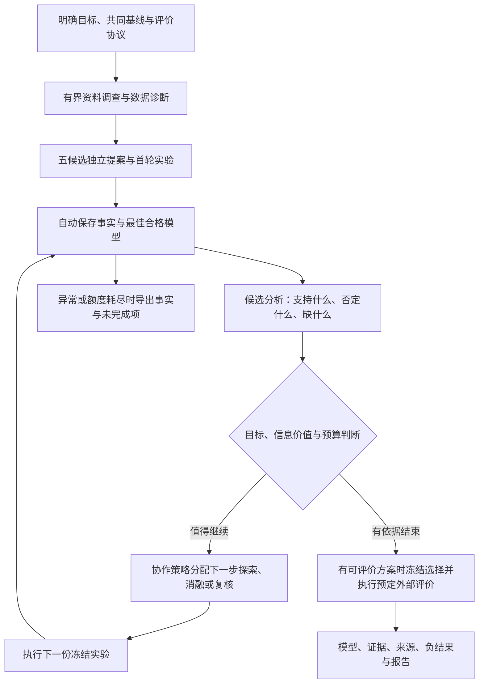

# V2 自主研究结果优化建议

日期：2026-09-07。本文是下一步建议，尚未实施本文件中的新增功能；不改变已保存的原始讨论稿，不启动新的模型运行。

## 依据与问题

依据 [真实验收记录](../docs/v2-autonomous-validation.md)、当前引擎/工具代码，以及下列公开项目的一手资料。

- 本次目标配置为 validate CVRMSE ≤ 5%，五个候选首轮已约 0.89%–0.91%。继续至少两次实验是验证反馈循环的测试要求，并非业务达标所必需。研究需要明确区分达标、优化和探索。
- 11 次正式实验全部成功，留下 10 条发现，但预算耗尽时没有候选最终报告、主报告或停止决定。已经有实际结果，尚未实现稳定的研究成果交付。
- 3,045,092 累计 tokens 中，输入 2,997,210，缓存输入 2,731,392（总量的 89.70%），输出 47,882（1.57%）。推理输出 10,248 是输出子项，不能重复计算。累计量含缓存，不等于费用；现有事件无法还原每次工具调用的 token 成本。
- 122 次工具调用中，历史读取 32 次、消息读取 20 次；模型实验室提交 12 次，其中 4 次失败。不能据此认定这 4 次失败是主要 token 来源。
- 首轮五个模型集中于物理启发的多项式岭回归。不同源码哈希只说明实现身份不同，不证明不同科学方向。所有首轮来源为自主猜想，本次没有查论文。

## 第一阶段：定义成果，并持续保存

### 明确研究契约

增加 `objective_mode`，由主智能体根据用户任务提出契约，在研究启动前固定：

| 模式 | 完成依据 | 后续实验的作用 |
|---|---|---|
| 达标 | 满足指定评价面的阈值及必要约束，完成预先约定的复核 | 检查达标是否可靠，而非机械用完额度 |
| 优化 | 与冻结的共同基线比较，达到预先设定的最小有意义改善；或有依据报告未改善 | 提升误差、复杂度或运行成本等明确目标 |
| 探索 | 对具体假设获得支持、反例或仍不足的证据 | 区分竞争解释，不要求每项实验分数上升 |

契约包括基线 ID、指标方向、必要物理约束、最小有意义改善、验证设计、无进展判断及预算。实验执行成功、达到绝对阈值和比基线改善分别记录。

每次反馈后产生结构化决定：继续、复核、换假设、达标结束、无改善结束或受阻结束。停止判断综合证据、预计信息价值和剩余资源，不能把固定两轮或用完三次额度当作研究完成。

### 软件持续保存事实，智能体解释发现

现有报告预留仍依赖后续模型调用。补充以下机制：

1. 每次实验结算后，软件自动更新事实简报：来源/假设、冻结配置、指标、与基线及历史最好结果的差异、实际制品 ID、分析缺项。
2. 候选在每次分析后更新短的研究总结，而非最后从零撰写长报告。
3. 服务退出时自动导出当前事实、已保存解释和流程图。模型断开或额度耗尽也保留可检查的产物。
4. 区分系统事实报告与智能体研究报告；未分析、未验证、未结题明确标记。模板报告不能冒充科学解释或补齐不存在的停止决定。
5. 保存当前最佳合格实验的模型与配置。后续退化保留为负结果，不覆盖历史最佳，也不因为验证分数最低就忽略约束是否满足。

“研究有结果”可以是改善、没有发现改善、假设未获支持或数据不足。应以证据完整程度评价交付，不要求编造正面发现。

## 第二阶段：减少上下文往返，增强实验反馈

### 紧凑状态与少量工具交互

- 程序在回合开始直接投递冻结协议摘要、未读消息、新反馈和预算状态，减少再次调用消息/历史工具。
- 历史提供 cursor、字段投影和摘要模式；源码、长报告与文献正文存为工件，按 ID 获取必要片段。
- 合并同一决策的登记：一次结构化提案可原子保存想法与冻结方案，保留来源、预测和反证条件；软件按已冻结提案安排实验，避免模型重复提交同一份配置。
- 实验完成后，下一次模型决策提交分析、继续理由和下一步。不能在尚无实际反馈时预先生成实验结论。
- 保存可恢复的证据摘要并按阶段管理上下文。完整证据持续存档；摘要不能丢掉失败、限制、协议 ID 和引用。
- 增加每次模型调用的用量增量、工具名、响应长度和错误码观测，不记录不必要正文。先测量，再判断节省效果；本次数据不支持直接把超额归因于推理强度。

### 让“根据反馈研究”有实质依据

仅使用训练/验证数据提供固定诊断：按设备、时间段和负荷区间的误差，偏差与残差结构，训练—验证差距，复杂度与运行成本。切片与复核规则尽可能在搜索前确定，避免事后挑选最好看的分组。

下一方案必须说明：哪个诊断发现值得处理，提出何种解释，如何设计对照或消融，预期改善在哪里，什么结果会推翻解释。引用一个 job ID 只能证明谱系，不能单独证明研究推理有效。

模型实验室提供已验证的最小模板和结构化错误信息。已有模型与特征接口能检验假设时直接使用；能力不足时允许候选自主扩展源码。开发预检和正式实验分别统计，保留实现失败，不把接口修复当成科学改进。

## 第三阶段：先独立，再按证据分配后续研究

保持一个主 Codex 和五个独立候选 Codex。`independent` 继续作为独立对照，不能在中途悄悄改变其分享规则。面向协作研究，选择独立首轮后进入 `adaptive` 的策略：

1. 主智能体准备共同目标、基线及经过核实的初始资料；候选独立提出并检验首轮假设。
2. 共享开放后，主智能体比较方法结构、结果、未解决误差和资源消耗。
3. 后续预算向有希望或信息价值高的实验倾斜，同时保留挑战现有最佳方案、探索不同解释的机会。没有必要让五条路线每轮消耗相同额度。
4. 粗粒度方法标签、特征结构和假设描述用于提示相似性；哈希用于精确执行身份。两者都不能自动判定创新性。

文献研究需要显式阶段：主智能体先进行有界检索并保存真实阅读范围，候选针对自己的知识缺口补查。登记资料如何改变了假设；没有相关证据可登记检索失败或自主猜想。需要文献支撑的任务可要求真实检索尝试，不要求虚构引用或凑论文数量。

## 推荐流程

最终留出只在冻结选择后用于外部评价，不反馈给候选继续调参。跨设备或跨时间稳健性需要预先设计；相同种子的确定性重跑不能当作统计上的独立重复证据。

## 对已有方案的借鉴

| 一手资料 | 可借鉴机制 | 在本项目中的取舍 |
|---|---|---|
| [Karpathy autoresearch](https://github.com/karpathy/autoresearch)（已读 README） | 固定评价、限定可修改范围、固定训练时长、保留或丢弃变更 | 先做小而完整的实验闭环；其 5 分钟预算是具体任务设计，不直接照搬为暖通实验标准 |
| [The AI Scientist-v2](https://arxiv.org/abs/2504.08066)（已读摘要） | 专门的实验管理者与渐进式树搜索 | 用主智能体管理研究分支，并保留可检验的假设、失败与对照 |
| [EvoX: Meta-Evolution for Automated Discovery](https://arxiv.org/abs/2602.23413)（已读摘要） | 同时演化候选解和生成候选的搜索策略 | 在已有稳定评价与足够历史后，再考虑演化搜索策略；当前 adaptive 不等于实现了 EvoX |

上述取舍是针对 ThermoForge 的设计建议，并非论文对本项目效果的验证。

## 下一次验收

先验收第一、二阶段：正常结束能生成带证据的研究报告；强制额度耗尽或进程中断时能导出事实与缺项；达标后复核、无改善、实现失败都可有依据结束。比较优化前后的输入量、工具往返、完成实验数与报告覆盖，不能只比较最优验证分数。

之后再做相同总预算、相同冻结评价设计的单 Codex 与五候选协作对照，计入主智能体及开发预检开销，进行足够重复并报告波动。研究质量收益尚待验证。本建议不自动追加 token、不修改既有运行预算，也不以已有合成结果代替真实设备验证。
